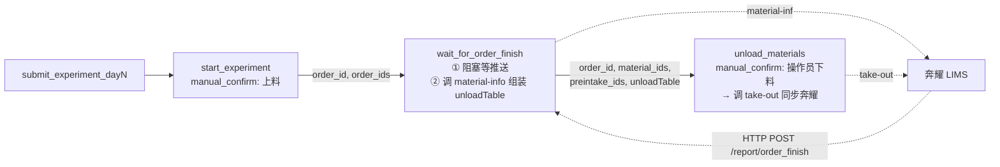

# Peptide Station 新增两个节点：等待订单完成 + 人工下料

> 日期: 2026-05-20  
> 目标文件: [peptide_station.py](../unilabos/devices/workstation/bioyond_studio/peptide_station/peptide_station.py)  
> 参考实现:  
> - [bioyond_cell_workstation.py](/Users/dp/python/yxz/unilabos/devices/workstation/bioyond_studio/bioyond_cell/bioyond_cell_workstation.py)（`wait_for_order_finish`、`get_material_info`）  
> - [bioyond_rpc.py L782-800](../unilabos/devices/workstation/bioyond_studio/bioyond_rpc.py)（`take_out`）  
> - 前端约束: [manual-confirm-detail.tsx](/Users/dp/go/code/Uni-Lab-Cloud/web/src/app/@enterprise/(new)/leap-lab/components/notification-draw/manual-confirm-detail.tsx)、[services/manual-confirm.ts](/Users/dp/go/code/Uni-Lab-Cloud/web/src/services/manual-confirm.ts)  
> 状态: 仅需求草稿，不写代码

---

## 一、需求背景

`BioyondPeptideStation` 当前实验流程在 `start_experiment`（manual_confirm 启动调度器）之后即结束，缺少：

1. **等待奔耀回报实验完成**：调度器跑完后，奔耀通过 LIMS 推送 `POST /report/order_finish` 回调；目前 peptide_station 没有把这条推送封装成 action 节点，下游无法在工作流图上"卡住"等结果，也拿不到 `usedMaterials` 等下游所需信息。
2. **下料引导**：实验完成后操作员需要把样品/产物从仓位里取出，下料前需要看到每个物料对应的 **仓库 / 坐标 (posX/posY/posZ) / 单位 / 物料名称**；下料完成后还需要回写一笔到奔耀（调用 `take-out` 接口），让奔耀清空相应库位状态。

因此在 `peptide_station.py` 增加两个 action 节点，串在 `start_experiment` 之后：

```
submit_experiment_dayN
  → start_experiment(manual_confirm 上料)
  → wait_for_order_finish (生成 unloadTable)
  → unload_materials (manual_confirm 下料 + 调 take-out)
```

---

## 二、关键设计决策

### D1. `unloadTable` 必须由节点 1 产出，不能放节点 2

前端 manual_confirm 弹窗（`manual-confirm-detail.tsx`）的数据来源只有两类：

| 数据 | 来源 | 用途 |
|------|------|------|
| `detail.schema` / `detail.uiSchema` | **当前**节点的 goal schema | 给操作员勾选的表单 |
| `previousNodeResult.data.param` | **上一个**节点输出 param（`getPreviousNodeResult(task_uuid, node_uuid)`） | 在弹窗里渲染表格、列表等只读信息 |

**前端拿不到节点 2 内部"半中间"生成的临时数据**——节点 2 一旦进入 manual_confirm 阻塞状态，它的 param 就只能是 `goal_default`（操作员勾选项），不能在阻塞前先调一次 `material-info`。

→ 因此必须把 `material-info` 查询、`unloadTable` 组装全部前移到节点 1：节点 1 在 LIMS 推送到达后立即查 `material-info`，把 `unloadTable` 作为输出 param 的一部分；节点 2 启动时前端自动通过 `getPreviousNodeResult` 拿到 `unloadTable` 渲染。

### D2. 节点 2 的执行时序：先人工下料，再调 take-out

节点 2 不是"调用 take-out 让奔耀帮忙下料"，而是"操作员物理下料完成后，调 take-out 通知奔耀同步状态"。完整时序：

```
                     节点 2 (manual_confirm) 启动
                                │
                                ▼
        前端弹窗显示 unloadTable + "确认下料完成" 按钮
                                │
                                ▼  操作员物理下料 (从仓位里取出样品)
                                │
                                ▼  操作员勾选 "已完成" → 点击"批准"
                                │
                                ▼  POST /api/v1/lab/workflow/manual-confirm/action {action: "approve"}
                                │
                                ▼  manual_confirm goal 解除阻塞 → 节点 2 函数体继续执行
                                │
                                ▼  调用 self.hardware_interface.take_out(order_id, preintake_ids, material_ids)
                                │  (= POST /api/lims/order/take-out, 文档见 docx/SUYVd65Ykov2prxsnOVcH5Eln7N)
                                │
                                ▼
                        节点 2 返回，下游继续
```

`take-out` 入参 `preintakeIds` / `materialIds` 由节点 1 输出的 `used_materials` 拆分得到（`preintakeId` 当前协议在 `usedMaterials` 中没有，全部传 `[]`；`materialIds` 来自每条 `usedMaterials.materialId`）。

---

## 三、节点 1：`wait_for_order_finish`（等推送 + 预生成 unloadTable）

### 行为

1. 入口先把 `order_code`（或从 `order_id` 反查到的 orderCode）记入 `self.last_order_code`，并 `clear()` 一个 `threading.Event`。
2. 阻塞在 `self.order_finish_event.wait(timeout=...)` 等 LIMS 推送。
3. 由基类 `WorkstationHTTPService._handle_order_finish_report` → `self.process_order_finish_report(report_request, used_materials)` 触发 push；peptide_station **override** `process_order_finish_report`：
   - `super().process_order_finish_report(...)` 保留父类行为（`resource_synchronizer.sync_from_external()` 等）。
   - 把 `report_request.data` 存入 `self.last_order_report`，orderCode 匹配时 `self.order_finish_event.set()`。
4. 解除阻塞后，按 `data.status` 解析返回值（沿用 bioyond_cell 语义）：`"30"→success` / `"-11"→abnormal_stop` / `"-12"→manual_stop` / 其它 `unknown_<status>` / 超时 `timeout`。
5. **【关键新增】对每条 `usedMaterials.materialId` 调用 `self.hardware_interface.material_info(material_id)`**（带本地缓存避免重复请求），组装 `unloadTable`（结构见 §五）。`material-info` 接口失败的物料行 `whName/posX/posY/posZ/unit/materialName` 用空串占位，并把 materialId 追加到 `unload_summary.missing_material_info`，**不抛异常**。
6. 把 `order_id`、`order_code`、`order_finish_status`、`order_finish_report`、`used_materials`、`unloadTable`、`unload_summary` 一起作为输出 handle 暴露。

### 入参（goal_default）

| 参数 | 类型 | 说明 |
|------|------|------|
| `order_id` | `str` | 来自 `start_experiment` 输出 handle `order_id`（首选）；用于回查 orderCode |
| `order_ids` | `List[str]` | 来自 `start_experiment` 输出 handle `order_ids`；多订单时按顺序逐个等 |
| `order_code` | `str` | 兜底入参；CLI 调试时若已知 orderCode 可直接传 |
| `timeout_seconds` | `int` | 默认 `36000`（10h），与 bioyond_cell 一致 |
| `poll_mode` | `bool` | 默认 `False`；为 `True` 时改用 `wait_for_order_finish_polling` 风格（0.5s 轮询，避免阻塞 ROS2 feedback 派发） |

### 输出 handles

| key | data_type | 说明 |
|-----|-----------|------|
| `order_finish_status` | `str` | `success` / `abnormal_stop` / `manual_stop` / `timeout` / `unknown_*` |
| `order_finish_report` | `json` | 完整 `report_request.data`，含 `orderCode/orderName/startTime/endTime/status/usedMaterials` |
| `used_materials` | `json` | 解析后的 `usedMaterials` 列表（每项 `materialId/locationId/typeMode/usedQuantity`） |
| `material_ids` | `json` | `List[str]`，从 `used_materials` 抽出 materialId，供节点 2 直接传给 `take-out` |
| `preintake_ids` | `json` | `List[str]`，当前协议为空列表，预留扩展点 |
| `unloadTable` | `table` | **下料表，前端在节点 2 manual_confirm 弹窗中通过 `getPreviousNodeResult` 拿到并渲染** |
| `unload_summary` | `json` | `{ "order_code": ..., "total_items": N, "missing_material_info": [materialId,...] }` |
| `order_id` / `order_code` | `str` | 透传给节点 2 |

### 接口依赖

| 接口 | 调用方式 | 用途 |
|------|----------|------|
| `process_order_finish_report` 钩子 | 基类已注册 | 接 LIMS push |
| `POST /api/lims/storage/material-info` | `self.hardware_interface.material_info(material_id)` | 查物料的 whName/posX/posY/posZ/unit |

### 实现要点（不写代码，仅设计）

- `BioyondPeptideStation.__init__` 末尾追加 `self.order_finish_event = threading.Event()`、`self.last_order_code = None`、`self.last_order_report = None`。
- 新增 `process_order_finish_report` override：先 `super().process_order_finish_report(...)`，再做 orderCode 匹配 + `set()`。
- 抽内部辅助 `_build_unload_table(used_materials)`：参考现有 `_build_result_table` + `_resolve_wh_name_by_material_id` 的写法，加 `material_info_cache` 字典避免重复请求。
- 多订单（`order_ids` 长度 > 1）按顺序逐个 wait，最后把每个订单的 `usedMaterials` 合并成一张大表，附加 `orderCode` 列方便操作员区分；任何一个订单 `abnormal_stop` 立即返回 `abnormal_stop` 并把当前 report 一起带出。
- 装饰器 `@action(always_free=True, description="等待订单完成回调并预生成下料表", handles=[...])`。

---

## 四、节点 2：`unload_materials`（人工下料 + 调 take-out 同步）

### 行为

1. 接收节点 1 输出的 `order_id` / `material_ids` / `preintake_ids` / `unloadTable`（unloadTable 前端会自动从上一个节点 param 渲染，节点本身只需要透传/兜底显示）。
2. 进入 `NodeType.MANUAL_CONFIRM` 阻塞，等操作员在前端：
   - 看 `unloadTable` 列出的每行物料 → 物理下料；
   - 全部下料完成后，勾选 goal 表单中的 `materials_unloaded=True`；
   - 点击"批准"按钮，发 `POST /api/v1/lab/workflow/manual-confirm/action {action: "approve"}`。
3. manual_confirm 解除阻塞后，节点函数体继续执行：
   - 校验 `materials_unloaded == True`，否则抛 `RuntimeError("下料未确认，拒绝结束节点")`（与 `start_experiment` 中"未确认上料"处理一致）。
   - 调用 `self.hardware_interface.take_out(order_id, preintake_ids=preintake_ids, material_ids=material_ids)`。
   - 把 `take_out` 返回值（含 `code`/`message`）原样收进 `take_out_result`；`code != 1` 时记 warning 但不抛异常（已经物理下料，回写失败需要人工兜底，不应让节点失败）。
4. 返回 `{success, take_out_result, unloaded_count, ...}`。

### 入参（goal_default）

| 参数 | 类型 | 说明 |
|------|------|------|
| `order_id` | `str` | 来自节点 1 输出 handle，必填 |
| `material_ids` | `List[str]` | 来自节点 1 输出 handle，必填 |
| `preintake_ids` | `List[str]` | 来自节点 1 输出 handle，默认 `[]` |
| `unloadTable` | `table` | 来自节点 1 输出 handle；本节点函数体几乎不用，纯粹透传给前端弹窗（前端走 `getPreviousNodeResult` 主动拉，节点本身仍 declare 这个 input handle 让连线显式可见） |
| `materials_unloaded` | `bool` | manual_confirm 占位字段，操作员勾选后置为 `True` |
| `timeout_seconds` | `int` | 默认 `3600`（1h） |
| `assignee_user_ids` | `List[str]` | 用 `placeholder_keys={"assignee_user_ids": "unilabos_manual_confirm"}` 占位 |

### 输出 handles

| key | data_type | 说明 |
|-----|-----------|------|
| `take_out_result` | `json` | `take-out` 接口原始响应 `{code, message, data}` |
| `unloaded_count` | `int` | 实际通知奔耀的物料数量（`len(material_ids)`） |
| `success` | `bool` | `take-out` HTTP/业务都成功 → `True`；其余 `False` |

### 接口依赖

| 接口 | 调用方式 | 用途 |
|------|----------|------|
| `POST /api/lims/order/take-out` | `self.hardware_interface.take_out(order_id, preintake_ids, material_ids)` | 通知奔耀同步取出（来源文档：docx/SUYVd65Ykov2prxsnOVcH5Eln7N） |

请求体格式（参考 [verify_bioyond_takeout_and_error.py L137-175](../scripts/verify_bioyond_takeout_and_error.py)）：

```json
{
  "apiKey": "B10B5995",
  "requestTime": "2026-05-20T10:50:00.123Z",
  "data": {
    "orderId": "<UUID>",
    "preintakeIds": [],
    "materialIds": ["<UUID-1>", "<UUID-2>"]
  }
}
```

### 实现要点（不写代码，仅设计）

- 装饰器：
  - `node_type=NodeType.MANUAL_CONFIRM`
  - `placeholder_keys={"assignee_user_ids": "unilabos_manual_confirm"}`
  - `goal_default={"materials_unloaded": False, "timeout_seconds": 3600, "assignee_user_ids": []}`
  - `feedback_interval=300`
  - 输入 handles 含 `order_id` / `material_ids` / `preintake_ids` / `unloadTable`
- `take-out` 失败时返回结构清晰，不要让节点抛异常打断工作流；让人工去 LIMS 后台手动复位。

---

## 五、`unloadTable` 列定义（节点 1 产出，节点 2 仅透传）

| 列名（中文） | key | 数据来源 |
|--------------|-----|----------|
| 仓库名称     | `whName`        | `material_info.locations[0].whName` |
| 坐标 X       | `posX`          | `material_info.locations[0].posX` |
| 坐标 Y       | `posY`          | `material_info.locations[0].posY` |
| 坐标 Z       | `posZ`          | `material_info.locations[0].posZ` |
| 单位         | `unit`          | `material_info.unit`（顶层）或 `locations[0].unit` |
| 物料名称     | `materialName`  | `material_info.name` |

> 多订单合并时在前面追加 `orderCode` 列。新增模块常量 `UNLOAD_TABLE_COLUMNS`，与现有上料确认表 `RESULT_TABLE_COLUMNS` 并存。

---

## 六、端到端工作流连线



---

## 七、影响面与兼容性

- **`peptide_station.py`** 增加：常量 `UNLOAD_TABLE_COLUMNS`、`__init__` 中事件字段、`process_order_finish_report` override、两个新 action、`_build_unload_table` 等私有方法。
- **基类 `station.py` 不动**：override 中保留 `super().process_order_finish_report()` 调用。
- **HTTP 服务**：基类已自动启动，无需修改 `WorkstationHTTPService`。
- **`bioyond_rpc.py` 不动**：`take_out` / `material_info` 已封装。
- **测试** (`tests/test_peptide_station_contracts.py`)：补 4 类用例
  1. `process_order_finish_report` orderCode 匹配 / 不匹配场景下 event 是否被触发
  2. `wait_for_order_finish` 在事件已 set 时立即返回，超时返回 `timeout`，且产出的 `unloadTable` 列顺序、字段名严格匹配
  3. `wait_for_order_finish` 中某条 `material-info` 失败时，`unloadTable` 用空串占位 + `unload_summary.missing_material_info` 含该 materialId
  4. `unload_materials` 在 `materials_unloaded=False` 时报错；`materials_unloaded=True` 时正确调用 `hardware_interface.take_out(order_id, preintake_ids, material_ids)`，并正确把响应放进 `take_out_result`

---

## 八、待人类确认的开放问题

1. **过滤产物 vs 全量**：`usedMaterials` 同时包含试剂、耗材、样品（`typeMode` 区分），下料表是否需要默认排除试剂/耗材？还是先全量列出，让操作员自己看？当前默认全量列出，列里带 `typeMode` 调试字段。
2. **失败重入语义**：若 `wait_for_order_finish` 超时，是否需要支持下一次启动该节点时"复用上一次推送"（即 event 已 set 时立即返回上一次 report）？bioyond_cell 不支持，每次进入都会先 `clear()`；建议保持一致。
3. **`take-out` 失败的兜底**：当前设计是仅 warn 不抛异常。如果你希望失败必须阻塞工作流（避免奔耀仓位脏数据），改为抛 `RuntimeError`，让操作员重试或人工介入。

> 以上 3 点不阻塞节点骨架开发，可在实现阶段再问。

---

## 附录 A：`orderCode` 字段的作用与匹配语义

`orderCode` 是奔耀 LIMS 体系里**订单的"业务编号"**（字符串，如 `EXP260520-103045`），与 `orderId`（UUID）共存但用途不同。本设计里它有 4 个职责：

### A.1 创建订单时由 unilabos 端生成

`orderCode` **不是** LIMS 自动生成的，而是 peptide_station 在创建订单时本地拼出来后随请求体一起提交：

参见 [`peptide_station.py` `_build_order_identity`](../unilabos/devices/workstation/bioyond_studio/peptide_station/peptide_station.py)（L1240 附近）：

```python
def _build_order_identity(self, day_key: str, order_name_override: Any = None) -> Tuple[str, str]:
    stamp = datetime.now().strftime("%y%m%d-%H%M%S")
    order_code = f"EXP{stamp}"
    ...
```

随后 `_create_order_payload` 把 `orderCode` 放进 `create_order` 的请求体里。LIMS 收到后会持久化这个值，并在以后所有回推消息里带上它。

### A.2 它是 `/report/order_finish` 推送的"业务 key"

奔耀通过 `POST /report/order_finish` 推送回来时，`request.data` 里同时含有：

- `orderCode`（业务编号字符串，对应我们创建时填的）
- `orderName`（人类可读名称）
- `status`（30 / -11 / -12 等）
- `usedMaterials[]`（每项含 `materialId`、`locationId`、`typeMode`、`usedQuantity`）

`orderId` (UUID) 在 `create_order` 返回的 allocation_map 里以 key 形式给出，但 push 报文里通常不带或不可靠，**业务侧识别同一笔订单只能依赖 `orderCode`**。

### A.3 节点 1 用它做"多订单并发隔离"

工作站 HTTP 服务是**进程级单例**，所有 wait 节点共用同一条推送通道：

```
A 节点等 EXP-001         ─┐
B 节点等 EXP-002         ─┼─►  /report/order_finish (单一进程入口)
C 节点等 EXP-003 (并行)  ─┘
```

如果不按 `orderCode` 过滤，任何一笔订单完成都会唤醒所有 wait 节点，导致 A 节点拿到 B 节点的 report。因此节点 1 复刻 [`bioyond_cell_workstation.py` L168-170](/Users/dp/python/yxz/unilabos/devices/workstation/bioyond_studio/bioyond_cell/bioyond_cell_workstation.py) 的过滤模式：

```
进入 wait_for_order_finish:
    self.last_order_code = <要等的 orderCode>
    self.order_finish_event.clear()
    self.order_finish_event.wait(timeout)

回调 process_order_finish_report:
    if report.orderCode == self.last_order_code:
        self.last_order_report = report
        self.order_finish_event.set()
    else:
        # 不属于本次等待，忽略（或仅记日志）
```

`last_order_code` 是 peptide_station 实例上的 **互斥状态字段**，等价于"当前进程正在等的那一笔"。

### A.4 节点 1 入参允许传 `order_id` 的原因

`start_experiment` 的输出 handle 是 `order_id` / `order_ids`（UUID），上游工作流图里只能拿到 UUID。所以节点 1 设计成：

```
上游 order_id (UUID)
    │
    ▼  内部反查
get_order_report(order_id) → data.code  (即 orderCode)
    │
    ▼
self.last_order_code = orderCode
进入阻塞等待
```

这层"UUID → orderCode"翻译对工作流编辑器用户透明。CLI 调试时若已经知道 orderCode，也可以直接传 `order_code` 入参跳过反查。

### A.5 节点 2 中 `orderCode` 的角色

下料节点 **不参与匹配**，只做透传 + 日志：

| 用途 | 字段 |
|------|------|
| 日志 / 排错 | 节点函数日志中带上 orderCode |
| 多订单分组列 | `unloadTable` 中可选的 `orderCode` 列（多订单合并时） |

下料节点真正调用 `take-out` 时用的是 `orderId`（UUID），不依赖 orderCode。

### A.6 与其他 ID 字段的对照速查

| 字段 | 类型 | 谁生成 | 用在哪 |
|------|------|--------|--------|
| `orderCode` | 字符串（业务编号） | unilabos 端 (`_build_order_identity`) | `/report/order_finish` 匹配、人工排错 |
| `orderId` | UUID | LIMS 端 | LIMS 内部 API 入参（`get_order_report` / `reset_order_status` / `take-out` 等） |
| `orderName` | 字符串（中文名称） | unilabos 端 | 仅展示用 |
| `materialId` | UUID | LIMS 端 | `material-info` 查询、入/出库、`take-out.materialIds` |
| `locationId` | UUID | LIMS 端 | 入/出库、`reset_location` |
| `preintakeId` | UUID | LIMS 端 | `take-out.preintakeIds`（当前协议在 `usedMaterials` 中无对应字段，全部传 `[]`） |

---

## 附录 B：前端 manual_confirm 的数据通道（说明 D1 决策的来源）

参见 [`manual-confirm-detail.tsx`](/Users/dp/go/code/Uni-Lab-Cloud/web/src/app/@enterprise/(new)/leap-lab/components/notification-draw/manual-confirm-detail.tsx)：

- `detail.schema` / `detail.uiSchema`：来自当前节点的 goal schema，渲染表单（`materials_unloaded` checkbox 在这里）。
- `previousNodeResult.data.param`：通过 [`services/manual-confirm.ts L20-28`](/Users/dp/go/code/Uni-Lab-Cloud/web/src/services/manual-confirm.ts) 的 `getPreviousNodeResult(task_uuid, node_uuid)`（即 `GET /api/v1/lab/workflow/task/{task_uuid}/node/{node_uuid}/param`）拿。当前前端只针对 `coin_cell_code` / `mount_resource` 做了硬编码渲染，但 param 里其它字段也都会一并下发，可被后续前端扩展直接使用。

→ 因此节点 1 把 `unloadTable` 写进自己的输出 param，节点 2 manual_confirm 弹窗能拿得到；如果放节点 2 内部生成，前端就拉不到。
