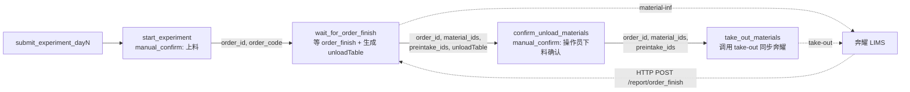

# Peptide Station 新增三个节点：等待订单完成 + 下料确认 + take-out 同步

> 日期: 2026-05-20  
> 目标文件: [peptide_station.py](../unilabos/devices/workstation/bioyond_studio/peptide_station/peptide_station.py)  
> 参考实现:  
> - [bioyond_cell_workstation.py](/Users/dp/python/yxz/unilabos/devices/workstation/bioyond_studio/bioyond_cell/bioyond_cell_workstation.py)（`wait_for_order_finish`、`get_material_info`）
> - [bioyond_rpc.py L782-824](../unilabos/devices/workstation/bioyond_studio/bioyond_rpc.py)（`take_out`）
> - [workstation_architecture.md](../docs/developer_guide/examples/workstation_architecture.md)（HTTP 报送进入 workstation，运行态记录保存在 workstation 内存）
> 状态: 仅需求草稿，不写代码

---

## 一、需求背景

`BioyondPeptideStation` 当前实验流程在 `start_experiment`（manual_confirm 启动调度器）之后即结束，缺少：

1. **等待奔耀回报实验完成**：调度器跑完后，奔耀通过 LIMS 推送 `POST /report/order_finish` 回调；目前 peptide_station 没有把这条推送封装成 action 节点，下游无法在工作流图上等待结果，也拿不到 `usedMaterials` 等下游所需信息。
2. **下料引导**：实验完成后操作员需要把样品/产物从仓位里取出，下料前需要看到每个物料对应的 **仓库 / 位置 / 物料名称 / 数量**；下料完成后还需要回写奔耀（调用 `take-out` 接口），让奔耀清空相应库位状态。

本轮新增三个 action 节点，串在 `start_experiment` 之后：

```text
submit_experiment_dayN
  -> start_experiment(manual_confirm 上料)
  -> wait_for_order_finish (等回调 + 生成 unloadTable)
  -> confirm_unload_materials (manual_confirm 下料确认)
  -> take_out_materials (调用 take-out 同步奔耀)
```

---

## 二、关键设计决策

### D1. 本轮只支持单订单，`order_ids` 只做占位

当前不实现多订单等待、乱序回调缓存、并发 wait 隔离。节点输入以 `order_id` 为主，`order_code` 可作为调试兜底。

`order_ids` 可在 handle/返回值中保留为占位字段，但实现只处理第一笔或直接忽略多订单列表。多订单、乱序回调、跨节点重跑复用缓存放到后续迭代。

### D2. `start_experiment` 需要显式透传订单字段

当前 `start_experiment` 只有输入 handles，缺少输出 handles；如果下游 wait 节点要接在 `start_experiment` 之后，必须让 `start_experiment` 透传：

- `order_id`
- `order_ids`（占位）
- `order_code`
- `resultTable`

实现时给 `start_experiment` 增加对应 `ActionOutputHandle`，并在返回值里保留这些字段。`submit_experiment_dayN` 的 `start_experiment` 嵌套字典也应包含 `order_code`，便于工作流编辑器连线。

### D3. `unloadTable` 必须与 `resultTable` 字段一致

`unloadTable` 不新增 `posX/posY/posZ/unit` 列，直接复用现有 `RESULT_TABLE_COLUMNS` 的四列：

```python
RESULT_TABLE_COLUMNS = [
    {"name": "设备", "key": "whName"},
    {"name": "位置", "key": "locationCode"},
    {"name": "物料名称", "key": "materialName"},
    {"name": "数量", "key": "quantity"},
]
```

`submit_experiment_dayN` 现有上料确认表 `resultTable` 形状如下；`unloadTable` 也必须保持同一 shape，只改 `tableName` 和行数据来源：

```json
{
  "data": [
    {
      "whName": "自动化堆栈",
      "locationCode": "A1",
      "materialName": "96孔板",
      "quantity": "1"
    }
  ],
  "columns": [
    {"name": "设备", "key": "whName"},
    {"name": "位置", "key": "locationCode"},
    {"name": "物料名称", "key": "materialName"},
    {"name": "数量", "key": "quantity"}
  ],
  "tableName": "resultTable"
}
```

`material-info` 官方 schema 中位置坐标字段是 `locations[].x/y/z`，不是 `posX/posY/posZ`。本轮下料表不展示坐标。

### D4. manual_confirm 只做人确认，take-out 放到普通 action

`confirm_unload_materials` 只负责展示下料表、等待操作员确认并透传数据；真正的 `take-out` 调用放到后续普通 action `take_out_materials`。

这样更接近 UniLab manual_confirm 的推荐模式：manual_confirm 是人机确认检查点，副作用由独立普通 action 执行。

### D5. 本轮不做 unload context 缓存

虽然 workstation architecture 文档支持在 workstation 内存保存 HTTP 报送记录，但本轮暂不实现 `unload_context_cache` 或 order report 缓存。

因此本轮限制如下：

- `wait_for_order_finish` 只等待本次进入节点之后到达的 `/report/order_finish`。
- 如果 push 早于 wait 节点到达，本轮不自动补救。
- 如果用户在 `confirm_unload_materials` approve 时忘记勾选，节点失败；当前架构不支持原地重新弹出同一个 manual_confirm，也不在本轮实现失败节点重跑。
- 后续若要支持重跑复用，应在 `BioyondPeptideStation` 实例上新增 station runtime 的 `unload_context_cache`，按 `orderCode` 缓存 `unloadTable/material_ids/order_id` 等上下文。

---

## 三、节点 1：`wait_for_order_finish`（等推送 + 生成 unloadTable）

### 行为

1. 解析单订单目标：
   - 首选 `order_id`。
   - 如果没有 `order_code`，通过 `self.hardware_interface.order_report(order_id)` 取返回数据中的 `code` 作为 `orderCode`。
   - `order_ids` 仅占位，本轮不实现多订单循环。
2. 设置 `self.last_order_code = order_code`、`self.last_order_report = None`，并 `self.order_finish_event.clear()`。
3. 阻塞在 `self.order_finish_event.wait(timeout=timeout_seconds)` 等 LIMS 推送。
4. peptide_station override `process_order_finish_report(report_request, used_materials)`：
   - 先调用 `super().process_order_finish_report(...)` 保留父类行为（状态发布、物料同步等）。
   - 当 `report_request.data.orderCode == self.last_order_code` 时，把 `report_request.data` 存入 `self.last_order_report`，并 `set()` event。
   - 非当前订单推送只记录日志，本轮不缓存。
5. 解除阻塞后解析 `status`：
   - `"30"` -> `success`
   - `"-11"` -> `abnormal_stop`
   - `"-12"` -> `manual_stop`
   - 其它 -> `unknown_<status>`
   - 超时 -> `timeout`
6. 对 `report.usedMaterials[].materialId` 调用 `self.hardware_interface.material_info(material_id)`，带本地函数级 `material_info_cache` 避免重复请求。
7. 组装 `unloadTable`、`material_ids`、`preintake_ids`、`unload_summary` 并作为输出 handles 暴露。

### 入参（goal_default）

| 参数 | 类型 | 说明 |
|------|------|------|
| `order_id` | `str` | 来自 `start_experiment` 透传输出，必填优先 |
| `order_code` | `str` | 调试兜底；若已知 orderCode 可跳过 `order_report` 反查 |
| `order_ids` | `List[str]` | 占位字段；本轮不实现多订单 |
| `timeout_seconds` | `int` | 默认 `36000`（10h） |
| `poll_mode` | `bool` | 默认 `False`；如需要可沿用 bioyond_cell 的轮询等待风格 |

### 输出 handles

| key | data_type | 说明 |
|-----|-----------|------|
| `order_finish_status` | `str` | `success` / `abnormal_stop` / `manual_stop` / `timeout` / `unknown_*` |
| `order_finish_report` | `json` | 完整 `report_request.data` |
| `used_materials` | `json` | JSON 化后的 `usedMaterials` 列表 |
| `material_ids` | `json` | 从 `used_materials` 抽出的 `materialId` 列表，可为空 |
| `preintake_ids` | `json` | 本轮默认 `[]`，保留扩展点 |
| `unloadTable` | `table` | 下料表，字段与 `resultTable` 一致 |
| `unload_summary` | `json` | `{ "order_code": ..., "total_items": N, "missing_material_info": [...] }` |
| `order_id` | `str` | 透传给后续节点 |
| `order_code` | `str` | 透传给后续节点 |
| `order_ids` | `json` | 占位透传 |

### `unloadTable` 组装规则

返回结构：

```json
{
  "data": [
    {
      "whName": "自动化堆栈",
      "locationCode": "A1",
      "materialName": "多肽产物",
      "quantity": "10 mg"
    }
  ],
  "columns": [
    {"name": "设备", "key": "whName"},
    {"name": "位置", "key": "locationCode"},
    {"name": "物料名称", "key": "materialName"},
    {"name": "数量", "key": "quantity"}
  ],
  "tableName": "unloadTable"
}
```

每行字段：

| key | 数据来源 |
|-----|----------|
| `whName` | `material_info.locations` 中匹配 `usedMaterials.locationId` 的 location 的 `whName`；匹配不到取第一条 location 的 `whName`；失败为空串 |
| `locationCode` | 匹配 location 的 `code`；匹配不到取第一条 location 的 `code`；再兜底 `usedMaterials.locationId` |
| `materialName` | `material_info.name`；失败为空串 |
| `quantity` | `usedMaterials.usedQuantity`，若 `material_info.unit` 存在则拼成字符串（如 `"10 mg"`） |

`material-info` 失败时不抛异常，对应行尽量保留 `locationCode` / `quantity`，`whName` 和 `materialName` 用空串，并把 `materialId` 放入 `unload_summary.missing_material_info`。

### 接口依赖

| 接口 | 调用方式 | 用途 |
|------|----------|------|
| `process_order_finish_report` 钩子 | 基类 HTTP 服务已注册 | 接 LIMS push |
| `POST /api/lims/order/order-report` | `self.hardware_interface.order_report(order_id)` | 从 `order_id` 反查 `orderCode` |
| `POST /api/lims/storage/material-info` | `self.hardware_interface.material_info(material_id)` | 查 `whName/locationCode/materialName/unit` |

#### `order_report(order_id)` API 形式

请求：

```json
{
  "apiKey": "B10B5995",
  "requestTime": "2026-05-20T10:50:00.123Z",
  "data": "<orderId UUID>"
}
```

响应中本节点只依赖 `data.code`：

```json
{
  "code": 1,
  "message": null,
  "timestamp": 1779255000000,
  "data": {
    "id": "<orderId UUID>",
    "name": "实验260520-103000",
    "code": "EXP260520-103000",
    "status": 30,
    "statusName": "完成"
  }
}
```

`BioyondV1RPC.order_report(order_id)` 已经返回响应中的 `data`，所以实现中应读取 `raw.get("code")`，不是 `raw["data"]["code"]`。

#### `material_info(material_id)` API 形式

请求：

```json
{
  "apiKey": "B10B5995",
  "requestTime": "2026-05-20T10:50:00.123Z",
  "data": "<materialId UUID>"
}
```

响应中本节点依赖：

```json
{
  "id": "<materialId UUID>",
  "name": "多肽产物",
  "unit": "mg",
  "locations": [
    {
      "id": "<locationId UUID>",
      "whid": "<warehouse UUID>",
      "whName": "自动化堆栈",
      "code": "A1",
      "x": 1,
      "y": 1,
      "z": 1,
      "quantity": 10
    }
  ]
}
```

`BioyondV1RPC.material_info(material_id)` 已经返回响应中的 `data`。字段映射：

| unloadTable key | 来源 |
|-----------------|------|
| `whName` | 匹配 `locationId` 的 `locations[].whName` |
| `locationCode` | 匹配 `locationId` 的 `locations[].code` |
| `materialName` | `name` |
| `quantity` | `usedMaterials[].usedQuantity` + `unit` |

### 实现要点

- `BioyondPeptideStation.__init__` 末尾追加 `self.order_finish_event = threading.Event()`、`self.last_order_code = None`、`self.last_order_report = None`。
- 新增 `process_order_finish_report` override，先 `super()`，再做单订单匹配。
- `used_materials` 参数是 `MaterialUsage` dataclass 列表；输出前必须转成 JSON dict。
- `unloadTable` 复用 `RESULT_TABLE_COLUMNS`，不新增 `UNLOAD_TABLE_COLUMNS`。

---

## 四、节点 2：`confirm_unload_materials`（人工下料确认）

### 行为

1. 接收节点 1 输出的 `order_id` / `order_code` / `material_ids` / `preintake_ids` / `unloadTable`。
2. 进入 `NodeType.MANUAL_CONFIRM` 阻塞，操作员根据 `unloadTable` 物理下料。
3. 操作员勾选 `materials_unloaded=True` 并 approve 后，节点函数体继续。
4. 校验 `materials_unloaded == True`：
   - 为 True：返回确认结果，并透传 `order_id/material_ids/preintake_ids/unloadTable` 给节点 3。
   - 为 False：抛 `RuntimeError("下料未确认，拒绝继续 take-out")`。

### 入参（goal_default）

| 参数 | 类型 | 说明 |
|------|------|------|
| `order_id` | `str` | 来自节点 1，必填 |
| `order_code` | `str` | 来自节点 1，日志/排错用 |
| `material_ids` | `List[str]` | 来自节点 1，可为空 |
| `preintake_ids` | `List[str]` | 来自节点 1，默认 `[]` |
| `unloadTable` | `table` | 来自节点 1，供人工确认展示 |
| `materials_unloaded` | `bool` | manual_confirm 勾选字段，默认 `False` |
| `timeout_seconds` | `int` | 默认 `3600` |
| `assignee_user_ids` | `List[str]` | `placeholder_keys={"assignee_user_ids": "unilabos_manual_confirm"}` |

### 输出 handles

| key | data_type | 说明 |
|-----|-----------|------|
| `unload_confirmed` | `bool` | 是否已人工确认下料 |
| `order_id` | `str` | 透传 |
| `order_code` | `str` | 透传 |
| `material_ids` | `json` | 透传 |
| `preintake_ids` | `json` | 透传 |
| `unloadTable` | `table` | 透传 |

### 实现要点

- 装饰器使用 `node_type=NodeType.MANUAL_CONFIRM`。
- `always_free=True`、`placeholder_keys`、`feedback_interval=300` 与现有 `start_experiment` 保持一致。
- 本节点不调用 `take_out`，只做确认与透传。
- 忘记勾选后不会自动重新显示下料指引；本轮不实现缓存或失败节点原地重跑。

---

## 五、节点 3：`take_out_materials`（调用 take-out 同步奔耀）

### 行为

1. 接收节点 2 透传的 `order_id` / `material_ids` / `preintake_ids`。
2. 校验 `order_id` 非空。
3. 调用 `self.hardware_interface.take_out(order_id, preintake_ids=preintake_ids, material_ids=material_ids)`。
4. 返回 `take_out_result`、`unloaded_count`、`success`。

### 入参

| 参数 | 类型 | 说明 |
|------|------|------|
| `order_id` | `str` | 必填 |
| `material_ids` | `List[str]` | 可为空；为空时由奔耀按 `orderId` 处理的能力以后现场确认 |
| `preintake_ids` | `List[str]` | 可为空，默认 `[]` |
| `order_code` | `str` | 日志/排错用 |

### 输出 handles

| key | data_type | 说明 |
|-----|-----------|------|
| `take_out_result` | `json` | `take-out` 原始响应 `{code, message, timestamp, data}` |
| `unloaded_count` | `int` | `len(material_ids)` |
| `success` | `bool` | `take_out_result.code == 1` 且 `data` 不为 False |

### 接口依赖

| 接口 | 调用方式 | 用途 |
|------|----------|------|
| `POST /api/lims/order/take-out` | `self.hardware_interface.take_out(order_id, preintake_ids, material_ids)` | 通知奔耀同步取出 |

请求体 schema（helper script 已核对）：

```json
{
  "apiKey": "B10B5995",
  "requestTime": "2026-05-20T10:50:00.123Z",
  "data": {
    "orderId": "<UUID>",
    "preintakeIds": [],
    "materialIds": ["<UUID-1>", "<UUID-2>"]
  }
}
```

响应 schema：

```json
{
  "code": 1,
  "message": null,
  "timestamp": 1779255000000,
  "data": true
}
```

`BioyondV1RPC.take_out(...)` 返回完整响应包，因此 `take_out_materials` 应保留原始包到 `take_out_result`。

### 实现要点

- 本轮不修改 `sample_waste_removal`，保持 backward compatibility。
- 新节点只调用现有完整能力的 `take_out(...)`。
- `preintake_ids` / `material_ids` 都按可选列表处理，默认 `[]`。
- `take-out` 返回 `code != 1` 时返回 `success=False` 并记录 warning；是否抛异常留作开放问题。

---

## 六、端到端工作流连线



---

## 七、影响面与兼容性

- **`peptide_station.py`**
  - 修改 `start_experiment`：增加 `order_id/order_code/order_ids/resultTable` 输出 handles，并在返回值透传。
  - 增加 `wait_for_order_finish`、`confirm_unload_materials`、`take_out_materials` 三个 action。
  - 增加 `process_order_finish_report` override。
  - 增加 `_build_unload_table(...)` 等私有辅助方法。
- **`bioyond_rpc.py` 不动**
  - `take_out` 已有完整 schema 能力。
  - `sample_waste_removal` 本轮不改，保持兼容。
- **基类 `station.py` 不动**
  - override 中保留 `super().process_order_finish_report(...)` 调用。
- **HTTP 服务不动**
  - `WorkstationHTTPService` 已支持 `/report/order_finish`。
- **本轮不做缓存**
  - 不新增 `unload_context_cache`。
  - 不支持 push 早于 wait 的自动补救。
  - 不支持失败 manual_confirm 原地重跑。
- **测试**：补在现有路径 `unilabos/devices/workstation/bioyond_studio/peptide_station/tests/test_peptide_station_contracts.py`
  1. `start_experiment` 输出 handles/返回值透传 `order_id/order_code/order_ids/resultTable`。
  2. `process_order_finish_report` orderCode 匹配 / 不匹配时 event 是否触发。
  3. `wait_for_order_finish` 单订单成功、超时、状态映射、`used_materials` JSON 化。
  4. `_build_unload_table` 列顺序严格等于 `RESULT_TABLE_COLUMNS`，且无 `posX/posY/posZ/unit` 列。
  5. `material-info` 失败时不抛异常，`missing_material_info` 正确记录。
  6. `confirm_unload_materials` 未勾选时报错，勾选后透传下游字段且不调用 `take_out`。
  7. `take_out_materials` 调用 `hardware_interface.take_out(order_id, preintake_ids, material_ids)`，不调用 `sample_waste_removal`。

---

## 八、待人类确认的开放问题

1. **过滤产物 vs 全量**：`usedMaterials` 同时包含试剂、耗材、样品（`typeMode` 区分），下料表是否需要默认排除试剂/耗材？当前默认全量列出。
2. **take-out 失败是否阻塞工作流**：本计划暂定返回 `success=False` 并 warning，不抛异常；如果希望奔耀仓位状态必须一致，可改为抛 `RuntimeError`。
3. **后续缓存/重跑能力**：如果要支持 push 早到、忘勾选后重跑复用 `unloadTable`，后续应在 `BioyondPeptideStation` station runtime 上实现 `unload_context_cache`，但本轮不做。
4. **多订单**：本轮只保留 `order_ids` 占位，不实现多订单等待、乱序回调或并发 wait。

---

## 附录 A：API schema 核对摘要

使用 `temp_benyao/scripts/api_helper.py --root temp_benyao/peptide` 核对：

### A.1 `POST /api/lims/storage/material-info`

请求：

```json
{
  "apiKey": "B10B5995",
  "requestTime": "2026-05-20T10:50:00.123Z",
  "data": "<materialId UUID>"
}
```

响应关键字段：

```json
{
  "id": "<materialId UUID>",
  "typeName": "样品",
  "code": "MAT-001",
  "barCode": "BC-001",
  "name": "多肽产物",
  "quantity": 10,
  "lockQuantity": 0,
  "unit": "mg",
  "status": 1,
  "isUse": true,
  "locations": [
    {
      "id": "<locationId UUID>",
      "whid": "<warehouse UUID>",
      "whName": "自动化堆栈",
      "code": "A1",
      "x": 1,
      "y": 1,
      "z": 1,
      "quantity": 10
    }
  ],
  "detail": []
}
```

注意：schema 没有 `posX/posY/posZ`，本轮也不展示坐标。

### A.2 `POST /api/lims/order/take-out`

请求：

```json
{
  "apiKey": "B10B5995",
  "requestTime": "2026-05-20T10:50:00.123Z",
  "data": {
    "orderId": "<orderId UUID>",
    "preintakeIds": [],
    "materialIds": ["<materialId UUID>"]
  }
}
```

响应：

```json
{
  "code": 1,
  "message": null,
  "timestamp": 1779255000000,
  "data": true
}
```

源码中已有 `BioyondV1RPC.take_out(order_id, preintake_ids=None, material_ids=None)`，本轮复用它。

### A.3 `/report/order_finish`

`/report/order_finish` 不在 Peptide JSON OpenAPI specs 中；schema 依据：

- `unilabos/devices/workstation/workstation_http_service.py`
- `temp_benyao/peptide/docs/reference/api_manual.md`

关键字段：

```json
{
  "token": "token-from-lims",
  "request_time": "2026-05-20 10:50:00.123",
  "data": {
    "orderCode": "EXP260520-103000",
    "orderName": "实验260520-103000",
    "startTime": "2026-05-20 09:00:00",
    "endTime": "2026-05-20 10:50:00",
    "status": "30",
    "usedMaterials": [
      {
        "materialId": "<materialId UUID>",
        "locationId": "<locationId UUID>",
        "typeMode": "1",
        "usedQuantity": 10
      }
    ]
  }
}
```

`WorkstationHTTPService` 会把 `usedMaterials[]` 转成 `MaterialUsage` dataclass 列表传给 `process_order_finish_report(report_request, used_materials)`；peptide 输出 `used_materials` handle 前需要转回 JSON dict：

```json
[
  {
    "materialId": "<materialId UUID>",
    "locationId": "<locationId UUID>",
    "typeMode": "1",
    "usedQuantity": 10
  }
]
```

---

## 附录 B：本轮不实现的内容

- 不做 station runtime 的 `unload_context_cache`。
- 不做多订单。
- 不做 push 早到后的补救。
- 不做 failed manual_confirm 原地重跑。
- 不改前端。
- 不改 `sample_waste_removal`。
