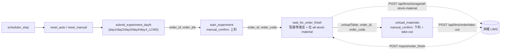

# Peptide 工作站新增「等待订单完成」+「人工下料」两个节点 Plan

> 日期: 2026-05-20（v2 修订: 2026-05-28 改为 deep_clone sirna v2 实现）
> 目标文件: [`unilabos/devices/workstation/bioyond_studio/peptide_station/peptide_station.py`](../unilabos/devices/workstation/bioyond_studio/peptide_station/peptide_station.py)
> 共享 RPC: [`unilabos/devices/workstation/bioyond_studio/bioyond_rpc.py`](../unilabos/devices/workstation/bioyond_studio/bioyond_rpc.py)
> 基类回调链: [`unilabos/devices/workstation/bioyond_studio/station.py`](../unilabos/devices/workstation/bioyond_studio/station.py) `process_order_finish_report`
> 参考实现（**deep_clone 来源**）:
> - [`Uni-Lab-OS-sirna/unilabos/devices/workstation/bioyond_studio/sirna_station/sirna_station.py`](../../Uni-Lab-OS-sirna/unilabos/devices/workstation/bioyond_studio/sirna_station/sirna_station.py) commit `38963ef`
> - [`Uni-Lab-OS-sirna/plan/2026-05-26_sirna_wait_finish_and_unload_nodes_plan.md`](../../Uni-Lab-OS-sirna/plan/2026-05-26_sirna_wait_finish_and_unload_nodes_plan.md) v2
> 状态: 仅设计，不写代码

---
## 一、需求背景

多肽工作站现有节点链：

```
scheduler_stop  →  reset_auto/reset_manual  →  submit_experiment_dayN  →  start_experiment(manual_confirm 上料)
```

其中 `start_experiment`（[peptide_station.py:917-935](../unilabos/devices/workstation/bioyond_studio/peptide_station/peptide_station.py)）是 `manual_confirm` 节点，操作员勾选 `materials_loaded=True` 后调用 `rpc.scheduler_start()`。工作流图到此结束 — 缺**任务等待**和**人工下料**两个收尾节点。

业务诉求与 sirna 工作站完全一致（sirna 同主题已完成，commit `38963ef`）：

1. **`wait_for_order_finish`**：阻塞等待奔耀通过 `POST /report/order_finish` 推送任务完成。匹配到当前 orderCode 后，立即调用 `POST /api/lims/storage/all-stock-material` 拉取该 orderId 当前实验台上所有物料，整理成下料指引表传给下游。
2. **`unload_materials`**：`manual_confirm` 节点。展示上一节点整理好的物料表给操作员，物理取出后勾选 `materials_unloaded=True`，本节点调用 `POST /api/lims/order/take-out` 通知奔耀下料完成。

> 多肽工作站此前（v1 草稿，[L993-1082 wait_for_order_finish](../unilabos/devices/workstation/bioyond_studio/peptide_station/peptide_station.py) + [L1101-1155 unload_materials](../unilabos/devices/workstation/bioyond_studio/peptide_station/peptide_station.py)）已自行实现过一版，但走的是「per-item `material_info` 反查 + 多订单循环 + take-out 传具体 ID 列表」的复杂路径；v2 决定**整体废弃 v1 实现**，直接 deep_clone sirna 38963ef 的简化版（all-stock-material + 4 列下料表 + take-out 传 `[]`/`[]`）。

---

## 二、关键决策（已确认）

| # | 决策 | 取值 |
|---|------|------|
| 1 | 实现策略 | **deep_clone sirna 38963ef**：方法名/常量名/字段名/伪代码逻辑全部按 sirna 一字一致复刻，仅替换日志前缀 `[sirna]` → `[peptide]`、类名 `BioyondSirnaStation` → `BioyondPeptideStation`，不做"按多肽习惯重命名"或"折中复用"。 |
| 2 | 下料节点交互形式 | **manual_confirm**：阻塞展示物料表→等待操作员勾选→调用 take-out。 |
| 3 | take-out 的 `preintakeIds` / `materialIds` 来源 | **传 `[]` / `[]`**：只传 `orderId`，让奔耀按订单决定取出范围。废弃 v1 的 `_collect_material_ids`/`_collect_preintake_ids` 逻辑。 |
| 4 | `all-stock-material` 的 `orderId` 来源 | **wait 节点入参 `order_id`**：直接接上游 `start_experiment.order_id`；不从 `/report/order_finish` 报文反推。 |
| 5 | 下料表列结构 | sirna v2 的 **4 列**：设备 / 位置 / 物料名称 / 数量，数据来自 `all-stock-material` 返回的 `locations[*].whName/code` + `name` + `quantity`。**废弃** peptide 现存 6 列结构（whName/posX/posY/posZ/unit/materialName）。 |
| 6 | 多订单 | wait 节点 v1 不做并发等待；`order_ids.length > 1` 且未指定 `order_id`/`order_code` → raise（与 sirna v2 一致）。 |
| 7 | v1 helper 命名约定 | **不保留**。9 个 v1 私有方法（`_wait_single_order_finish` / `_extract_used_materials` / `_collect_material_ids` / `_collect_preintake_ids` / `_build_unload_rows` / `_fetch_material_info_cached` / `_first_location` / `_stringify_coord` / `_compose_unload_table`）整体删除，由 sirna 的 3 个新 helper 替代。 |

> 决策 1 是本 plan 与 v1 草稿最大的语义差别 —— 不再"借鉴 sirna 思路 + 保留 peptide 命名"，而是**整段 verbatim 复刻**。优势：减少未来 sirna/peptide 双线维护成本，bug fix 可以直接两边拉同一份 patch。
>
> 决策 5 注意：peptide 现有 [`UNLOAD_TABLE_COLUMNS`（L128-135）](../unilabos/devices/workstation/bioyond_studio/peptide_station/peptide_station.py) 是 6 列 v1 格式，**必须替换**为 sirna v2 的 4 列；同时删除 [`UNLOAD_TABLE_COLUMNS_MULTI_ORDER`（L136-139）](../unilabos/devices/workstation/bioyond_studio/peptide_station/peptide_station.py)。

---

## 三、新增 / 修改的接口与代码

### 3.1 `bioyond_rpc.py` 新增 `all_stock_material` RPC 方法

**deep_clone 来源**：[`Uni-Lab-OS-sirna/unilabos/devices/workstation/bioyond_studio/bioyond_rpc.py:132-179`](../../Uni-Lab-OS-sirna/unilabos/devices/workstation/bioyond_studio/bioyond_rpc.py)（41 行有效代码）

操作：在 peptide [`bioyond_rpc.py`](../unilabos/devices/workstation/bioyond_studio/bioyond_rpc.py) 中现有 `stock_material` 方法之后**追加**完全相同的实现，不删不改既有方法。

签名：

```python
def all_stock_material(self, json_str: str) -> list:
    """拉取订单当前实验台上的全部物料（isUse=true/false）。

    json_str 示例:
        '{"orderId": "<uuid>", "typeMode": 0}'   # typeMode 可选，缺省返回全部类型

    返回:
        list[dict]: 失败或 code != 1 时返回空 list；
                    成功时返回 response['data']（数组），每项含 id/code/name/typeMode/locations 等。
    """
```

实现要点（与 sirna 完全一致）：

- `params = json.loads(json_str)`；`json.JSONDecodeError` 或缺 `orderId` 时记 `self._logger.error` 后返回 `[]`。
- POST 到 `f"{self.host}/api/lims/storage/all-stock-material"`，请求体包 `{"apiKey", "requestTime", "data": params}`。
- `response.code != 1` 返回 `[]`。

> 不复用 `stock_material`：URL 不同（`all-stock-material` vs `stock-material`），入参不同（必填 `orderId` + 可选 `typeMode` vs `typeMode/filter/includeDetail`），返回语义不同（`isUse=true/false` 全部返回 + 新增 `typeMode` 字段）。

### 3.2 `BioyondPeptideStation.__init__` 补 `last_used_materials` 字段

peptide 现状（[L338-340](../unilabos/devices/workstation/bioyond_studio/peptide_station/peptide_station.py)）已有：

```python
self.order_finish_event = threading.Event()
self.last_order_code: Optional[str] = None
self.last_order_report: Optional[Dict[str, Any]] = None
```

**唯一需要补**：

```python
self.last_used_materials: List[Any] = []
```

放在 `last_order_report` 那一行后面。

> sirna `__init__`（[L423-426](../../Uni-Lab-OS-sirna/unilabos/devices/workstation/bioyond_studio/sirna_station/sirna_station.py)）四个字段是连续 4 行；peptide 已有前 3 个，只差这一个。
>
> `import threading` / `import time` peptide 顶部 [L11-12](../unilabos/devices/workstation/bioyond_studio/peptide_station/peptide_station.py) 已存在，无需新增。

### 3.3 用 sirna v2 整段替换 `process_order_finish_report` override

peptide 现状：[L937-974](../unilabos/devices/workstation/bioyond_studio/peptide_station/peptide_station.py) 已有一版自写实现，逻辑接近 sirna 但**不存** `last_used_materials`，且日志格式与 sirna 不同。

操作：**整段删除 L937-974，原位**逐字复刻 sirna [L442-485](../../Uni-Lab-OS-sirna/unilabos/devices/workstation/bioyond_studio/sirna_station/sirna_station.py)，仅做两处替换：

- 日志前缀 `[sirna]` → `[peptide]`
- docstring 不变（"Override 基类 ``/report/order_finish`` 回调…" 即可，不必加"多肽场景"前缀）

复刻后的代码骨架（伪代码视角，**实际以 sirna L442-485 为准**）：

```python
def process_order_finish_report(self, report_request, used_materials=None):
    materials = list(used_materials or [])
    try:
        base_result = super().process_order_finish_report(report_request, materials)
    except Exception as exc:
        logger.error(f"[peptide] 基类 process_order_finish_report 抛错: {exc}", exc_info=True)
        base_result = {"processed": False, "error": str(exc)}

    data = getattr(report_request, "data", None) or {}
    order_code = str(data.get("orderCode") or "")
    status = data.get("status")

    self.last_order_report = data
    self.last_used_materials = materials      # ← v1 没存，v2 必须存

    logger.info(
        f"[peptide] /report/order_finish 收到: orderCode={order_code} status={status} "
        f"expected={self.last_order_code!r} used_materials={len(materials)}"
    )

    if self.last_order_code and order_code == self.last_order_code:
        logger.info("[peptide] order_finish orderCode 匹配，触发 order_finish_event")
        self.order_finish_event.set()
    else:
        logger.info(
            f"[peptide] order_finish orderCode 不匹配当前等待项，仅记录 "
            f"(expected={self.last_order_code!r} got={order_code!r})"
        )
    return base_result
```

关键点（与 sirna v2 §3.3 一字一致）：

- **必须先调 `super().process_order_finish_report(...)`**：保留基类 `_publish_task_status` 和 `resource_synchronizer.sync_from_external()` 副作用（[`station.py`](../unilabos/devices/workstation/bioyond_studio/station.py) `process_order_finish_report` 内 status==30 时触发同步）。
- `used_materials` 默认 `None` → `[]`，避免单元测试不传时崩。
- orderCode 严格相等才 `set()`；不匹配仅日志。
- 推送可能在 `wait_for_order_finish` 入口设置 `last_order_code` 之前就到达 → 此时不会触发 event；这是已知边界，详见 §十-3。

### 3.4 给 `start_experiment` 补 `order_code` 输出 handle

peptide 现状（[L901-915](../unilabos/devices/workstation/bioyond_studio/peptide_station/peptide_station.py)）输出 handles：

| 现有 key | 现有 data_type | 现有 data_key |
|---------|----------------|--------------|
| `order_id`     | `bioyond_order_id`     | `order_id`     |
| `order_ids`    | `bioyond_order_ids`    | `order_ids`    |
| `resultTable`  | `table`                | `resultTable`  |

**新增**（最小增量，不动既有 3 个）：

| 新增 key | data_type | label | data_key |
|---------|-----------|-------|----------|
| `order_code` | `bioyond_order_code` | 订单编号 | `order_code` |

同时在 `start_experiment` 返回字典（[L928-934](../unilabos/devices/workstation/bioyond_studio/peptide_station/peptide_station.py)）里补：

```python
result["order_code"] = ""  # peptide 当前 _run_scheduler_action 不返回 order_code；先占位空串
```

> sirna 同位置（[start_experiment L1351-1439](../../Uni-Lab-OS-sirna/unilabos/devices/workstation/bioyond_studio/sirna_station/sirna_station.py)）能从 `start_info` 直接拿到 `order_code` 字段；peptide 的 `_run_scheduler_action` 未返回该字段，因此 v1 阶段**先占位空串**，让 wait 节点走它内部的 `rpc.order_report(order_id).code` 兜底反查路径（与 sirna v2 §4.2 第 1 步逻辑一致）。后续如果 peptide submit_experiment_dayN 想直接把 `order_code` 顺出来，可以在独立 plan 里推进，本 plan 不做。

---

## 四、节点 1：`wait_for_order_finish`（阻塞等待 + 整理物料）

### 4.1 整体策略

**deep_clone 源**：sirna [L1532-1679](../../Uni-Lab-OS-sirna/unilabos/devices/workstation/bioyond_studio/sirna_station/sirna_station.py)（148 行）

操作：

1. **删除**peptide 现有 `wait_for_order_finish`（[L993-1082](../unilabos/devices/workstation/bioyond_studio/peptide_station/peptide_station.py)，共 90 行）。
2. **原位**逐字复刻 sirna L1532-1679，仅做：
   - 日志前缀 `[sirna]` → `[peptide]`
   - 装饰器 `description` 中的"sirna" 字样改"多肽"（如有）
   - 不改方法名、参数名、参数顺序、handles 顺序、返回字典 key 顺序

### 4.2 装饰器（复刻自 sirna，列于此处便于审阅）

```python
@action(
    always_free=True,
    goal_default={
        "order_id": "",
        "order_code": "",
        "timeout_seconds": 36000,
        "poll_mode": True,
    },
    description="阻塞等待奔耀 /report/order_finish 推送，并通过 all-stock-material 整理下料指引表",
    handles=[
        ActionInputHandle(key="order_id",   data_type="bioyond_order_id",   label="实验ID",
                          data_key="order_id",   data_source=DataSource.HANDLE, io_type="source"),
        ActionInputHandle(key="order_ids",  data_type="bioyond_order_ids",  label="实验ID列表",
                          data_key="order_ids",  data_source=DataSource.HANDLE, io_type="source"),
        ActionInputHandle(key="order_code", data_type="bioyond_order_code", label="订单编号",
                          data_key="order_code", data_source=DataSource.HANDLE, io_type="source"),
        ActionOutputHandle(key="order_id",            data_type="bioyond_order_id",     label="实验ID",
                           data_key="order_id",            data_source=DataSource.EXECUTOR),
        ActionOutputHandle(key="order_code",          data_type="bioyond_order_code",   label="订单编号",
                           data_key="order_code",          data_source=DataSource.EXECUTOR),
        ActionOutputHandle(key="order_finish_status", data_type="string",               label="完成状态",
                           data_key="order_finish_status", data_source=DataSource.EXECUTOR),
        ActionOutputHandle(key="order_finish_report", data_type="object",               label="订单完成推送报文",
                           data_key="order_finish_report", data_source=DataSource.EXECUTOR),
        ActionOutputHandle(key="used_materials",      data_type="array",                label="使用物料列表",
                           data_key="used_materials",      data_source=DataSource.EXECUTOR),
        ActionOutputHandle(key="all_stock_materials", data_type="array",                label="实验台全部物料",
                           data_key="all_stock_materials", data_source=DataSource.EXECUTOR),
        ActionOutputHandle(key="unloadTable",         data_type="object",               label="下料指引表",
                           data_key="unloadTable",         data_source=DataSource.EXECUTOR, io_type="target"),
    ],
)
def wait_for_order_finish(
    self,
    order_id: str = "",
    order_code: str = "",
    timeout_seconds: int = 36000,
    poll_mode: bool = True,
    **kwargs: Any,
) -> Dict[str, Any]:
    ...
```

### 4.3 主流程（伪代码 — 实际以 sirna L1532-1679 为准）

```text
1. resolve order_id / order_code（_kwarg_text 兜底）
   - order_id 必填（用于推送匹配的兜底反查 + 调用 all-stock-material）：
        若未提供，且 order_ids 长度==1，取 order_ids[0]；
        若 order_ids 长度>1 且未指定 order_id/order_code → raise（避免误选订单）
   - 若 order_code 为空且 order_id 非空：
        report = rpc.order_report(order_id) 现有路径
        order_code = report.get("code") or report.get("orderCode") or ""
   - 若 order_code 仍为空 → raise

2. 准备等待状态
   self.last_order_code = order_code
   self.last_order_report = None
   self.last_used_materials = []
   self.order_finish_event.clear()

3. 阻塞等待
   if poll_mode:
       0.5s 轮询 self.order_finish_event.is_set() + 超时（让出 ROS2 feedback 派发线程）
   else:
       self.order_finish_event.wait(timeout=timeout_seconds)
   超时 → status="timeout"，跳到步骤 6 用空报文返回。

4. 解析推送状态（顶层常量 ORDER_FINISH_STATUS_MAP）
   raw_status = str(self.last_order_report.get("status", ""))
   status = ORDER_FINISH_STATUS_MAP.get(raw_status, f"unknown_{raw_status}" if raw_status else "missing_status")

5. 拉取实验台物料（用 order_id，不是 order_code！）
   仅 status in {success, abnormal_stop, manual_stop} 时调用，timeout/未知状态跳过。
   rpc = self._require_hardware_interface("all_stock_material")
   all_materials_json = json.dumps({"orderId": order_id}, ensure_ascii=False)
   all_materials = rpc.all_stock_material(all_materials_json) or []

6. 整理 unloadTable（4 列：设备/位置/物料名称/数量）
   unload_rows = self._build_unload_rows_from_all_stock_material(all_materials)
   unloadTable = self._build_unload_table(unload_rows)

7. 返回
   return {
       "success": status in {"success", "abnormal_stop", "manual_stop"},
       "order_id":              order_id,
       "order_code":            order_code,
       "order_finish_status":   status,
       "order_finish_report":   self.last_order_report or {},
       "used_materials":        [self._used_material_to_dict(m) for m in self.last_used_materials],
       "all_stock_materials":   all_materials,
       "unloadTable":           unloadTable,
       "confirmation_message":  f"任务完成: status={status}; 已整理 {len(unload_rows)} 行下料指引",
   }
```

### 4.4 顶层常量改造（peptide_station.py [L122-145](../unilabos/devices/workstation/bioyond_studio/peptide_station/peptide_station.py)）

| 常量 | 当前 | 操作 |
|------|------|------|
| `RESULT_TABLE_COLUMNS` (L122) | 4 列上料表 | **保留**，不动 |
| `UNLOAD_TABLE_COLUMNS` (L128) | **6 列 v1**: `whName/posX/posY/posZ/unit/materialName` | **整段替换为 sirna v2 4 列**: `whName/locationCode/materialName/quantity`（设备/位置/物料名称/数量）|
| `UNLOAD_TABLE_COLUMNS_MULTI_ORDER` (L136) | 多订单 7 列 | **整段删除**（v2 不再支持多订单下料场景） |
| `ORDER_FINISH_STATUS_MAP` | **缺** | **新增**，复刻 sirna [L182-186](../../Uni-Lab-OS-sirna/unilabos/devices/workstation/bioyond_studio/sirna_station/sirna_station.py) `{"30":"success","-11":"abnormal_stop","-12":"manual_stop"}` |
| `MATERIAL_TYPE_ORDER` (L140) | `("Sample","Consumables","Reagent")` | **保留**（2026-06-01 实施时纠正：该常量实际被上料表构建器 `_build_result_table` L1774 使用，并非 v1 unload 孤儿；删除会破坏上料表，故保留） |
| `PEPTIDE_SAMPLE_FILE_KEY` / `DAY1_CEM_METHOD_KEY` / `DAY1_CEM_METHOD_DEFAULT` | 多肽 day1 业务常量 | **保留**，不动 |

替换后 `UNLOAD_TABLE_COLUMNS`（与 sirna 一字一致）：

```python
UNLOAD_TABLE_COLUMNS: List[Dict[str, str]] = [
    {"name": "设备",     "key": "whName"},
    {"name": "位置",     "key": "locationCode"},
    {"name": "物料名称", "key": "materialName"},
    {"name": "数量",     "key": "quantity"},
]

ORDER_FINISH_STATUS_MAP: Dict[str, str] = {
    "30": "success",
    "-11": "abnormal_stop",
    "-12": "manual_stop",
}
```

### 4.5 多订单情况

完全沿用 sirna v2 决策：

- `order_ids.length > 1` 且未指定 `order_id`/`order_code` → raise，提示「请指定 order_id」。
- 工作流图层面：未来如要并发等多订单，让上层多拉几个 `wait_for_order_finish` 节点并行。
- 这条决策必须写在节点 `description` 第二行（deep_clone sirna 即可）。

---

## 五、节点 2：`unload_materials`（manual_confirm + take-out）

### 5.1 整体策略

**deep_clone 源**：sirna [L1764-1825](../../Uni-Lab-OS-sirna/unilabos/devices/workstation/bioyond_studio/sirna_station/sirna_station.py)（62 行）

操作：

1. **删除** peptide 现有 `unload_materials`（[L1101-1155](../unilabos/devices/workstation/bioyond_studio/peptide_station/peptide_station.py)，共 55 行）。
2. **原位**逐字复刻 sirna L1764-1825，仅改日志前缀。

### 5.2 装饰器（复刻自 sirna）

```python
@action(
    always_free=True,
    node_type=NodeType.MANUAL_CONFIRM,
    placeholder_keys={
        "unloadTable":        "unilabos_manual_confirm",
        "assignee_user_ids":  "unilabos_manual_confirm",
    },
    goal_default={
        "order_id":          "",
        "materials_unloaded": False,
        "timeout_seconds":    3600,
        "assignee_user_ids":  [],
    },
    feedback_interval=300,
    description=(
        "展示上一节点整理的下料指引表；操作员物理取出后勾选 materials_unloaded=True，"
        "本节点再调用 /api/lims/order/take-out 通知奔耀下料完成。"
    ),
    handles=[
        ActionInputHandle(key="order_id",            data_type="bioyond_order_id",     label="实验ID",
                          data_key="order_id",            data_source=DataSource.HANDLE, io_type="source"),
        ActionInputHandle(key="order_code",          data_type="bioyond_order_code",   label="订单编号",
                          data_key="order_code",          data_source=DataSource.HANDLE, io_type="source"),
        ActionInputHandle(key="unloadTable",         data_type="object",               label="下料指引表",
                          data_key="unloadTable",         data_source=DataSource.HANDLE, io_type="source"),
        ActionInputHandle(key="used_materials",      data_type="array",                label="使用物料列表",
                          data_key="used_materials",      data_source=DataSource.HANDLE, io_type="source"),
        ActionInputHandle(key="order_finish_report", data_type="object",               label="订单完成推送报文",
                          data_key="order_finish_report", data_source=DataSource.HANDLE, io_type="source"),
        ActionOutputHandle(key="success",         data_type="boolean",            label="是否成功",
                           data_key="success",         data_source=DataSource.EXECUTOR),
        ActionOutputHandle(key="order_id",        data_type="bioyond_order_id",   label="实验ID",
                           data_key="order_id",        data_source=DataSource.EXECUTOR),
        ActionOutputHandle(key="take_out_result", data_type="object",             label="take-out 返回包",
                           data_key="take_out_result", data_source=DataSource.EXECUTOR),
    ],
)
def unload_materials(
    self,
    order_id: str = "",
    materials_unloaded: bool = False,
    timeout_seconds: int = 3600,
    assignee_user_ids: Optional[List[str]] = None,
    **kwargs: Any,
) -> Dict[str, Any]:
    ...
```

### 5.3 主流程（伪代码 — 实际以 sirna L1764-1825 为准）

```text
1. del timeout_seconds, assignee_user_ids   # 框架参数，本动作不用
   order_id = (order_id or "").strip() or self._kwarg_text(kwargs, "order_id")

2. 校验：上一节点必须传 order_id；缺即 raise
   if not order_id:
       raise ValueError("unload_materials 需要 order_id（请连上 wait_for_order_finish.order_id）")

3. 人工确认门禁
   if not self._as_manual_gate(materials_unloaded):
       raise RuntimeError("下料未确认，拒绝调用 take-out")

4. 调 take-out（关键决策：传空 ID 列表）
   rpc = self._require_hardware_interface("take_out")
   self._require_rpc_method(rpc, "take_out")
   take_out_response = rpc.take_out(order_id, [], [])
   success = bool(take_out_response.get("code") == 1) if isinstance(take_out_response, dict) else False

5. 返回
   return {
       "success":         success,
       "order_id":        order_id,
       "take_out_result": take_out_response,
       "confirmation_message": (
           "下料确认，已通知奔耀 take-out 成功"
           if success
           else "下料确认，但 take-out 返回失败/异常，请检查 LIMS 状态"
       ),
   }
```

### 5.4 与 peptide 现有 `end_experiment` 的关系

peptide 当前的 `end_experiment`（如有，类似 sirna 结构）做的是清理本地 deck 资源树（按 `unilabos_extra.order_id` 过滤后 remove 资源），不调 take-out。

`unload_materials` 与 `end_experiment` **职责不重叠**：

- `unload_materials`：通知奔耀「下料完成」（外部副作用）。
- `end_experiment`：清空本地 PLR 资源树（内部副作用）。

工作流图上两者可以并存或择一，**本 plan 不删除 `end_experiment`**。

---

## 六、待删的 v1 私有 helper（[L1836-1997](../unilabos/devices/workstation/bioyond_studio/peptide_station/peptide_station.py)）

| 行号 | helper | 唯一调用方 | 处置 |
|------|--------|-----------|------|
| L1836-1878 | `_wait_single_order_finish` | v1 wait_for_order_finish | **删除** |
| L1880-1895 | `_resolve_order_code` | v1 wait_for_order_finish ([L1028](../unilabos/devices/workstation/bioyond_studio/peptide_station/peptide_station.py)) | **删除**（deep_clone 后孤儿） |
| L1897-1904 | `_extract_used_materials` | v1 wait | **删除** |
| L1907-1913 | `_collect_material_ids` | v1 unload | **删除** |
| L1916-1922 | `_collect_preintake_ids` | v1 unload | **删除** |
| L1924-1950 | `_build_unload_rows` | v1 wait | **删除**（被 sirna `_build_unload_rows_from_all_stock_material` 取代） |
| L1952-1971 | `_fetch_material_info_cached` | v1 wait（per-item `material_info` 反查） | **删除** |
| L1973-1979 | `_first_location` | v1 helper 链 | **删除** |
| L1982-1988 | `_stringify_coord` | v1 helper 链 | **删除** |
| L1991-1997 | `_compose_unload_table` | v1 wait（多订单合表） | **删除**（被 sirna `_build_unload_table` 取代） |
| **L2118-2125** | **`_extract_order_ids`** | submit_experiment_dayN ([L926](../unilabos/devices/workstation/bioyond_studio/peptide_station/peptide_station.py)) + v1 wait ([L1009](../unilabos/devices/workstation/bioyond_studio/peptide_station/peptide_station.py)) | **保留**（删 v1 wait 后 submit 仍需要） |

> 删除 `_resolve_order_code` 是 deep_clone 的副作用：sirna v2 wait 节点改用 `rpc.order_report(order_id)` 内联反查，不再走 helper。

---

## 七、新增的 helper（来自 sirna v2 deep_clone）

在 `BioyondPeptideStation` 类内**追加**3 个静态方法（建议放在文件尾部 helper 区块）：

| sirna 行号 | helper | 行数 | 作用 |
|-----------|--------|------|------|
| [L3522-3567](../../Uni-Lab-OS-sirna/unilabos/devices/workstation/bioyond_studio/sirna_station/sirna_station.py) | `_build_unload_rows_from_all_stock_material(all_materials)` | 46 | 把 `all-stock-material` 返回数组 → 4 列 unload_rows，同名物料多库位按 location 拆多行，空 location 占位一行 |
| [L3570-3579](../../Uni-Lab-OS-sirna/unilabos/devices/workstation/bioyond_studio/sirna_station/sirna_station.py) | `_build_unload_table(unload_rows, table_name="下料指引")` | 10 | 按 `UNLOAD_TABLE_COLUMNS` 渲染 `data/columns/tableName` 三段 |
| [L3582-3594](../../Uni-Lab-OS-sirna/unilabos/devices/workstation/bioyond_studio/sirna_station/sirna_station.py) | `_used_material_to_dict(m)` | 13 | 把 `used_materials` 中混杂的 dataclass/dict 统一序列化为 dict（透传给 `wait.used_materials` 输出 handle） |

3 个方法逐字复刻、不改名、不调整签名。

---

## 八、端到端工作流连线（更新后）



---

## 九、影响面与兼容性

| 文件 | 改动 | 风险 |
|------|------|------|
| `unilabos/devices/workstation/bioyond_studio/bioyond_rpc.py` | 新增 `all_stock_material()` 一个方法 | 仅新增；其他工作站不受影响 |
| `unilabos/devices/workstation/bioyond_studio/peptide_station/peptide_station.py` | ① 顶部常量：替换 `UNLOAD_TABLE_COLUMNS` 为 4 列 + 删 `UNLOAD_TABLE_COLUMNS_MULTI_ORDER` + 删 `MATERIAL_TYPE_ORDER` + 新增 `ORDER_FINISH_STATUS_MAP`；② `__init__` 末尾补 `last_used_materials`；③ 整段替换 `process_order_finish_report`；④ 删除 `wait_for_order_finish` + `unload_materials` v1 实现 + 9 个 v1 helper（保留 `_extract_order_ids`），原位复刻 sirna v2 节点 + 3 个 helper；⑤ `start_experiment` 输出 handle 新增 `order_code` + 返回字典补 `order_code` 占位 | `start_experiment` 输出 handle 新增是兼容性最敏感的点；`UNLOAD_TABLE_COLUMNS` 列结构变更可能影响**仅依赖该常量结构的旧测试或前端渲染逻辑** — 必须在 §十一 测试里逐项覆盖 |
| `unilabos/devices/workstation/bioyond_studio/station.py` | **不动** | override 中保留 `super().process_order_finish_report()` 调用 |
| `unilabos/devices/workstation/workstation_http_service.py` | **不动** | 基类已注册 `/report/order_finish` 路由 |
| `unilabos/devices/workstation/bioyond_studio/peptide_station/tests/test_peptide_station_contracts.py` | 删除 9 个 v1 测试用例（[L988-1190](../unilabos/devices/workstation/bioyond_studio/peptide_station/tests/test_peptide_station_contracts.py)），新增对应 v2 用例（参照 sirna `test_sirna_wait_unload.py`） | 测试覆盖必须保持或提升 |

兼容性要点：

1. peptide 现有 HTTP 服务由基类 `BioyondWorkstation.post_init` 启动 `WorkstationHTTPService`，本 plan **不引入** peptide 专属 HTTP 服务。
2. `process_order_finish_report` override 严格保留 `super()` 调用顺序，**保证基类的 `resource_synchronizer.sync_from_external()` 副作用仍在 status==30 下触发**。
3. `start_experiment` 输出 handle 新增 `order_code` 是**纯新增字段**，不删除/重命名既有 handle。
4. `wait_for_order_finish` / `unload_materials` 与 `end_experiment` 并存。
5. 删除 `UNLOAD_TABLE_COLUMNS_MULTI_ORDER` 后，**禁止**未来再引入"多订单合并下料表"——多订单场景统一走"多个 wait 节点并行 + 多个 unload 节点并行"工作流图。

---

## 十、节点 1 / 节点 2 接收数据竞态边界

| 边界 | 行为 | 备注 |
|------|------|------|
| 推送先到（在 `wait_for_order_finish` 设置 `last_order_code` 之前） | `process_order_finish_report` 中 `self.last_order_code` 为空，不触发 event；`self.last_order_report` 仍记录到，但 wait 节点之后 `event.wait()` 走超时路径 | 建议工作流图上保证 `start_experiment.scheduler_start` 调用与 `wait_for_order_finish` 节点入口足够靠近，降低概率；v1 不强行 buffer 历史 push |
| 多个 wait 节点并发等不同 orderCode | 单 process 内 `self.order_finish_event` 只有一个 → 多 wait 互相覆盖 | v1 不支持并发 wait；如需并发，独立 plan 推进（需把 event 改成按 orderCode 维度的 dict） |
| `all-stock-material` 推送时刻已经 take-out 过的物料 | `isUse=true` 仍会返回；操作员仍能看到、勾选下料 | v1 不过滤 `isUse=false`，让操作员看全部 |

---

## 十一、测试计划

### 11.1 待删的 peptide v1 测试（[`test_peptide_station_contracts.py`](../unilabos/devices/workstation/bioyond_studio/peptide_station/tests/test_peptide_station_contracts.py)）

| 行号 | 测试函数 | 删除原因 |
|------|---------|---------|
| L988 | `test_process_order_finish_report_triggers_event_on_match` | v2 process_order_finish_report 整体替换，断言细节不一致 |
| L997 | `test_process_order_finish_report_ignores_mismatched_order_code` | 同上 |
| L1006 | `test_wait_for_order_finish_returns_immediately_when_event_set` | v2 wait 返回字典形态变了（新增 `all_stock_materials`/`unloadTable`/`order_finish_report` 等） |
| L1057 | `test_wait_for_order_finish_returns_timeout_status` | 同上 |
| L1073 | `test_wait_for_order_finish_records_missing_material_info` | v2 wait 不再调 per-item `material_info`，断言无效 |
| L1124 | `test_unload_materials_blocks_when_not_confirmed` | v2 unload 入参/校验路径变了 |
| L1136 | `test_unload_materials_calls_take_out_with_resolved_lists` | v2 take-out 传 `[]/[]`，"resolved_lists" 语义已废弃 |
| L1156 | `test_unload_materials_does_not_raise_when_take_out_fails` | 同上 |
| L1185 | `test_unload_table_columns_constant_layout` | v2 列结构 6→4 列，断言彻底失效 |

### 11.2 新增的 peptide v2 测试

**位置（2026-05-29 锁定）**：所有 v2 新增测试集中放在新文件 [`unilabos/devices/workstation/bioyond_studio/peptide_station/tests/test_peptide_wait_unload.py`](../unilabos/devices/workstation/bioyond_studio/peptide_station/tests/test_peptide_wait_unload.py) — 包括 RPC 层的 `all_stock_material` payload 测试和 station 层的 wait/unload/process_order_finish_report 测试。不拆分多文件，与现有 `test_peptide_station_contracts.py`（保留 v1 删完后剩余的 ~58 个用例）解耦。

| 测试 | 覆盖 |
|------|------|
| `all_stock_material` payload | URL = `/api/lims/storage/all-stock-material`；data 含 `orderId`；缺 `orderId` → 返回 `[]` 且记日志；JSON 解析失败 → 返回 `[]`；code != 1 → 返回 `[]` |
| `process_order_finish_report` override | ① super() 必被 mock 验证；② orderCode 匹配 → `event.is_set()`；③ 不匹配 → `event` 仍未置位；④ `last_used_materials` 被记录 |
| `wait_for_order_finish` 事件路径 | ① 事件提前 set + status="30" → success；② 超时 → status=`timeout`、success=False、不调 `all_stock_material`；③ status=`-11` → `abnormal_stop`、仍调 `all_stock_material` |
| `wait_for_order_finish` 入参兜底 | ① 只传 `order_id` 不传 `order_code`：mock `order_report` 返回 `{"code":"EXP-001"}` resolve OK；② 都不传 → raise；③ `order_ids.length>1` 且未指定 → raise |
| `wait_for_order_finish` `unloadTable` 整理 | 给 fake rpc 灌 1 条带 `locations[0].whName/code`、`name`、`quantity` 的物料 → `unloadTable.data` 含正确 4 列；`columns == UNLOAD_TABLE_COLUMNS` 引用相等 |
| `wait_for_order_finish` `used_materials` 透传 | 通过 `process_order_finish_report` 注入混合 dataclass/dict 的 `used_materials`，wait 返回字典中 `used_materials` 全部为 dict |
| `unload_materials` 门禁 | `materials_unloaded=False` → raise；`materials_unloaded=True` 且 `order_id=""` → raise |
| `unload_materials` take-out 透传 | `materials_unloaded=True, order_id="abc"` → fake rpc 收到 `take_out("abc", [], [])`；返回包 `{"code":1}` → success=True；`{"code":99}` → success=False；非 dict 返回 → success=False |
| `start_experiment` 输出 handle 新增 | AST 扫描 `start_experiment` 的 ActionOutputHandle 列表中含 `order_code`；返回字典含 `order_code` key |
| `UNLOAD_TABLE_COLUMNS` v2 形态 | 长度=4；keys=`["whName","locationCode","materialName","quantity"]`；names=`["设备","位置","物料名称","数量"]` |
| `ORDER_FINISH_STATUS_MAP` 内容 | `{"30":"success","-11":"abnormal_stop","-12":"manual_stop"}` |
| `UNLOAD_TABLE_COLUMNS_MULTI_ORDER` / `MATERIAL_TYPE_ORDER` 已删除 | 用 `getattr(module, ..., None) is None` 反向断言常量不存在 |

测试组装策略沿用 sirna v2 的 `object.__new__(BioyondPeptideStation)` + 手动注入 `hardware_interface`/`bioyond_config`/`order_finish_event`/`last_order_code`/`last_order_report`/`last_used_materials` 的做法，避免 ROS/HTTP boot。

---

## 十二、验收清单

- [ ] `bioyond_rpc.py` 存在 `all_stock_material(self, json_str: str) -> list`，URL = `/api/lims/storage/all-stock-material`。
- [ ] `BioyondPeptideStation.__init__` 末尾存在 `last_used_materials: List[Any] = []`。
- [ ] `BioyondPeptideStation.process_order_finish_report` 与 sirna `38963ef` 主体一字一致，必调 `super()`，记录 `last_used_materials`。
- [ ] `wait_for_order_finish` 是 normal action（非 manual_confirm），输出 handles 含 `order_id`/`order_code`/`order_finish_status`/`order_finish_report`/`used_materials`/`all_stock_materials`/`unloadTable`，主体逻辑与 sirna `wait_for_order_finish` 一字一致。
- [ ] `unload_materials` 是 `manual_confirm`，输入含 `order_id`+`unloadTable`，`materials_unloaded=False` 时 raise，`True` 时 take-out 调用为 `rpc.take_out(order_id, [], [])`。
- [ ] `start_experiment` 输出 handle 新增 `order_code`，返回字典含 `order_code` key。
- [ ] `UNLOAD_TABLE_COLUMNS` 是 4 列 v2 结构；`ORDER_FINISH_STATUS_MAP` 已新增；`UNLOAD_TABLE_COLUMNS_MULTI_ORDER` / `MATERIAL_TYPE_ORDER` 已删除。
- [ ] 9 个 v1 私有 helper（`_wait_single_order_finish` / `_resolve_order_code` / `_extract_used_materials` / `_collect_material_ids` / `_collect_preintake_ids` / `_build_unload_rows` / `_fetch_material_info_cached` / `_first_location` / `_stringify_coord` / `_compose_unload_table`）已全部删除；`_extract_order_ids` 保留。
- [ ] `_build_unload_rows_from_all_stock_material` / `_build_unload_table` / `_used_material_to_dict` 三个新 helper 已加入类内，与 sirna `38963ef` 一字一致。
- [ ] `unload_materials` 不解析 `unloadTable` 内容、不从 `all_stock_materials` 提取 ID 喂 take-out；仅传 `[]/[]`。
- [ ] `python3 -c "import ast; ast.parse(open('peptide_station.py').read())"` OK；`bioyond_rpc.py` 同样 OK；测试文件同样 OK。
- [ ] `pytest unilabos/devices/workstation/bioyond_studio/peptide_station/tests/` 全绿；删 9 加 ~12，最终用例数与 sirna 测试套接近。
- [ ] peptide 工作流图能从 `start_experiment` 拖一根 `order_id` 线到 `wait_for_order_finish`，再从 wait 拖 `unloadTable` + `order_id` 到 `unload_materials`，整条链路绿色无错。

---

## 十三、待人类下次确认（不阻塞 v1 开发）

1. **`order_code` 占位空串是否够用**：peptide `start_experiment` 当前 `_run_scheduler_action` 不返回 `order_code`，本 plan 在返回字典里设 `result["order_code"] = ""`。wait 节点会走 `rpc.order_report(order_id).code` 内联反查兜底。是否需要在 submit_experiment_dayN 阶段就把 `order_code` 顺出来传到 `start_experiment`？建议独立 plan 推进。
2. ~~**`MATERIAL_TYPE_ORDER` 是否一起删**~~：2026-05-29 已确认 — **一并删**。
3. **多订单等待并发**：v1 raise；未来如果多肽真有多 borderNumber 场景需要并发，独立 plan 推进 event 改 dict 化。
4. **`isUse=false` 物料是否过滤**：v1 不过滤；可加入参 `include_unused: bool = True`（默认 True 不过滤）。
5. **超时后下游 `unload_materials` 怎么办**：v1 wait 超时返回结构正常但 `unloadTable.data=[]` 的对象，下游 manual_confirm 展示空表，操作员勾选后仍调 take-out。如果业务希望"超时直接阻断不进入下料"，需要在 wait 节点 raise（与 sirna v2 §十-5 一致）。

---

## 十四、修订记录

### 2026-05-20（v1，已废弃）

最初的草稿尝试在多肽分支「自研」节点逻辑：

- `wait_for_order_finish` 走 per-item `material_info` 反查 + 多订单循环（`_wait_single_order_finish` / `_fetch_material_info_cached`）。
- `unload_materials` 从 `_collect_material_ids` / `_collect_preintake_ids` 提取具体 ID 喂 take-out。
- `UNLOAD_TABLE_COLUMNS` 为 6 列（`whName/posX/posY/posZ/unit/materialName`），`UNLOAD_TABLE_COLUMNS_MULTI_ORDER` 为 7 列。

实现完成并 push 后发现 sirna 同主题（sirna v2 plan，2026-05-26）走的是更简化的 `all-stock-material` + 4 列 + take-out 传空列表路径。继续维护两套实现成本过高。

### 2026-05-28（v2，本 plan）

修订原因：人类决策 — peptide 当前 `wait_for_order_finish` 和 `unload_materials` **完全废弃**，仿照 sirna 分支 deep_clone 实现。

| 段落 | v1 | v2 |
|------|----|----|
| §二 决策 | 仅决策"manual_confirm + take-out 传空列表 + 4 列下料表" | 追加决策 1（deep_clone 策略）、决策 7（v1 helper 命名约定不保留） |
| §三 3.2 `__init__` 字段 | 全部新增 | 仅补 `last_used_materials`（前 3 个已存在） |
| §三 3.3 `process_order_finish_report` | 自写 override，日志格式 `[peptide.order_finish]` | 整段替换为 sirna `[peptide]` 风格，记录 `last_used_materials` |
| §四 wait 节点 | 自写多订单循环 + per-item `material_info` 反查 | deep_clone sirna L1532-1679，单订单 + `all-stock-material` 一次拉齐 |
| §五 unload 节点 | take-out 传具体 ID 列表 | take-out 传 `[]/[]` |
| §六 v1 helper | 全部保留 | 全部删除（保留 `_extract_order_ids` 给 submit 用） |
| §七 新增 helper | 无（自己写在节点内） | 3 个独立 helper deep_clone 自 sirna L3522-3594 |
| §四 4.4 顶层常量 | `UNLOAD_TABLE_COLUMNS` 6 列 + `UNLOAD_TABLE_COLUMNS_MULTI_ORDER` 7 列 | 4 列 + 删多订单常量 + 新增 `ORDER_FINISH_STATUS_MAP` |

代码相应改动（待 Agent 模式执行）：

1. `unilabos/devices/workstation/bioyond_studio/bioyond_rpc.py` — 追加 `all_stock_material` 41 行实现。
2. `unilabos/devices/workstation/bioyond_studio/peptide_station/peptide_station.py`：
   - 顶部常量：替换 `UNLOAD_TABLE_COLUMNS`（6→4 列）、删 `UNLOAD_TABLE_COLUMNS_MULTI_ORDER`、删 `MATERIAL_TYPE_ORDER`、新增 `ORDER_FINISH_STATUS_MAP`。
   - `__init__` 末尾补 `last_used_materials`。
   - `process_order_finish_report` 整段替换。
   - 删除 `wait_for_order_finish` v1 实现（L993-1082），原位 deep_clone sirna L1532-1679。
   - 删除 `unload_materials` v1 实现（L1101-1155），原位 deep_clone sirna L1764-1825。
   - 删除 9 个 v1 helper（L1836-1997 范围内除 `_extract_order_ids` 外全部）。
   - 类内追加 3 个 sirna helper：`_build_unload_rows_from_all_stock_material` / `_build_unload_table` / `_used_material_to_dict`。
   - `start_experiment` 输出 handles 追加 `order_code`，返回字典补 `order_code` 占位。
3. `unilabos/devices/workstation/bioyond_studio/peptide_station/tests/test_peptide_station_contracts.py`：
   - 删除 9 个 v1 测试用例。
4. `unilabos/devices/workstation/bioyond_studio/peptide_station/tests/test_peptide_wait_unload.py`（**新建**，2026-05-29 锁定为单一文件）：
   - 新增 ~12 个 v2 测试用例（覆盖 RPC `all_stock_material` + station `wait_for_order_finish` / `unload_materials` / `process_order_finish_report` / `start_experiment` 输出 handle / 4 个常量改造），参照 sirna 的 `test_sirna_wait_unload.py` + `test_bioyond_rpc_all_stock_material.py` 的断言风格但合并到单一文件。
