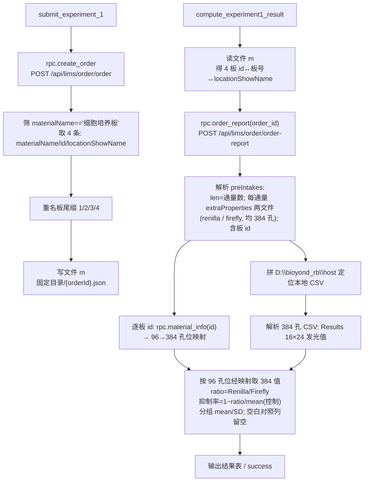

# 实验一结果计算节点（双荧光素酶报告基因检测）

## 目标
围绕小核酸**实验一**（报告基因检测，Firefly + Renilla 双荧光素酶）新增两块能力：

1. **落盘 4 块细胞培养板信息（文件 m）** —— `submit_experiment_1` 走到 `/api/lims/order/order`（即 `rpc.create_order`，[bioyond_rpc.py L719‑730](/Users/dp/python/Uni-Lab-OS-sirna/unilabos/devices/workstation/bioyond_studio/bioyond_rpc.py)）创建订单后，从返回物料里筛出 `materialName == "细胞培养板"` 的记录（共 4 块，均为 96 孔板），把 `materialName`、`id`、`locationShowName` 三项写入**项目固定目录**下、以 `orderId` 命名的文件 m，并给 4 块同名板**尾缀编号 1/2/3/4**（依次递增）以便后续区分板 1..板 4。
2. **新增计算节点 `compute_experiment1_result`** —— 先读文件 m，再调 `/api/lims/order/order-report`（[bioyond_rpc.py L782](/Users/dp/python/Uni-Lab-OS-sirna/unilabos/devices/workstation/bioyond_studio/bioyond_rpc.py) `order_report`）拿 `preIntakes`，对每块板 id 调 `/api/lims/storage/material-info`（[bioyond_rpc.py L468](/Users/dp/python/Uni-Lab-OS-sirna/unilabos/devices/workstation/bioyond_studio/bioyond_rpc.py) `material_info`）拿 96→384 孔位映射，最后解析 renilla/firefly 两个 384 孔 CSV，按图二规则算出 ratio / 抑制率 / 均值 / SD。

> 既有同类范式：实验二的报告计算节点见 [实验二结果节点_cd151a7b.plan.md](/Users/dp/python/Uni-Lab-OS-sirna/plan/实验二结果节点_cd151a7b.plan.md)；本计划与之共用「order-report 轮询 + 本地文件定位 + 节点串联」骨架，但本实验是**双荧光素酶比值/抑制率**计算，且新增「提交期落盘 4 板」环节。

---

## 端到端数据流



---

## 一、提交期落盘 4 块细胞培养板（文件 m）

### 1.1 接入点
`submit_experiment_1` 最终走 `_submit_experiment_core`（[sirna_station.py L1057](/Users/dp/python/Uni-Lab-OS-sirna/unilabos/devices/workstation/bioyond_studio/sirna_station/sirna_station.py)）。其中：
- `rpc.create_order(...)` 即对 `/api/lims/order/order` 的调用（L1134）。
- 返回经 `_extract_create_order_materials`（[L3324](/Users/dp/python/Uni-Lab-OS-sirna/unilabos/devices/workstation/bioyond_studio/sirna_station/sirna_station.py)）解析为 `material_records`，每条含 `materialName / materialId / locationShowName / locationCode / ...`，且带 `orderId`。

→ 在 `material_records` 解析完成后**追加一步**：筛 `细胞培养板` → 落盘文件 m。建议抽成独立私有方法 `_dump_cell_plates_file(order_id, material_records)`，仅在实验一路径调用（`experiment_number == 1`），避免影响实验二/通用提交。

### 1.2 筛选与编号
- 过滤：`record.get("materialName") == "细胞培养板"`（精确匹配；若现场有空格/全角差异，做 `strip()` 容错，关键词匹配待确认）。
- 期望命中 **4 条**（4 块 96 孔板）；数量 ≠ 4 时记 warning 但仍写入（便于排障）。
- 按 `material_records` 中出现顺序赋 `seq = 1,2,3,4`，改名 `materialName -> f"细胞培养板{seq}"`（“末尾加上编号，按 1 2 3 4 依次递增”）。
- **待确认**：改名是否仅写入文件 m（本计划默认如此），还是需要回写 LIMS（调用某 update-material 接口）。当前仓库未见对应改名接口，默认只在文件 m 内体现。

### 1.3 文件 m 结构与位置
- 位置：**项目下固定文件夹**（建议 `unilabos_data/sirna/experiment1_plates/` 或 `data/experiment1_plates/`，**目录路径待确认**，需可跨 session 稳定）。
- 文件名：`{orderId}.json`。
- 结构（JSON）：
```json
{
  "orderId": "xxxx",
  "createdAt": "2026-06-08T20:00:00+08:00",
  "plates": [
    {"seq": 1, "id": "板1id", "materialName": "细胞培养板1", "locationShowName": "A1"},
    {"seq": 2, "id": "板2id", "materialName": "细胞培养板2", "locationShowName": "A2"},
    {"seq": 3, "id": "板3id", "materialName": "细胞培养板3", "locationShowName": "A3"},
    {"seq": 4, "id": "板4id", "materialName": "细胞培养板4", "locationShowName": "A4"}
  ]
}
```
- `id` 取 `record.get("materialId")`；`locationShowName` 取 `record.get("locationShowName")`（兜底 `locationCode`，参考 [L3346](/Users/dp/python/Uni-Lab-OS-sirna/unilabos/devices/workstation/bioyond_studio/sirna_station/sirna_station.py)）。

---

## 二、计算节点 `compute_experiment1_result`

### 2.1 读文件 m
按 `order_id` 拼出 `固定目录/{order_id}.json` 读取，得到 `plate_seq_by_id = {id: seq}`、`plate_name_by_id`、`location_by_id`。文件不存在 → 抛错提示「请先执行 submit_experiment_1 生成板文件」。

### 2.2 order-report 解析 preIntakes
- 调 `rpc.order_report(order_id)` 取 `data.preIntakes`（解析方式参考 [sirna_station.py L3170/3211/3233](/Users/dp/python/Uni-Lab-OS-sirna/unilabos/devices/workstation/bioyond_studio/sirna_station/sirna_station.py) 已有 preIntakes 遍历，及 [reaction_station.py L798‑847](/Users/dp/python/Uni-Lab-OS-sirna/unilabos/devices/workstation/bioyond_studio/reaction_station/reaction_station.py) extraProperties 解析）。
- **`len(preIntakes)` = 通量数（有几个通量）**。
- 每个 preIntake：
  - `extraProperties`（dict，value 可能是 JSON 字符串，需 `json.loads` 容错）里有**两个文件地址** → 一个 renilla、一个 firefly（均为 384 孔板数据）。**区分方式待确认**：默认按文件名含 `Renilla`/`Firefly`（见图一文件名 `Firefly_*.csv` / `Renilla_*.csv`）大小写不敏感匹配。
  - 文件地址为相对/远端路径 → 统一拼前缀 `D:\bioyond_rb\host` 定位本地文件（沿用实验二 plan 的定位约定）。
  - preIntake 中**含板 id**（与文件 m 记录的 id 对齐），用于把该通量结果归到具体板。**板 id 在 preIntake 的具体字段名待确认**（候选 `materialId` / `materialIds` / `sampleMaterials[].materialId`）。

### 2.3 material-info 取 96→384 映射
- 对文件 m 里每个板 id 调 `rpc.material_info(id)`。
- 解析返回，构造 `mapping = {plate_id: {"A1":"A2", "B2":"C3", ...}}`（键=96 孔位，值=对应 384 孔位）。
- **返回里映射字段的确切路径待确认**（material-info 现有用法见 [bioyond_cell_workstation.py L310](/Users/dp/python/Uni-Lab-OS-sirna/unilabos/devices/workstation/bioyond_studio/bioyond_cell/bioyond_cell_workstation.py)）；需先用真实响应确认 96→384 映射在哪个字段。

### 2.4 解析 384 孔 CSV（renilla / firefly）
样例：renilla=`/Users/dp/Downloads/Experiment1_260601_131236_.csv`，firefly=`/Users/dp/Downloads/Experiment1_260601_131236111.csv`。两者结构相同（BioTek Synergy H1 导出）：
- 文件前段是元信息（`Software Version` / `Plate Type 384 WELL PLATE` / `Date` 等）。
- `Results` 行之后是表头 `\t1..24`，随后 16 行 `A..P` 的发光值（每行末尾一列 `Lum` 标记，需丢弃）。
- 解析为 `values_384 = {"A1": 12, "A2": 10, ...}`（行 A–P × 列 1–24）。
- 复用 [unilabos/script/rna_concentration.py](/Users/dp/python/Uni-Lab-OS-sirna/unilabos/script) 解析 BioTek 网格的思路（那里是 8×12，本处改 16×24）。

### 2.5 计算规则（图二，双荧光素酶）
对每块板的每个 **96 孔位** `w`：
1. 经 `mapping[plate_id][w]` 得到 384 孔位 `w384`。
2. `Renilla = values_384_renilla[w384]`，`Firefly = values_384_firefly[w384]`。
3. **`ratio = Renilla / Firefly`**（图二实测：空白对照 1897/309=6.14、样品1 1342/240=5.59，均为 Renilla/Firefly ✓）。
4. **抑制率 `= 1 − ratio / mean(控制 ratio)`**（图二公式 `1 − ft/mean(ft)` 解读；`mean(控制 ratio)` = 空白对照各孔 ratio 的均值）。
5. 按**样本分组**（每样本含若干复孔，图二为 3 个重复）算 `mean(抑制率)` 与 `SD(抑制率)`（样本标准差 n−1）。
6. **空白对照那一列先不填数据**（按需求：空白对照行/列的抑制率/mean/SD 暂留空 `/`，不输出）。

**待确认（计算关键）**：
- 样本身份与复孔分组来源：96 孔板的「空白对照 / 样品N」布局是按列三联（图二左侧 cols1‑3=空白对照、4‑6=样品1…），还是来自 preIntake 的 `sampleMaterials` / 细胞培养板.xlsx？决定如何把孔位归到样本。
- 抑制率公式里 `mean(控制 ratio)` 的精确口径（全板空白均值 / 每板各自空白均值）。
- 4 块 96 孔板 与 通量(preIntakes)、与同一张 384 孔读数文件的对应关系（4×96=384，是否一张 384 文件含 4 板，由各板 96→384 映射切分）。

### 2.6 节点实现
在 [sirna_station.py](/Users/dp/python/Uni-Lab-OS-sirna/unilabos/devices/workstation/bioyond_studio/sirna_station/sirna_station.py) 仿 `unload_materials` / `wait_for_order_finish` 新增：
```python
@action(always_free=True, description="计算小核酸实验1结果（双荧光素酶 ratio/抑制率）",
        handles=[ActionInputHandle(key="order_id", ...), ActionOutputHandle(key="resultTable", ...)])
def compute_experiment1_result(self, order_id: str, host_prefix=r"D:\bioyond_rb\host", **kwargs):
    ...  # 读m → order_report → material_info → 解析CSV → 计算 → 结果表
```
- `handles` 输入 `order_id`（连上游 `wait_for_order_finish.order_id` 或 `submit_experiment_1.order_id`）。
- 输出建议复用 `resultTable`（data/columns/tableName，参考 [_build_result_table L3450](/Users/dp/python/Uni-Lab-OS-sirna/unilabos/devices/workstation/bioyond_studio/sirna_station/sirna_station.py)）：列含 板/样本/Renilla/Firefly/ratio/抑制率/mean/SD。
- 列入 `_debug_call_session("compute_experiment1_result")` 保持与其它节点一致的调用日志。

---

## 三、验证
1. 用样例两文件本地跑通解析+计算（renilla=`Experiment1_260601_131236_.csv`，firefly=`..._131236111.csv`），核对 ratio≈图二（6.14/5.59/2.03/3.81…）。
2. 造一个文件 m（4 板 + 假映射）端到端跑 `compute_experiment1_result`，确认空白对照列留空、样本 mean/SD 计算正确。
3. `make build` / `python -c import` 确认节点注册无误；更新 `bioyond-sirna-station/action-index.md` 与 `actions/compute_experiment1_result.json`（schema）。

## 四、待确认清单（汇总）
- 项目固定目录的确切路径（文件 m 落盘位置，需跨 session 稳定）。
- `细胞培养板` 改名是否需回写 LIMS（默认仅写文件 m）。
- preIntake 中「板 id」「renilla/firefly 文件地址」的确切字段名与区分规则。
- `material_info` 返回里 96→384 映射的字段路径。
- 样本身份/复孔分组来源 与 抑制率 `mean(控制)` 口径。
- 384 读数文件与 4 块板/通量 的对应关系。
