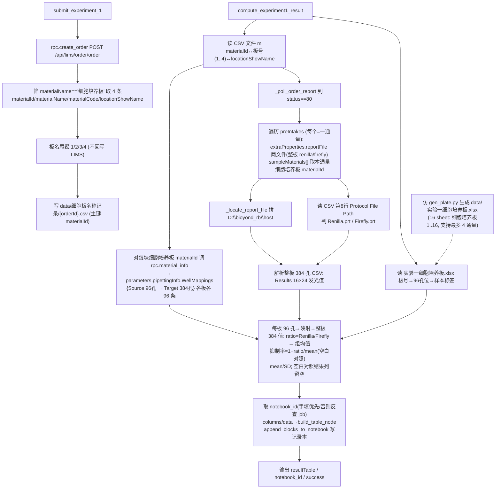

# 实验一结果计算节点（双荧光素酶报告基因检测）

## 目标
围绕小核酸**实验一**（报告基因检测，Firefly + Renilla 双荧光素酶）新增三块能力：

1. **落盘 4 块细胞培养板信息（CSV 文件 m）** —— `submit_experiment_1` 调 `/api/lims/order/order`（`rpc.create_order`）创建订单后，从返回物料里筛 `materialName == "细胞培养板"` 的 4 条记录，写 `data/细胞板名称记录/{orderId}.csv`，板名尾缀 `1/2/3/4`，**主键用 `materialId`（不是 `id`）**。**不回写 LIMS**。
2. **生成实验一孔板图 `实验一细胞培养板.xlsx`** —— 仿 [data/gen_plate.py](/Users/dp/python/Uni-Lab-OS-sirna/data/gen_plate.py) 产出含 **4 块 96 孔板**（sheet `细胞培养板1..4`）的 xlsx，每孔标 `空白对照 / 样品N-ID`，作为**孔位→样本身份**唯一来源。
3. **新增计算节点 `compute_experiment1_result`** —— 读 CSV 文件 m + 孔板 xlsx，轮询 `order-report` 到 `status==80` 拿 `preIntakes`，**对每块细胞培养板各自 `materialId` 调 `material-info` 拿其 96→384 映射**，解析 renilla/firefly 两个整板 384 孔 CSV，按图二规则算 ratio / 抑制率 / 均值 / SD。

> 同类范式：实验二报告节点 `compute_experiment2_result`（[sirna_station.py L1974](/Users/dp/python/Uni-Lab-OS-sirna/unilabos/devices/workstation/bioyond_studio/sirna_station/sirna_station.py)）已实现「轮询 order-report + reportFile 定位本地文件」骨架，实验一直接复用其 helper。

---

## 真实数据结构（已抓取并 live 调用确认，来自工作站 `D:\Uni-Lab-OS-Sirna\_sirna_local\api_logs`，订单 test0611110619）

### A) submit `/api/lims/order/order` 响应（细胞培养板记录）
`data` 形如 `{orderId: [record...]}`，经 `_extract_create_order_materials`（[L3324](/Users/dp/python/Uni-Lab-OS-sirna/unilabos/devices/workstation/bioyond_studio/sirna_station/sirna_station.py)）拿到。本订单真实样例：

| seq | locationShowName | materialCode | id（领用记录，**不记**） | materialId（**主键，下游用**） |
|---|---|---|---|---|
| 1 | 4-14 | 0001-00037 | 3a21c6d1-fc95-0a48-… | `3a21c6d1-f9e1-ef91-f5de-507113076f0b` |
| 2 | 4-15 | 0001-00036 | 3a21c6d1-fc95-edad-… | `3a21c6d1-f9c7-7ccd-1246-aa235fb166f5` |
| 3 | 4-16 | 0001-00035 | 3a21c6d1-fc95-e929-… | `3a21c6d1-f99d-733f-29f7-40a73d7be122` |
| 4 | 4-17 | 0001-00038 | 3a21c6d1-fc95-1d18-… | `3a21c6d1-f9e9-13f6-8201-029607be5827` |

外加 384孔板一条：`materialId = 3a21c6d2-01a8-55e4-a8c5-80ea331dc84b`（locationShowName 4-13）。

- **关键修正（用户指正）**：每条记录有两个 id —— `id`（领用记录 id）与 `materialId`（板物料 id）。**文件 m 只记 `materialId`，调 material-info 也传 `materialId`**。原计划误记 `id` 字段，去掉。
- 按出现顺序（4-14→4-17）赋 `seq 1..4`，板名改 `细胞培养板{seq}`，与 xlsx sheet 名一一对应。
- **384孔板不再需要记录到文件 m**（其 parameters 为 null，不提供映射，见 C）。

### B) `order-report` 响应（`rpc.order_report(order_id)`）—— 实验一真实结构
- 顶层 `data.status == 80`（Success）才取报告；`data.preIntakes` 为数组，**`len(preIntakes)` = 通量数**（本订单 = 1）。
- **实验一一个 preIntake = 一个通量**，结构（status==0 抓取，status==80 时 extraProperties 会含 reportFile）：
```json
{
  "sequence": 1,
  "materialId": null,
  "materialIds": "3a21c6d1-f99d-…|3a21c6d1-f9c7-…|3a21c6d1-f9e1-…|3a21c6d1-f9e9-…",
  "extraProperties": { "reportFile": ["upload/result/<code>/<ts>.csv", "upload/result/<code>/<ts2>.csv"] },
  "sampleMaterials": [
    { "materialId": "3a21c6d1-f99d-733f-…", "materialName": "细胞培养板", "materialCode": "0001-00035", "materialLocation": "自动化堆栈:4-16" },
    { "materialId": "3a21c6d1-f9c7-7ccd-…", "materialName": "细胞培养板", ... },
    { "materialId": "3a21c6d1-f9e1-ef91-…", "materialName": "细胞培养板", ... },
    { "materialId": "3a21c6d1-f9e9-13f6-…", "materialName": "细胞培养板", ... }
  ],
  "status": 80, "statusName": "..."
}
```
- **重要差异（与实验二不同）**：顶层 `preIntake.materialId` 为 **null**；本通量的 4 块细胞培养板在 **`preIntake.sampleMaterials[].materialId`**（也可用 `materialIds` 竖线串）。
- `reportFile` 两文件都是 `.csv`（renilla + firefly），是**整块 384 板**的读数（4 块 96 板交错铺在同一 384 板上，见 C），不是每板一对。
- 现成 helper 可复用：
  - `_poll_order_report(order_id, interval, timeout)` 轮询到 status==80（[L1901](/Users/dp/python/Uni-Lab-OS-sirna/unilabos/devices/workstation/bioyond_studio/sirna_station/sirna_station.py)）。
  - `_parse_report_files(report_file)` 把 reportFile 归一成相对路径列表（[L1872](/Users/dp/python/Uni-Lab-OS-sirna/unilabos/devices/workstation/bioyond_studio/sirna_station/sirna_station.py)）；本节点**按 preIntake 取**（每通量自己的两文件）。
  - `_locate_report_file(host_prefix, rel)` 拼 `D:\bioyond_rb\host`（[L1895](/Users/dp/python/Uni-Lab-OS-sirna/unilabos/devices/workstation/bioyond_studio/sirna_station/sirna_station.py)）。

### C) `material-info` 响应（`rpc.material_info(materialId)`）—— 已 live 调用确认（5 个 materialId 全查）
**结论（冻结点解除）：每块细胞培养板用自己的 `materialId` 调 material-info，各自返回自己那 96 条 96→384 映射；384孔板的 `parameters` 为 null。**

- 对 **384孔板** materialId（`3a21c6d2-01a8-…`）：`parameters: null` —— **无映射，不用**。
- 对**每块细胞培养板** materialId：`data.parameters` 是 JSON 字符串，解析后 `{ "pipettingInfo": "{...}" }`，再解析 `pipettingInfo` 得 `{ "SourcePlate", "TargetPlate", "WellMappings": [{"Source":"A1","Target":"B2"}, ...] }`，每板含 **96 条**。
- 4 块板的 Target 正好交错铺满整块 384（实测各板首条）：

| 板(seq/location) | materialId 尾段 | A1→Target | 落点规律 |
|---|---|---|---|
| 板1 / 4-14 | f9e1 | **B2** | 偶行(B)×偶列 |
| 板2 / 4-15 | f9c7 | **B1** | 偶行(B)×奇列 |
| 板3 / 4-16 | f99d | **A2** | 奇行(A)×偶列 |
| 板4 / 4-17 | f9e9 | **A1** | 奇行(A)×奇列 |

- 转 `mapping[seq] = {wm["Source"]: wm["Target"] for wm in WellMappings}`（每板各自 96→384）。
- **不需要象限归属逻辑**：每板 materialId 直接拿到自己完整的一组映射。原「4 板象限归属」开放点据此关闭。

---

## 端到端数据流



---

## 一、提交期落盘 4 块细胞培养板（CSV 文件 m）

### 1.1 接入点
`submit_experiment_1` → `_submit_experiment_core`。`rpc.create_order` 后 `material_records = _extract_create_order_materials(parsed_result)`。在其后追加 `_dump_cell_plates_file(order_ids, material_records)`，**仅 `experiment_number == 1` 调用**，落盘失败不阻断提交主流程。

### 1.2 筛选与编号
- 过滤 `record.get("materialName").strip() == "细胞培养板"`。
- 板名改 `f"细胞培养板{seq}"`（与 xlsx sheet 名一致）。仅写文件，不回写 LIMS。
- 【多通量】N = 通量数×4：单通量=4、2 通量=8、4 通量=16。把原「≠4 记 warning」放开为：仅当命中 0 块、或 N 不是 4 的倍数、或 N>16 时记 warning；4/8/12/16 视为正常。
- 【补充2】seq 全局编号按 `(通量sequence, 通量内 sampleMaterials 顺序)`（来自 order-report，通量1→板1-4、通量2→板5-8）；order-report 取不到时退回 create_order 出现顺序。该 `materialId→seq` 映射同时供补充1 的前端重命名复用。

### 1.3 CSV 文件 m
- 目录 `data/细胞板名称记录/`（不存在则建）；文件名 `{orderId}.csv`。
- 列：`seq,materialId,materialName,materialCode,locationShowName,preIntakeCode,preIntakeId`（**主键 materialId**；`preIntakeCode`=通量名称、`preIntakeId`=通量id，来自 order-report，见补充2）：
```csv
seq,materialId,materialName,materialCode,locationShowName,preIntakeCode,preIntakeId
1,3a21cccd-3aa5-a35b-9aec-49c9d0e17c90,细胞培养板1,0001-00084,4-14,test0612145853-01,3a21cccd-439b-d127-b811-269fc0989a39
2,3a21cccd-3a94-5ed2-04a7-31218ea4cb18,细胞培养板2,0001-00082,4-15,test0612145853-01,3a21cccd-439b-d127-b811-269fc0989a39
...
5,3a21cccd-3a52-a5e1-e497-c7e29296466c,细胞培养板5,0001-00079,4-11,test0612145853-02,3a21cccd-4399-9b1c-7b13-19907198f880
...
```
- **不再记录 384孔板 id**（parameters 为 null，不提供映射）。
- 旧文件无 `preIntakeCode/preIntakeId` 列时，`_read_cell_plates_file` 兼容留空。

---

## 二、生成实验一孔板图 `实验一细胞培养板.xlsx`
仿 [data/gen_plate.py](/Users/dp/python/Uni-Lab-OS-sirna/data/gen_plate.py)（当前生成单 sheet「细胞培养板」，8×12，单元格 `空白对照`/`样品N-ID`）新增 `data/gen_experiment1_plate.py`，循环生成 **16 个 sheet** `细胞培养板1..16`（最多支持 4 通量、每通量 4 块），输出 `data/实验一细胞培养板.xlsx`。sheet 名与文件 m 板名一一对应，作为板号→孔板图桥梁。
- 【多通量】`PLATE_COUNT` 由 4 改为 16；`main()` 若 `data/实验一细胞培养板.xlsx` 已存在则打开、保留现有 `细胞培养板1..4` 并仅补建缺失的 `细胞培养板5..16`（满足「再添加 12 块」、不破坏已有布局），不存在则全生成；输出路径对齐 [exp1_report.py L40](/Users/dp/python/Uni-Lab-OS-sirna/unilabos/script/exp1_report.py) 的 `DEFAULT_PLATE_MAP`（`<repo>/data/实验一细胞培养板.xlsx`）。
- 【次要待确认】每块板样品布局是否固定（暂沿用随机填充）。

---

## 三、计算节点 `compute_experiment1_result`

### 3.1 读 CSV 文件 m
读 `data/细胞板名称记录/{order_id}.csv` → `板号/location_by_materialId`。缺文件 → 抛错提示先跑 submit_experiment_1。

### 3.2 读孔板 xlsx
读 `data/实验一细胞培养板.xlsx`，按板号取 sheet `细胞培养板{seq}` → `label_by_well = {"A1":"空白对照","A2":"样品1-ID",...}`。

### 3.3 order-report → 每通量两文件 + 本通量板列表
- `report = _poll_order_report(order_id, interval, timeout)`（到 status==80）。
- 遍历 `report["preIntakes"]`（每个=一通量）：
  - 取 `preIntake["extraProperties"]["reportFile"]` 两路径，`_parse_report_files` 归一，`_locate_report_file(host_prefix, rel)` 定位本地 → 解析得**整板** renilla/firefly 两个 384 grid。
  - 取 `preIntake["sampleMaterials"]` 里 `materialName=="细胞培养板"` 的 `materialId` 列表（兜底用 `materialIds` 竖线串拆分），与 file m 对齐得各板 seq。

### 3.4 renilla/firefly 区分
reportFile 文件名是时间戳（无 Renilla/Firefly 字样）。判定法：读 CSV 第 8 行 `Protocol File Path:` 是否含 `Firefly.prt` / `Renilla.prt`（样例文件该行即 `...\Biotek_Synergy_H1\Firefly.prt`）。一级兜底：按文件名含 renilla/firefly 判（即现有 `detect_channel`，正式环境靠它）。

**仿真环境二级兜底（新增）**：仿真酶标仪导出的 csv 协议名（`test0420.prt`）与文件名（纯时间戳）都不含 renilla/firefly 关键字，`detect_channel` 全返回 `None`，导致两通道都拿不到 grid、通量被跳过、`plates_data` 为空抛 `RuntimeError`。处理：在 `sirna_station.py` 通量解析循环（[L2371-2392](/Users/dp/python/Uni-Lab-OS-sirna/unilabos/devices/workstation/bioyond_studio/sirna_station/sirna_station.py)）中，把 `detect_channel` 返回 `None` 的文件收集到 `unassigned_grids`，循环结束后 `random.shuffle` 随机分配给仍为 `None` 的 `renilla_grid`/`firefly_grid`。正式环境关键字命中时 `unassigned_grids` 为空，本段不生效，行为完全不变。`detect_channel` 本身不改。改后核心片段：

```python
renilla_grid = firefly_grid = None
unassigned_grids = []  # 仿真兜底：无 renilla/firefly 关键字的文件先收集
for rel in rels:
    local = self._locate_report_file(host_prefix, rel)
    if not os.path.exists(local):
        logger.warning("[sirna] 报告文件不存在: %s", local)
        continue
    grid, meta = e1.parse_biotek_384_csv(local)
    channel = e1.detect_channel(local, meta)
    if channel == "renilla":
        renilla_grid = grid
    elif channel == "firefly":
        firefly_grid = grid
    else:
        unassigned_grids.append(grid)

# 仿真兜底：判不出通道时随机分配给缺失通道；正式环境此段不生效
random.shuffle(unassigned_grids)
if renilla_grid is None and unassigned_grids:
    renilla_grid = unassigned_grids.pop()
    logger.warning("[sirna] 未判别出 renilla 通道，仿真兜底随机分配一个文件作为 renilla")
if firefly_grid is None and unassigned_grids:
    firefly_grid = unassigned_grids.pop()
    logger.warning("[sirna] 未判别出 firefly 通道，仿真兜底随机分配一个文件作为 firefly")

if renilla_grid is None or firefly_grid is None:
    logger.warning(
        "[sirna] 通量 seq=%s 缺 renilla/firefly 文件，跳过(renilla=%s firefly=%s)",
        preintake.get("sequence"), renilla_grid is not None, firefly_grid is not None,
    )
    continue
```

> 需在 `sirna_station.py` 顶部 import 区增加 `import random`（当前未导入）。
> 注意：仿真两文件常是内容相同的 96 孔占位数据，而 `parse_biotek_384_csv` 按 384 孔解析，能跑通但结果不可信；正式环境需换两份不同的 384 孔真实读数。

### 3.5 material-info → 每板 96→384 映射（已确认结构）
- **对每块细胞培养板各自 `materialId` 调 `rpc.material_info(materialId)`**：
  `params = json.loads(info["parameters"])` → `pip = json.loads(params["pipettingInfo"])` → `pip["WellMappings"]` → `mapping[seq] = {wm["Source"]: wm["Target"]}`（各板 96 条）。
- 384孔板 / 细胞培养板自身若 parameters 为 null 则跳过；某板拿不到映射记 warning、跳过该板，不阻断其它板。
- **无需象限归属**：每板 materialId 直接返回自己完整一组映射（板1 A1→B2 / 板2 A1→B1 / 板3 A1→A2 / 板4 A1→A1）。

### 3.6 解析 384 孔 CSV（renilla / firefly）
样例 renilla=`/Users/dp/Downloads/Experiment1_260601_131236_.csv`、firefly=`..._131236111.csv`（BioTek Synergy H1）：`Results` 段后表头 `\t1..24`，16 行 `A..P` 发光值（末列 `Lum` 丢弃）→ `values_384 = {"A1":12,...}`（注意：行字母判定需 `len==1`，否则空串表头行会被误并入）。

### 3.7 计算规则（图二，双荧光素酶）
对每块板 `seq`、其每个 96 孔位 `w`：
1. `w384 = mapping[seq][w]`。
2. `Renilla = renilla_384[w384]`、`Firefly = firefly_384[w384]`（整板 grid，按各板映射取各自的孔）。
3. `ratio = Renilla / Firefly`。
4. `label = label_by_well[seq][w]`（孔板 xlsx 对应 sheet）。
5. **按板分别**聚合：每块板各自的 `空白对照` 组 ratio 求均值（本板分母）。
6. `抑制率 = 1 − ratio / mean(本板空白对照组 ratio)`。
7. 按 **板×样本** 组算 `mean(抑制率)`、`SD(抑制率)`（n−1）。
8. **空白对照结果列先留空**（其 ratio 均值仍作本板分母）。

> 【已定】空白均值 / 抑制率 mean/SD **按板分别聚合**（不跨板合并）。`meta.blank_mean_ratio_by_seq` 给各板空白 ratio 均值。

### 3.8 节点实现
仿 `compute_experiment2_result` 新增 `@action def compute_experiment1_result(self, order_id, notebook_id="", host_prefix=r"D:\bioyond_rb\host", poll_interval_seconds=10.0, poll_timeout_seconds=3600, plate_map_path="", **kwargs)`：
- 输入 handle `order_id`（连 `wait_for_order_finish.order_id`）；`notebook_id` 走 `goal_default`（前端表单字段，可手填，留空自动反查）。
- 输出 handle `resultTable`（列 板/孔位/样本/Renilla/Firefly/ratio/抑制率/抑制率均值/抑制率SD）+ `notebook_id` + `success`。
- 用 `_debug_call_session("compute_experiment1_result")`。

### 3.9 写入实验记录本（照搬实验二范式）
现状只把结果作为 `resultTable` handle 抛出，本次补「写记录本」，对齐 `compute_experiment2_result`（[L2032-2124](/Users/dp/python/Uni-Lab-OS-sirna/unilabos/devices/workstation/bioyond_studio/sirna_station/sirna_station.py)）。

1. **取 notebook_id（兜底，不强制）**：手填优先，否则 `self._resolve_notebook_id("compute_experiment1_result")` 反查当前 job；**仍取不到则只记 warning 日志、跳过写记录本**（不 `raise`），计算结果照常返回。与实验二一致（两边都改成此策略）。
2. **构块（仅在拿到 notebook_id 时执行）**：实验一无图片，只一张结果表，比实验二简单。把 `result["columns"]`/`result["data"]` 转成原生表格：
   - `header = [c["name"] for c in result["columns"]]`
   - `rows = [[row[c["key"]] for c in result["columns"]] for row in result["data"]]`
   - blocks = `text_block(标题+order_id+时间戳)` → `text_block("一、双荧光素酶报告基因检测结果")` → `build_table_node(header, rows)` → `text_block(各板空白对照 ratio 均值说明，取自 result["meta"]["blank_mean_ratio_by_seq"])` → 末尾 `text_block("")`（避免 void 节点收尾）。
   - 引入 `from unilabos.devices.workstation.bioyond_studio.sirna_station import notebook_client as nbc`（实验二 [L2018-2020](/Users/dp/python/Uni-Lab-OS-sirna/unilabos/devices/workstation/bioyond_studio/sirna_station/sirna_station.py) 同款局部 import）。
3. **写入（仅在拿到 notebook_id 时执行）**：`nbc.append_blocks_to_notebook(notebook_id, blocks)`，info 日志记录 appended/total。
4. **不归档原始 csv**（用户已确认，无需 `archive_raw_files`、不调 `upload_to_oss`）。
5. **返回值**在现有 `success/order_id/resultTable/meta/confirmation_message` 基础上加 `"notebook_id": notebook_id`（跳过写记录本时为 `""`）；`confirmation_message` 视是否写入分别提示「已写入记录本 {notebook_id}」/「未取到 notebook_id，仅计算未写记录本」。

> 注意：写记录本放在 `result` 计算成功之后；若 `plates_data` 为空仍按现状先抛 `RuntimeError`（不会走到写记录本）。

---

## 三bis、多通量扩展（2/4 通量，最多 16 块板）

语义确认：**每通量 4 块各不相同的板，全局连续编号；2 通量 = 8 块（细胞培养板1..8），4 通量 = 16 块（细胞培养板1..16）。**

为什么核心计算无需改：计算节点 `compute_experiment1_result` 已 `for preintake in preintakes` 按通量遍历，renilla/firefly 整板 CSV 与本通量 4 块板 materialId 都在 preIntake 级别取（[sirna_station.py L2400-2469](/Users/dp/python/Uni-Lab-OS-sirna/unilabos/devices/workstation/bioyond_studio/sirna_station/sirna_station.py)）；`exp1_report.compute_exp1_result` 的空白分母与 mean/SD 都按 `(seq, label)` 聚合（[exp1_report.py L236-264](/Users/dp/python/Uni-Lab-OS-sirna/unilabos/script/exp1_report.py)），在全局唯一 seq 下 2/4 通量不会跨板混算。真正卡点只有两处：

1. **孔板布局 xlsx 只有 4 个 sheet** → 见「## 二」改为 16 sheet（`细胞培养板1..16`）。第二个通量的板（seq 5..8）此前因 sheet 不存在被静默丢弃或退化读活动 sheet 而错贴标签，扩到 16 后消除。
2. **落盘记录写死「期望 4 块」** → 见「## 1.2」放开为 4 的倍数、≤16；seq 全局递增逻辑不变。

只读核查（预计无改动）：确认 `compute_experiment1_result`、`exp1_report`、`_extract_preintake_cell_plate_ids`、`_read_cell_plates_file` 内没有其它硬编码「4」的限制；`mapping_cache` 按 materialId 缓存可跨通量复用。

## 三ter、本轮补充修改（基于 2 通量 live 日志 test0612145853）

live 证据（`D:\Uni-Lab-OS-Sirna\_sirna_local\api_logs\2026-06-12_151141_compute_experiment1_result_raw_calls.md`，order-report status==80）：
- `data.preIntakes` 长度=2（两个通量）。每个 preIntake：`code`=通量名称（如 `test0612145853-01`/`-02`），`id`=通量id，`sequence`=1/2，`sampleMaterials[]`=本通量 4 块细胞培养板（各带 `materialId`、`extraProperties.PreintakeCode/PreintakeSequence`，以及完整 `materialParams.pipettingInfo.WellMappings` 的 96→384 映射）。
- 通量1 的 4 块板=库位 4-14/4-15/4-16/4-17，通量2=4-10/4-11/4-12/4-13；两通量各自铺到不同的 384 板（TargetPlate 不同）。

### 关键不变量：结果文件按通量隔离，绝不跨通量串读
**每个通量下的板，只读「本通量 `preIntake.extraProperties.reportFile`」解析出的 renilla/firefly 结果，再配「本通量这几块板各自的 96→384 映射」计算。两个通量各读各的 384 结果文件、各自的 384 TargetPlate，严禁交叉。**
- 现状已满足：`compute_experiment1_result` 的 `for preintake in preintakes` 循环体内，先在**循环内**读 `preintake["extraProperties"]["reportFile"]` 得本通量 `renilla_grid/firefly_grid`，再 `for material_id in _extract_preintake_cell_plate_ids(preintake)` 把**本通量的** grid 挂到本通量的板（[L2400-2469](/Users/dp/python/Uni-Lab-OS-sirna/unilabos/devices/workstation/bioyond_studio/sirna_station/sirna_station.py)）。`renilla_grid/firefly_grid` 在每次 preintake 迭代开头重置，不会泄漏到下一通量。
- 实现约束：`reportFile` 解析、通道判别、仿真兜底 `random.shuffle(unassigned_grids)` 必须**全部留在 preIntake 循环体内**（按通量作用域），不得上提到循环外共享；`material_info` 取映射用各板自己的 `materialId`（天然按通量隔离）。多通量聚合按 `(seq,label)` 进行，因每板的 grid 已是本通量的，聚合也不会跨通量混读数。
- `create_order` 响应（submit 日志）只是按 orderId 分组的**扁平物料列表**，**不含通量分组**；通量 code/id 只能从 order-report 拿。`rpc.order_report(order_id)` 是单次拉取（[bioyond_rpc.py L782](/Users/dp/python/Uni-Lab-OS-sirna/unilabos/devices/workstation/bioyond_studio/bioyond_rpc.py)）。

### 补充1：前端「物料放置指引」细胞培养板名带序号
- 现状：`_build_result_table`（[L4383](/Users/dp/python/Uni-Lab-OS-sirna/unilabos/devices/workstation/bioyond_studio/sirna_station/sirna_station.py)，tableName=`物料放置指引`）直接用 `mat["materialName"]`，8 块板全显示「细胞培养板」。
- 改法：submit 流程构建确认/结果表前，用 `materialId→seq` 映射把 `materialName=="细胞培养板"` 的记录重命名为 `细胞培养板{seq}`（与 m 文件、xlsx sheet 同一套 seq）。
- 落点：在 [L1148-1173](/Users/dp/python/Uni-Lab-OS-sirna/unilabos/devices/workstation/bioyond_studio/sirna_station/sirna_station.py)（`experiment_number==1`）先算 `materialId→seq`（见补充2 的同一映射），就地改写 `material_records` 里细胞培养板的 `materialName`，再调 `_extract_suggested_locations` / `_format_create_order_confirmation` / `_build_result_table`。这样确认文案、库位汇总、`物料放置指引` 表全部带序号。

### 补充2：m 文件记录通量名称/通量id
- submit 阶段（`experiment_number==1`，create_order 之后）对 `order_ids[0]` 调一次 `rpc.order_report(order_id)`：
  - 遍历 `preIntakes`：`code`(通量名称) / `id`(通量id) / `sequence`；遍历其 `sampleMaterials`（`materialName=='细胞培养板'`）建 `materialId → {preIntakeCode, preIntakeId, preIntakeSequence, withinSeq}`。
  - **seq 全局编号**：按 `(preIntakeSequence, 通量内 sampleMaterials 出现顺序)` 排序赋 `seq=1..N`（通量1→板1-4、通量2→板5-8，与 16-sheet xlsx 对齐）。
  - 兜底：order-report 取不到 / preIntakes 为空 / 调用异常时，退回原 create_order 出现顺序赋 seq，通量列留空并 `logger.warning`，不阻断提交。
- `_dump_cell_plates_file`（[L2160](/Users/dp/python/Uni-Lab-OS-sirna/unilabos/devices/workstation/bioyond_studio/sirna_station/sirna_station.py)）：
  - 入参增加 `materialId→通量信息` 映射（或在内部调用 order-report）；CSV 列扩为 `seq,materialId,materialName,materialCode,locationShowName,preIntakeCode,preIntakeId`（`preIntakeCode`=通量名称、`preIntakeId`=通量id）。
  - seq 改用上面的全局编号；命中块数告警放开为 4 的倍数、≤16（见 ## 1.2）。
- `_read_cell_plates_file`（[L2217](/Users/dp/python/Uni-Lab-OS-sirna/unilabos/devices/workstation/bioyond_studio/sirna_station/sirna_station.py)）：解析新增 `preIntakeCode/preIntakeId` 列（缺列时留空，兼容旧文件）。

### 补充3：结果表最前面加「通量名称」列
- `exp1_report.compute_exp1_result`（[exp1_report.py L192](/Users/dp/python/Uni-Lab-OS-sirna/unilabos/script/exp1_report.py)）：
  - `plates` 每项新增 `preintake_code`；`wells`/`data` 行带上该值（key 如 `preintake`）。
  - `columns` 最前面插入 `{"name": "通量名称", "key": "preintake"}`（值就写 preIntake `code`）。
- `compute_experiment1_result`（[L2400-2469](/Users/dp/python/Uni-Lab-OS-sirna/unilabos/devices/workstation/bioyond_studio/sirna_station/sirna_station.py)）：通量循环里把 `preintake.get("code")` 注入每个 `plates_data` 项的 `preintake_code`。
- 写记录本表头自动跟随 columns，无需额外改。

> 可选优化（不在本轮范围）：order-report 的 `sampleMaterials[].materialParams.pipettingInfo.WellMappings` 已含每板 96→384 映射，compute 节点可省去逐板 `material_info` 调用；本轮先不动，保持现有 `material_info` 取映射逻辑。

### 补充4：下料指引表细胞培养板名带序号（与上料一致）
- 现象：实验一**下料**时前端的细胞培养板不带 1/2/3/4。根因——下料表与上料表是两条独立路径，补充1 只改了上料；下料表 `_build_unload_rows_from_all_stock_material`（[L4570](/Users/dp/python/Uni-Lab-OS-sirna/unilabos/devices/workstation/bioyond_studio/sirna_station/sirna_station.py)）直接用 `mat["name"]`（恒为「细胞培养板」），从未重命名。
- 数据依据（已用 live 日志 `2026-06-12_154242_wait_for_order_finish_raw_calls.md` 核实）：`all_stock_material`（`materials-by-order-id`）每条物料带 `id`，且该 `id` == `order-report.sampleMaterials[].materialId` == m 文件 `materialId`（例：细胞培养板@4-13 `id=3a21ccf2-41a8-…6939` 即通量2 第4块板）。可按 `mat["id"]` join m 文件拿 `细胞培养板{seq}`（跨通量全局 seq 1..N）。m 文件仅实验一生成，按文件存在与否天然把改名限定在实验一，实验二/旧订单不受影响。
- 改法（单文件 sirna_station.py）：
  1. `_build_unload_rows_from_all_stock_material` 增可选入参 `name_by_material_id: Optional[Dict[str, str]] = None`；行内 `mat_id = str(mat.get("id") or "").strip()`、`material_name = (name_by_material_id or {}).get(mat_id) or str(mat.get("name") or "")`；locations 拆行/quantity 回退逻辑不变。
  2. `wait_for_order_finish`（[L1689](/Users/dp/python/Uni-Lab-OS-sirna/unilabos/devices/workstation/bioyond_studio/sirna_station/sirna_station.py)）拉到 `all_materials` 后、构建行前：`try: plates = self._read_cell_plates_file(normalized_order_id)["plates"]` 失败（`FileNotFoundError` 等）置空 dict、**不现算**直接回退显示原始「细胞培养板」，并 `logger.warning("[sirna] 下料表未找到细胞板名称记录(order_id=%s)，细胞培养板回退显示原名: %s", normalized_order_id, exc)` 便于追溯，不阻断主流程；成功则 `name_by_material_id = {p["materialId"]: p["materialName"] for p in plates}`；传入行构建。
  3. 不改 `UNLOAD_TABLE_COLUMNS`（仍 4 列）、不改前端、不动上料路径。
- 验证：用 live 日志的 8 条细胞培养板（2 通量）+ 对应 m 文件跑 `_build_unload_rows_from_all_stock_material`，确认输出 `细胞培养板1..8` 且非细胞培养板物料名字不变；语法/import 校验。

### 补充5：原始数据可下载 + 结果表导出可下载 Excel（与实验二本轮3 对齐）
需求：实验一计算节点最后也要 ① 把**原始数据**（各通量 renilla/firefly 的 384 孔 CSV）上传成记录本可下载附件；② 把**生成的结果表**导出成可下载的 Excel 附件。现状 `compute_experiment1_result`（[L2453](/Users/dp/python/Uni-Lab-OS-sirna/unilabos/devices/workstation/bioyond_studio/sirna_station/sirna_station.py)）只把结果写成记录本原生 `table`，无附件、无 xlsx。机制完全复用实验二已跑通的 `notebook_client`（`upload_to_oss(scene="file")` + `build_file_node`）。

#### 补充5a：原始数据附件（renilla/firefly CSV）
- 原始文件本地路径在通量循环里已算出：`local = self._locate_report_file(host_prefix, rel)`（[L2544](/Users/dp/python/Uni-Lab-OS-sirna/unilabos/devices/workstation/bioyond_studio/sirna_station/sirna_station.py)）。
- 改法：循环中把 `os.path.exists(local)` 的 CSV 路径收集进一个 `raw_csv_paths`（去重保序，跨所有通量；2 文件×通量数）。计算完成、构造 blocks 时，加章节「原始数据附件」，对每个路径 `nbc.upload_to_oss(raw, scene="file", content_type="text/csv")` + `nbc.build_file_node(meta)`；单个上传失败仅 `logger.warning`，不阻断。
- 新增形参 `archive_raw_files: bool = True`（与实验二同名同义），False 时跳过附件。

#### 补充5b：结果表导出 xlsx
- [exp1_report.py](/Users/dp/python/Uni-Lab-OS-sirna/unilabos/script/exp1_report.py) 新增可复用函数：
  `build_exp1_report_xlsx(result: dict, out_xlsx: str, order_id: str = "", stamp: str = "") -> str`
  —— 单 sheet「实验一结果」：第1行可选标题（order_id+时间戳），其后 `result["columns"]` 作表头（`name`）、`result["data"]` 逐行按 `key` 取值；末尾追加一行「各板空白对照 ratio 均值: result['meta']['blank_mean_ratio_by_seq']」说明。复用模块已 `import openpyxl`（`_OPENPYXL_OK`）。返回 `out_xlsx`。
- `compute_experiment1_result`：算出 `result` 后，建临时目录 `out_dir = os.path.join(tempfile.gettempdir(), "sirna_exp1", normalized_order_id)`，`report_xlsx = e1.build_exp1_report_xlsx(result, os.path.join(out_dir, "实验一结果.xlsx"), order_id=normalized_order_id, stamp=stamp)`；失败 `try/except`+warning 不阻断。成功则 `report_meta = nbc.upload_to_oss(report_xlsx, scene="file", content_type="application/vnd.openxmlformats-officedocument.spreadsheetml.sheet")`。

#### 记录本章节与返回值
- blocks 章节顺序（沿用实验二「先正文表、再报告、再原始数据」习惯）：
  一、双荧光素酶报告基因检测结果（原生 table，保留）→ 各板空白 ratio 均值说明（保留）→ **二、实验报告（可下载 xlsx）**：`build_file_node(report_meta)` → **三、原始数据附件**：每个 raw CSV 的 `build_file_node` → 末尾空段落。
- 与实验二一致：blocks（含 OSS 上传）无条件构造，仅 `if notebook_id:` 才 `append_blocks_to_notebook`（取不到 notebook_id 时仅 warning 跳过写入，计算结果照常返回）。
- 返回值新增 `"report_url": report_meta.get("url","")` 与 `"raw_file_urls": [...]`；`confirmation_message` 补充「已挂 xlsx + N 个原始 CSV 附件」。

#### 校验（补充5）
- `python3 -m py_compile` exp1_report.py / sirna_station.py；本地用样例 plates_data 跑 `compute_exp1_result` → `build_exp1_report_xlsx` 落地 xlsx，用 openpyxl 校验表头=columns、行数=data、含空白均值说明行。`ReadLints` 无新增错误。按既有约定只 add、不 commit。

## 四、验证
1. 生成 `data/实验一细胞培养板.xlsx`（16 sheet，原 1..4 内容保留）。
2. 本地用样例两文件跑解析+计算，核对 ratio 与图二口径。
3. 端到端跑节点，确认空白对照结果列留空、mean/SD 正确，且结果表已写入指定 notebook（手填 notebook_id 验证；不接记录本/反查不到时应只 warning 跳过写记录本、不报错，仍正常输出 resultTable）。
4. 【多通量】构造 8 块板（2 通量）的 `data/细胞板名称记录/{orderId}.csv`（seq 1..8）+ 2 个 preIntake 的 order-report，跑 `compute_experiment1_result`，确认 8 块板都产出结果行、各板空白 ratio 独立、无「sheet 不存在/读活动 sheet 错贴标签」告警。
5. 【补充1】submit_experiment_1 返回的 `物料放置指引` 表里 8 块细胞培养板分别显示 `细胞培养板1..8`（不再统一「细胞培养板」）。
6. 【补充2】m 文件含 `preIntakeCode/preIntakeId` 两列，通量1 的 4 块板 code 同为 `*-01`、通量2 同为 `*-02`，id 对应各 preIntake.id；order-report 取不到时通量列留空且有 warning、提交不中断。
7. 【补充3】结果表第一列为「通量名称」，值为对应 preIntake.code，并随表写入记录本。
7b. 【不变量】2 通量构造两套不同的 renilla/firefly 384 读数，断言通量1 的板取到通量1 文件的值、通量2 的板取到通量2 文件的值（互换文件应使对应通量结果随之变化），确认结果文件未跨通量串读。
8. `make build` / import 通过；如需更新 `bioyond-sirna-station/action-index.md` 与 `actions/compute_experiment1_result.json`（补 `notebook_id` 输入/输出）。
9. 【补充5a】跑 `compute_experiment1_result` 后记录本出现「原始数据附件」章节，各通量 renilla/firefly CSV 均为可下载卡片（去重、无遗漏）；`archive_raw_files=False` 时不挂附件。
10. 【补充5b】`build_exp1_report_xlsx` 落地「实验一结果.xlsx」单 sheet：表头=结果表列名、行=结果数据、含空白均值说明行；记录本「实验报告（可下载 xlsx）」章节出现可下载卡片，返回值含 `report_url`。

## 五bis、本轮修改（2026-06-14，基于参考报告核对）

参考报告 `/Users/dp/Downloads/场景一实验报告-报告基因长质粒psi-CHECK系统 试验报告.xlsx` 已 live 核对：sheet=`试验报告/抑制活性/数据处理/Sheet1`，无嵌图。其中 **`抑制活性` sheet** 列=`序列 | 质粒 | Ratio | 抑制活性 | SD`，是**按样本聚合**的汇总表(样例：质粒1 Ratio=0.7486 抑制活性=0.2514 SD=0.069；抑制活性=1−Ratio)，我们当前只产出"逐孔明细表"，缺这张汇总表。

### 14a 生成文件落盘到后端电脑（保存位置）
- 现状：`compute_experiment1_result` 的 `out_dir = os.path.join(tempfile.gettempdir(), "sirna_exp1", normalized_order_id)`（[sirna_station.py L2660](/Users/dp/python/Uni-Lab-OS-sirna/unilabos/devices/workstation/bioyond_studio/sirna_station/sirna_station.py)），「实验一结果.xlsx」只在临时目录。
- 改法（与实验二共用同一 helper）：
  - `BioyondSirnaStation` 新增 `@staticmethod def _experiment_result_dir(sub: str = "") -> str`：基目录 `<repo>/data/实验结果/{YYYY-MM-DD}`（`Path(__file__).resolve().parents[5] / "data" / "实验结果" / date`，与 `_cell_plates_record_dir` 同样取 `parents[5]`），`sub` 非空拼一层，`makedirs(exist_ok=True)` 后返回；日期取节点开始 `datetime.now().strftime("%Y-%m-%d")`。
  - `out_dir` 改为 `self._experiment_result_dir(normalized_order_id)`；其余 xlsx 生成/上传不变。结果落在 `data/实验结果/{日期}/{order_id}/实验一结果.xlsx`。
- 验证：跑节点后该路径下出现 xlsx；重复跑同 order 覆盖、不报错。

### 15 新增"抑制活性(按样本汇总)"表（参考 `抑制活性` sheet）
- 数据来源：`exp1_report.compute_exp1_result` 已算出每孔 ratio、各板空白 ratio 均值 `blank_mean_by_seq`、每孔抑制率 `inhibition` 与按 `(seq,label)` 的 mean/SD。本表只需在样本维度再汇总一次。
- [exp1_report.py](/Users/dp/python/Uni-Lab-OS-sirna/unilabos/script/exp1_report.py) 新增 `build_inhibition_activity_table(plates) -> dict`（或让 `compute_exp1_result` 顺带返回 `summary`，避免重复解析）：
  - 按样本(非空白对照)聚合：`序列`=行序、`质粒`=样本号(short：从 label 取数字)、`Ratio`=mean(本样本各孔 ratio)/mean(同板空白对照 ratio)(=归一化 ratio)、`抑制活性`=1−Ratio(即抑制率均值)、`SD`=抑制率 SD(n−1)。
  - 多通量时按 `(seq,label)` 分组(与明细表一致)，序列连续编号；空白对照不出行。
  - 返回 `{"columns":[{"name":"序列","key":"idx"},{"name":"质粒","key":"plasmid"},{"name":"Ratio","key":"ratio"},{"name":"抑制活性","key":"inhibition"},{"name":"SD","key":"sd"}], "data":[...]}`。
- `compute_experiment1_result`（[sirna_station.py L2697-2717](/Users/dp/python/Uni-Lab-OS-sirna/unilabos/devices/workstation/bioyond_studio/sirna_station/sirna_station.py)）：现有章节「一、双荧光素酶报告基因检测结果」(逐孔明细)后，新增章节「二、抑制活性(按样本汇总)」，`summary = e1.build_inhibition_activity_table(...)`，`nbc.build_table_node([c["name"] for c in summary["columns"]], [[row[c["key"]] for c in summary["columns"]] for row in summary["data"]])`；原「实验报告/原始数据附件」章节号顺延。
- [build_exp1_report_xlsx](/Users/dp/python/Uni-Lab-OS-sirna/unilabos/script/exp1_report.py)：新增一张 `抑制活性` sheet(列 `序列/质粒/Ratio/抑制活性/SD`)，与明细 `实验一结果` sheet 并存(需把 result 里带上 summary，或函数签名增 `summary` 形参)。
- 验证：用样例两文件端到端跑 `compute_experiment1_result`，前端记录本出现「抑制活性」汇总表(每样本一行、抑制活性=1−Ratio、与明细表 mean/SD 一致)；report xlsx 含 `抑制活性` sheet。

## 五、待确认清单
- 【次要】`实验一细胞培养板.xlsx` 每块板内样品布局是否固定（暂随机）。

## 已确认（含真实数据 / live 调用）
- 文件 m：`data/细胞板名称记录/{orderId}.csv`；列 `seq,materialId,materialName,materialCode,locationShowName`；**主键 materialId，不记 id**。
- 板名尾缀 1/2/3/4，仅写本地、不回写 LIMS。
- 样本身份来源：新建 `data/实验一细胞培养板.xlsx`（仿 gen_plate.py）；**多通量扩展为 16 sheet 细胞培养板1..16**（支持最多 4 通量、每通量 4 块），保留现有 1..4、补建 5..16。
- order-report：`data.status==80`、`data.preIntakes[]`（len=通量数）；每 preIntake 顶层 `materialId=null`，本通量板在 `sampleMaterials[].materialId`，两文件 `extraProperties.reportFile`（整板 renilla/firefly）。复用 `_poll_order_report`/`_parse_report_files`/`_locate_report_file`（前缀 `D:\bioyond_rb\host`）。
- renilla/firefly 区分：CSV 第8行 `Protocol File Path` 含 `Renilla.prt`/`Firefly.prt`；**仿真环境兜底**——关键字判不出时在通量循环里收集 `unassigned_grids` 并 `random.shuffle` 随机分配给缺失通道（顶部 `import random`，`detect_channel` 不改，正式环境不生效）。
- **96→384 映射（live 确认）：对每块细胞培养板各自 materialId 调 material-info → parameters(JSON) → pipettingInfo(JSON) → WellMappings:[{Source,Target}]，各板 96 条，交错铺满 384；384孔板 parameters 为 null。冻结的「4 板象限归属」开放点据此关闭。**
- 抑制率：ratio 按 空白对照/样品N 分组求均值；抑制率 = 1 − ratio/mean(空白对照组 ratio)；空白对照结果列暂留空。
- **多通量（已定）**：每通量 4 块各不相同的板、全局连续编号，最多 4 通量（16 块）。改动仅两处——xlsx 扩到 16 sheet（`细胞培养板1..16`）、`_dump_cell_plates_file` 把「期望 4 块」放开为 4 的倍数且 ≤16；计算节点 `for preintake in preintakes` 与 `exp1_report` 按 `(seq,label)` 全局聚合本就成立，核心计算逻辑不改。
- **写记录本（照搬实验二，已定）**：实验一结果表也写入实验记录本。`notebook_id` 走 `goal_default`（可手填，留空 `_resolve_notebook_id` 反查当前 job），**取不到仅记 warning、跳过写记录本、不报错**（计算结果照常返回；实验一、实验二统一此兜底策略）；用 `notebook_client.build_table_node` 把 `columns/data` 转表 + 标题/空白均值说明，`append_blocks_to_notebook` 写入；**不归档原始 csv**；节点同时仍输出 `resultTable` handle，并新增 `notebook_id` 输出 handle（跳过写记录本时为空串）。
