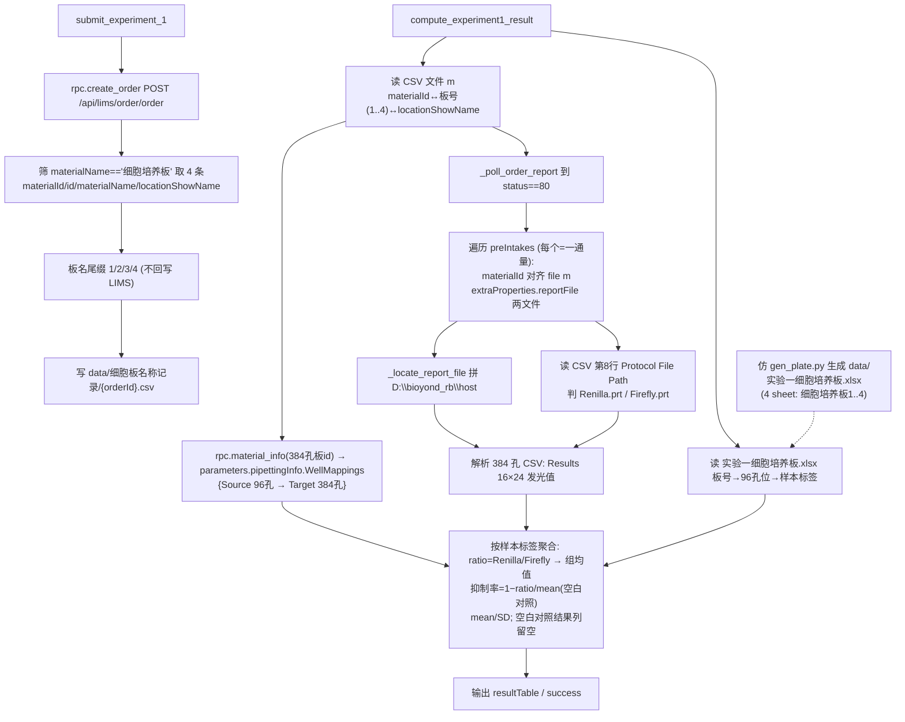

# 实验一结果计算节点（双荧光素酶报告基因检测）

## 目标
围绕小核酸**实验一**（报告基因检测，Firefly + Renilla 双荧光素酶）新增三块能力：

1. **落盘 4 块细胞培养板信息（CSV 文件 m）** —— `submit_experiment_1` 调 `/api/lims/order/order`（`rpc.create_order`）创建订单后，从返回物料里筛 `materialName == "细胞培养板"` 的 4 条记录，写 `data/细胞板名称记录/{orderId}.csv`，板名尾缀 `1/2/3/4`。**不回写 LIMS**。
2. **生成实验一孔板图 `实验一细胞培养板.xlsx`** —— 仿 [data/gen_plate.py](/Users/dp/python/Uni-Lab-OS-sirna/data/gen_plate.py) 产出含 **4 块 96 孔板**（sheet `细胞培养板1..4`）的 xlsx，每孔标 `空白对照 / 样品N-ID`，作为**孔位→样本身份**唯一来源。
3. **新增计算节点 `compute_experiment1_result`** —— 读 CSV 文件 m + 孔板 xlsx，轮询 `order-report` 到 `status==80` 拿 `preIntakes`，按 `materialId` 调 `material-info` 拿 96→384 映射，解析 renilla/firefly 两个 384 孔 CSV，按图二规则算 ratio / 抑制率 / 均值 / SD。

> 同类范式：实验二报告节点 `compute_experiment2_result`（[sirna_station.py L1974](/Users/dp/python/Uni-Lab-OS-sirna/unilabos/devices/workstation/bioyond_studio/sirna_station/sirna_station.py)）已实现「轮询 order-report + reportFile 定位本地文件」骨架，实验一直接复用其 helper。

---

## 真实数据结构（已抓取，来自工作站 `D:\Uni-Lab-OS-Sirna\_sirna_local\api_logs`）

### A) submit `/api/lims/order/order` 响应（细胞培养板记录）
`data` 形如 `{orderId: [record...]}`，经 `_extract_create_order_materials`（[L3324](/Users/dp/python/Uni-Lab-OS-sirna/unilabos/devices/workstation/bioyond_studio/sirna_station/sirna_station.py)）拿到。4 块板每条结构（真实样例）：
```json
{
  "id": "3a21c2c9-7e2c-c3ce-6f4f-c1b0187f077a",          // 领用记录 id
  "materialId": "3a21c2c9-7cb2-75ae-623c-587bbdccc65c",  // 板物料 id ← 下游 material-info / preIntake 对齐用这个
  "materialName": "细胞培养板",
  "materialCode": "0001-00250",
  "locationShowName": "4-14",
  "locationCode": "4-14",
  "materialTypeMode": "Sample",
  "materialTypeName": "细胞培养板",
  "quantity": "1个"
}
```
- 实测 4 块板顺序：`locationShowName` 4-14 / 4-15 / 4-16 / 4-17（materialCode 0001-00250/249/248/251）→ 按此出现顺序赋 seq 1..4。
- **注意有两个 id**：`id`（领用记录）与 `materialId`（板物料）。**下游用 `materialId`**；文件 m 两者都存，主键用 `materialId`。

### B) `order-report` 响应（`rpc.order_report(order_id)`）
- 顶层 `data.status == 80`（Success）才取报告；`data.preIntakes` 为数组，**`len(preIntakes)` = 通量数**。
- 每个 preIntake（真实样例，实验二，结构同实验一）：
```json
{
  "materialId": "3a21c25a-061d-ce28-d337-e5140fb4d4a8",   // 与 file m 的 materialId 对齐
  "materialIds": "3a21c25a-061d-ce28-d337-e5140fb4d4a8",
  "materialName": "细胞培养板",
  "sequence": 1,
  "extraProperties": {
    "reportFile": [
      "upload/result/test0610141650/20260610_142416046.csv",
      "upload/result/test0610141650/20260610_142416047.xml"
    ]
  },
  "status": 30, "statusName": "Retrieved"
}
```
- 实验二两文件是 `.csv`(RNA)+`.xml`(qPCR)；**实验一两文件应是两个 `.csv`（renilla + firefly）**。
- 现成 helper 可直接复用：
  - `_poll_order_report(order_id, interval, timeout)` 轮询到 status==80（[L1894](/Users/dp/python/Uni-Lab-OS-sirna/unilabos/devices/workstation/bioyond_studio/sirna_station/sirna_station.py)）。
  - `_extract_report_files(report)` 从 `preIntakes[].extraProperties.reportFile` 取相对路径列表（[L1875](/Users/dp/python/Uni-Lab-OS-sirna/unilabos/devices/workstation/bioyond_studio/sirna_station/sirna_station.py)）；本节点需**按 preIntake 分组**取（每板各自两文件），而非全量 extend。
  - `_locate_report_file(host_prefix, rel)` 拼 `D:\bioyond_rb\host`（[L1887](/Users/dp/python/Uni-Lab-OS-sirna/unilabos/devices/workstation/bioyond_studio/sirna_station/sirna_station.py)）。

### C) `material-info` 响应（`rpc.material_info(materialId)`）—— 已 live 调用确认
**关键修正：96→384 映射不在 `detail`，而在「384孔板」的 `parameters` 里（不是细胞培养板）。**
- 对**细胞培养板** materialId 调 material-info：`parameters: null`、`detail: []`、`locations: []` —— **无映射**。
- 对**384孔板** materialId（提交 order/order 响应里 `materialName=="384孔板"` 那条，本例 id `3a21c2c9-82b9-d334-7224-1fe4fa2c4ca5`）调 material-info：`data.parameters` 是 JSON 字符串，解析后：
```json
{ "pipettingInfo": "{\"SourcePlate\":\"<384id>\",\"TargetPlate\":\"<384id>\",\"WellMappings\":[{\"Source\":\"A1\",\"Target\":\"B2\"},{\"Source\":\"A2\",\"Target\":\"B4\"}, ... ]}" }
```
  即 `parameters`(JSON 串) → `pipettingInfo`(又是 JSON 串) → `WellMappings: [{"Source": "<96孔位>", "Target": "<384孔位>"}]`。
- 实测一组 WellMappings 含 96 条：Source A1..H12（96 孔）→ Target 落在偶数行(B/D/F/H/J/L/N/P)×偶数列(2/4/…/24)，即 384 的一个象限。
- 解析为 `mapping = {"A1":"B2","A2":"B4",...}`（96 孔位→384 孔位），正是计算所需。
- **【唯一待确认】** 本订单 4 块 细胞培养板 → 1 块 384孔板（4×96=384，gantt 有「移液到384孔板-1/2/3/4」4 步）。但该 384孔板 material-info 只返回了**一组**96 条 WellMappings（一个象限），且 `pipettingInfo.SourcePlate==TargetPlate==384id`，**未直接标明属于哪块 细胞培养板**。需一份**真正跑满 4 板**的完成订单来确认：4 块板的 4 组 WellMappings 是分别挂在各自 细胞培养板.parameters（跑后填充）、还是聚合在 384孔板（多组/全 384 条）。当前样例疑似只实际用了 1 块板。

---

## 端到端数据流



---

## 一、提交期落盘 4 块细胞培养板（CSV 文件 m）

### 1.1 接入点
`submit_experiment_1` → `_submit_experiment_core`（[L1057](/Users/dp/python/Uni-Lab-OS-sirna/unilabos/devices/workstation/bioyond_studio/sirna_station/sirna_station.py)）。`rpc.create_order` 后 `material_records = _extract_create_order_materials(parsed_result)`（[L1136](/Users/dp/python/Uni-Lab-OS-sirna/unilabos/devices/workstation/bioyond_studio/sirna_station/sirna_station.py)）。在其后追加 `_dump_cell_plates_file(order_id, material_records)`，**仅 `experiment_number == 1` 调用**。

### 1.2 筛选与编号
- 过滤 `record.get("materialName").strip() == "细胞培养板"`，期望命中 4 条（≠4 记 warning 仍写）。
- 按出现顺序赋 `seq=1..4`，板名改 `f"细胞培养板{seq}"`（与 xlsx sheet 名一致）。仅写文件，不回写 LIMS。

### 1.3 CSV 文件 m
- 目录 `data/细胞板名称记录/`（不存在则建）；文件名 `{orderId}.csv`。
- 列：`seq,materialId,id,materialName,materialCode,locationShowName`：
```csv
seq,materialId,id,materialName,materialCode,locationShowName
1,3a21c2c9-7cb2-75ae-623c-587bbdccc65c,3a21c2c9-7e2c-c3ce-6f4f-c1b0187f077a,细胞培养板1,0001-00250,4-14
2,3a21c2c9-7c95-b06f-6b47-cd970193357b,3a21c2c9-7e2c-98b2-aabe-3f7e19dba47d,细胞培养板2,0001-00249,4-15
3,3a21c2c9-7c71-016e-25c4-3840468a0d24,3a21c2c9-7e2c-4a8c-ba08-39393b7c2e4c,细胞培养板3,0001-00248,4-16
4,3a21c2c9-7ce7-ddcb-35fe-92faa4777637,3a21c2c9-7e2c-de86-aa4c-72aa77ecc5fc,细胞培养板4,0001-00251,4-17
```
- **额外记录 384孔板 id**（96→384 映射的来源，见 3.5）：同时把 order/order 响应中 `materialName=="384孔板"` 的 `materialId` 记下（本例 `3a21c2c9-82b9-d334-7224-1fe4fa2c4ca5`）。建议加一行 `seq=0,...,materialName=384孔板`，或单列文件。

---

## 二、生成实验一孔板图 `实验一细胞培养板.xlsx`
仿 [data/gen_plate.py](/Users/dp/python/Uni-Lab-OS-sirna/data/gen_plate.py)（当前生成单 sheet「细胞培养板」，8×12，单元格 `空白对照`/`样品N-ID`）新增 `data/gen_experiment1_plate.py`，循环生成 **4 个 sheet** `细胞培养板1..4`，输出 `data/实验一细胞培养板.xlsx`。sheet 名与文件 m 板名一一对应，作为板号→孔板图桥梁。
- 【次要待确认】每块板样品布局是否固定（暂沿用随机填充）。

---

## 三、计算节点 `compute_experiment1_result`

### 3.1 读 CSV 文件 m
读 `data/细胞板名称记录/{order_id}.csv` → `板号_by_materialId`、`location_by_materialId`。缺文件 → 抛错提示先跑 submit_experiment_1。

### 3.2 读孔板 xlsx
读 `data/实验一细胞培养板.xlsx`，按板号取 sheet `细胞培养板{seq}` → `label_by_well = {"A1":"空白对照","A2":"样品1-ID",...}`。

### 3.3 order-report → 每通量两文件
- `report = _poll_order_report(order_id, interval, timeout)`（到 status==80）。
- 遍历 `report["preIntakes"]`：用 `preIntake["materialId"]` 对齐 file m 板号；取 `preIntake["extraProperties"]["reportFile"]` 两路径，`_locate_report_file(host_prefix, rel)` 定位本地。

### 3.4 renilla/firefly 区分
reportFile 文件名是时间戳（无 Renilla/Firefly 字样）。判定法：读 CSV 第 8 行 `Protocol File Path:` 是否含 `Firefly.prt` / `Renilla.prt`（样例文件该行即 `...\Biotek_Synergy_H1\Firefly.prt`）。兜底：若两文件含明显 Renilla/Firefly 文件名则按名判。

### 3.5 material-info → 96→384 映射（已确认结构）
- 取 **384孔板** materialId（来自 order/order 响应 `materialName=="384孔板"`，建议在 1.3 文件 m 里一并记录，或 compute 时从 order/order / preIntakes 再取）。
- `info = rpc.material_info(板384_id)` → `params = json.loads(info["parameters"])` → `pip = json.loads(params["pipettingInfo"])` → `pip["WellMappings"]`（`[{"Source","Target"}]`）。
- 转 `mapping = {wm["Source"]: wm["Target"] for wm in WellMappings}`（96→384）。
- 细胞培养板自身 material-info 的 parameters 当前为 null，**不要**从细胞培养板取映射。
- **【唯一待确认】** 4 块板各自象限的 WellMappings 如何区分归属（见上文「真实数据结构 C」）。拿到真实 4 板完成订单后定。

### 3.6 解析 384 孔 CSV（renilla / firefly）
样例 renilla=`/Users/dp/Downloads/Experiment1_260601_131236_.csv`、firefly=`..._131236111.csv`（BioTek Synergy H1）：`Results` 段后表头 `\t1..24`，16 行 `A..P` 发光值（末列 `Lum` 丢弃）→ `values_384 = {"A1":12,...}`。复用 [unilabos/script/rna_concentration.py](/Users/dp/python/Uni-Lab-OS-sirna/unilabos/script) 解析思路（8×12 改 16×24）。

### 3.7 计算规则（图二，双荧光素酶）
每个 96 孔位 `w`（属板 `materialId`，板号 `seq`）：
1. `w384 = mapping[materialId][w]`。
2. `Renilla = values_384_renilla[w384]`、`Firefly = values_384_firefly[w384]`。
3. `ratio = Renilla / Firefly`（实测 1897/309=6.14、1342/240=5.59 ✓）。
4. `label = label_by_well[w]`（孔板 xlsx）。
5. 按样本标签聚合 `空白对照/样品N` 各组 ratio 均值（已确认）。
6. `抑制率 = 1 − ratio / mean(空白对照组 ratio)`。
7. 按样本组算 `mean(抑制率)`、`SD(抑制率)`（n−1）。
8. **空白对照结果列先留空**（其 ratio 均值仍作分母）。

### 3.8 节点实现
仿 `compute_experiment2_result` 在 [sirna_station.py](/Users/dp/python/Uni-Lab-OS-sirna/unilabos/devices/workstation/bioyond_studio/sirna_station/sirna_station.py) 新增 `@action def compute_experiment1_result(self, order_id, host_prefix=r"D:\bioyond_rb\host", poll_interval_seconds=10.0, poll_timeout_seconds=3600, plate_map_path="", **kwargs)`：
- 输入 handle `order_id`（连 `wait_for_order_finish.order_id`）；输出 `resultTable`（列 板/样本/Renilla/Firefly/ratio/抑制率/mean/SD，参考 [_build_result_table L3450](/Users/dp/python/Uni-Lab-OS-sirna/unilabos/devices/workstation/bioyond_studio/sirna_station/sirna_station.py)）+ `success`。
- 用 `_debug_call_session("compute_experiment1_result")`。

---

## 四、验证
1. 生成 `data/实验一细胞培养板.xlsx`（4 sheet）。
2. 本地用样例两文件跑解析+计算，核对 ratio≈图二（6.14/5.59/2.03/3.81）。
3. 造 CSV 文件 m + 假 96→384 映射端到端跑节点，确认空白对照结果列留空、mean/SD 正确。
4. `make build` / import 通过；更新 `bioyond-sirna-station/action-index.md` 与 `actions/compute_experiment1_result.json`。

## 五、待确认清单
- 【待真实4板订单】4 块 细胞培养板 各自的 96→384 WellMappings 如何区分归属：是各自 细胞培养板.parameters（跑后填充）、还是聚合在 384孔板（多组 / 全 384 条）。当前 live 样例疑似只实际用 1 块板，384孔板 只返回一组 96 条。
- 【次要】`实验一细胞培养板.xlsx` 每块板内样品布局是否固定（暂随机）。

## 已确认（含真实数据）
- 文件 m：`data/细胞板名称记录/{orderId}.csv`；列 `seq,materialId,id,materialName,materialCode,locationShowName`；下游主键 `materialId`。
- 板名尾缀 1/2/3/4，仅写本地、不回写 LIMS。
- 样本身份来源：新建 `data/实验一细胞培养板.xlsx`（4 sheet 细胞培养板1..4，仿 gen_plate.py）。
- order-report：`data.status==80`、`data.preIntakes[]`（len=通量数），每 preIntake `materialId` + `extraProperties.reportFile` 两文件；复用 `_poll_order_report`/`_extract_report_files`/`_locate_report_file`（前缀 `D:\bioyond_rb\host`）。
- renilla/firefly 区分：CSV 第8行 `Protocol File Path` 含 `Renilla.prt`/`Firefly.prt`。
- 96→384 映射（live 确认）：在 **384孔板** 的 `material-info.parameters`(JSON) → `pipettingInfo`(JSON) → `WellMappings:[{Source,Target}]`；细胞培养板的 parameters/detail 为空。
- 抑制率：ratio 按 空白对照/样品N 分组求均值；抑制率 = 1 − ratio/mean(空白对照组 ratio)；空白对照结果列暂留空。
