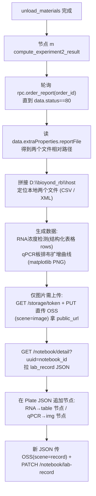

# 实验二结果计算与记录本展示节点（节点 m）

## 目标
在 [sirna_station.py](/Users/dp/python/Uni-Lab-OS-sirna/unilabos/devices/workstation/bioyond_studio/sirna_station/sirna_station.py) 中新增一个 `@action` 节点，接在 `unload_materials` 之后，自动完成：拉取实验二报告文件 → 生成数据(RNA 表格 + qPCR 曲线图) → 上传 OSS(图片/附件) → 写入实验记录本(RNA 用原生表格节点、qPCR 用图片节点)。

## 记录本可嵌入的节点类型（已查证）
notebook 编辑器(Plate/Slate)支持的承载形式：
- **`img` 图片**：matplotlib 出的 qPCR 扩增曲线/板排布图。需先传 OSS 拿 `url`。
- **原生表格 `table`/`tr`/`td`/`th`**：在记录本里**直接渲染成表格**(可编辑、导出 Word/PDF 保留)，**无需上传 OSS**，直接把数据写进 Plate JSON。**RNA 浓度检测首选此方式**。
- **`file` 附件**：csv/xlsx/docx/pdf(≤4MB)，只显示**可下载卡片、不内嵌预览**。用于归档原始仪器文件。
- 编辑器**没有**专门的 spreadsheet/数据表自定义节点，内嵌表格只能用原生 `table`。

## 端到端数据流

## 关键前置结论（已查证）
- notebook 运行时，后端 `job_start.data.notebook_id` 即记录本 UUID（见 [engine/model.go](/Users/dp/go/code/uni-lab-backend/pkg/core/schedule/engine/model.go) `SendActionData`）。
- edge 已解析为 `JobAddReq.notebook_id` 并带在 `QueueItem`（[ws_client.py](/Users/dp/python/Uni-Lab-OS-sirna/unilabos/app/ws_client.py)），但**当前不会注入到 `@action` 方法**，需补一处透传。
- 认证复用 edge 现成 Lab AK/SK：`BasicConfig.auth_secret()` + `HTTPConfig.remote_addr`（[config.py](/Users/dp/python/Uni-Lab-OS-sirna/unilabos/config/config.py)、[client.py](/Users/dp/python/Uni-Lab-OS-sirna/unilabos/app/web/client.py)），`Authorization: Lab base64(ak:sk)`。
- OSS 直传有现成实现可复用：[neware](/Users/dp/python/Uni-Lab-OS-sirna/unilabos/devices/neware_battery_test_system/neware_battery_test_system.py) 的 `get_upload_token` / `upload_file_with_presigned_url`（`GET /api/v1/lab/storage/token` → `PUT` 预签名 URL）。
- `order_report` 现有 RPC 只传 `data=order_id`（[bioyond_rpc.py](/Users/dp/python/Uni-Lab-OS-sirna/unilabos/devices/workstation/bioyond_studio/bioyond_rpc.py) L782）；`status` 是**响应字段**，仅 `status==80` 时才有 `extraProperties.reportFile`，否则轮询重查。
- 图片生成逻辑沿用已有两份计划：RNA(BioTek 荧光 CSV)→浓度；qPCR(XML)→板排布+扩增曲线。

## 实现步骤

### 1. 把 notebook_id 透传给 @action
推荐在框架层注入（最干净，一次解决所有节点）：
- [host_node.py](/Users/dp/python/Uni-Lab-OS-sirna/unilabos/ros/nodes/presets/host_node.py) `send_goal`：在 `JSON_UNILABOS_PARAM` 里加入 `notebook_id`（与 `sample_uuids` 同位置）。
- [base_device_node.py](/Users/dp/python/Uni-Lab-OS-sirna/unilabos/ros/nodes/base_device_node.py) `_execute_driver_command`：把 `unilabos_param.notebook_id` 解析为方法可声明的系统入参。
- 备选（不改框架）：节点内从 `HostNode.get_instance()` 当前 job 上下文读取 `notebook_id`。

### 2. 云端客户端 helper（OSS + notebook）
新增模块（建议 `unilabos/devices/workstation/bioyond_studio/sirna_station/notebook_client.py`），复用 Lab AK/SK：
- `upload_to_oss(file_path, scene)` → 复用 neware 两函数，返回 `public_url` + `path`。
- `get_notebook_detail(uuid)` / `fetch_lab_record(url)` / `save_lab_record(uuid, value)`：对齐前端契约（`GET /notebook/detail`、`PATCH /notebook/lab-record`，`lab_record` 存 record JSON 的 OSS URL，`lab_record_status="editing"`）。
- `build_image_node(asset)` → Plate `img` 节点：`{type:"img", url, path, name, size, mimeType, width, align:"center", uploadStatus:"done", children:[{text:""}]}`。
- `build_table_node(headers, rows)` → Plate 原生表格：顶层 `{type:"table", colSizes:[...], children:[tr...]}`；首行 cell 用 `th`、数据行用 `td`，每个 cell 的 `children` 为 `[{type:"p", children:[{text:"..."}]}]`。**RNA 浓度检测用这个，无需 OSS。**
- `build_file_node(asset)`（可选）→ Plate `file` 附件：`{type:"file", url, path, name, size, mimeType, uploadStatus:"done", children:[{text:""}]}`，用于归档原始 xlsx/csv。

### 3. 报告文件获取
节点 m 内：轮询 `rpc.order_report(order_id)`（间隔/超时可配），命中 `data.status==80` 后取 `data.extraProperties.reportFile` 两路径，前缀拼 `D:\bioyond_rb\host` 定位本地文件；按扩展名区分 `.csv`(RNA) / `.xml`(qPCR)。

### 4. 生成数据/图片
复用/落地两份提取计划为可 import 的函数：
- RNA：`rna_concentration` 逻辑 → 返回**结构化表格**(表头 + 各行)，供构造原生 `table` 节点；可选另出 xlsx 作附件归档。
- qPCR：`qpcr_plate_curves` 逻辑(matplotlib) → `qPCR板排布及扩增曲线.png`(图片)；板排布可另出 `table` 或并入图片。

### 5. 新增节点 m
在 sirna_station.py 仿 `unload_materials` 加 `@action def compute_experiment2_result(self, order_id, notebook_id="", host_prefix=r"D:\bioyond_rb\host", poll_interval=..., poll_timeout=..., **kwargs)`，串联步骤 3→4→2：
- RNA 表格 → `build_table_node` 直接追加(无需上传)。
- qPCR 图片 → 上传 OSS → `build_image_node` 追加。
- `handles` 输入 `order_id`（连 `wait_for_order_finish.order_id`）、输出 `success` / 图片 URL 列表。

### 6. 工作流接线
将 m 接在 `unload_materials` 之后（参考首图节点 DAG），order_id 取自上游。

### 7. 验证
用真实/示例报告文件试跑：order-report 轮询命中 80、两文件定位、RNA 表格数据 + qPCR 曲线图生成、图片 OSS 上传成功、notebook detail 读取 → 追加 `table`(RNA) + `img`(qPCR) 节点 → PATCH 保存，前端记录本里 **RNA 显示为表格、qPCR 显示为图片**。

## 待确认/假设
- 样本身份映射表（96 孔板图 `细胞培养板.xlsx`）来源：是否为 reportFile 之外、工作站已知文件？（提取脚本需要它做孔位→样本映射）
- `reportFile` 两文件的具体内容/命名规则（默认按 `.csv`=RNA、`.xml`=qPCR 区分）。
- RNA 浓度标准曲线仍为占位（待真实标曲）。
- `lab_record` 为整份覆盖式保存：节点 m 写入前先拉最新再追加；若用户同时在前端编辑存在 last-write-wins 覆盖风险。
- 记录本须 `lab_record_status=="editing"` 才能写入（后端约束）。
