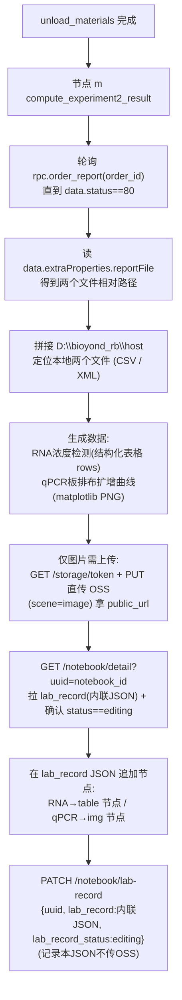

# 实验二结果计算与记录本展示节点（节点 m）

## 目标
在 [sirna_station.py](/Users/dp/python/Uni-Lab-OS-sirna/unilabos/devices/workstation/bioyond_studio/sirna_station/sirna_station.py) 中新增一个 `@action` 节点，接在 `unload_materials` 之后，自动完成：拉取实验二报告文件 → 生成数据(RNA 表格 + qPCR 曲线图) → 上传 OSS(图片/附件) → 写入实验记录本(RNA 用原生表格节点、qPCR 用图片节点)。

## 记录本可嵌入的节点类型（已查证）
notebook 编辑器(Plate/Slate)支持的承载形式：
- **`img` 图片**：matplotlib 出的 qPCR 扩增曲线/板排布图。需先传 OSS 拿 `url`。
- **原生表格 `table`/`tr`/`td`/`th`**：在记录本里**直接渲染成表格**(可编辑、导出 Word/PDF 保留)，**无需上传 OSS**，直接把数据写进 Plate JSON。**RNA 浓度检测首选此方式**。
- **`file` 附件**：csv/xlsx/docx/pdf(≤4MB)，只显示**可下载卡片、不内嵌预览**。用于归档原始仪器文件。
- 编辑器**没有**专门的 spreadsheet/数据表自定义节点，内嵌表格只能用原生 `table`。

## 端到端数据流



## 关键前置结论（已查证 ✅）
- notebook 运行时，后端 `job_start.data.notebook_id` 即记录本 UUID（见 [engine/model.go](/Users/dp/go/code/uni-lab-backend/pkg/core/schedule/engine/model.go) `SendActionData`）。
- edge 已解析为 `JobAddReq.notebook_id` 并带在 `QueueItem`（[ws_client.py](/Users/dp/python/Uni-Lab-OS-sirna/unilabos/app/ws_client.py)），但**当前不会注入到 `@action` 方法**。**决策：节点内从 `HostNode.get_instance()` 当前 job 上下文读 `notebook_id`，不改框架。**
- **认证 ✅ 已确认可用**：edge `client.py` 用 `Authorization: Lab base64(ak:sk)`（`BasicConfig.auth_secret()`）。后端 `labRouter = v1.Group("/lab", auth.AuthWeb())`，`AuthWeb` 支持 `Lab` 方案，`getLabUser` 把 `base64(ak:sk)` 解析成 lab 用户（[middleware.go](/Users/dp/go/code/uni-lab-backend/pkg/middleware/auth/middleware.go) L103-123, L221）。故 edge 直接可调 `/notebook/detail` 与 `/notebook/lab-record`。
- **notebook 接口 ✅ 存在**：`GET /api/v1/lab/notebook/detail?uuid=` → `NotebookDetailResp`；`PATCH /api/v1/lab/notebook/lab-record` → `UpdateNotebookLabRecordReq`（[router.go](/Users/dp/go/code/uni-lab-backend/pkg/web/router.go) L290/L298，[model.go](/Users/dp/go/code/uni-lab-backend/pkg/core/notebook/model.go) L207-236）。
- **⚠️ lab_record 存储方式（已厘清）**：后端 `lab_record` 为 `datatypes.JSON`，按原样存（[notebook.go](/Users/dp/go/code/uni-lab-backend/pkg/core/notebook/notebook/notebook.go) L1586-1588）。前端**两种格式都支持**：前端"保存"按钮默认把 Slate JSON 传 OSS(`scene='record'`)、`lab_record` 存 **URL 字符串**；但读取 `fetchNotebookRecord` 同时兼容**内联数组**（"老 inline 格式"直接返回）。→ **edge 节点选内联数组**：直接 PATCH `lab_record:[...]`，省掉记录本 JSON 的 OSS 往返。**只有 qPCR 图片二进制才需要 OSS**（供 `img` 节点的 url）。
- **写 lab_record 的硬约束**：必须 `notebook.lab_record_status == "editing"` 才能写（[notebook.go](/Users/dp/go/code/uni-lab-backend/pkg/core/notebook/notebook/notebook.go) L1496-1498）；目标记录本当前正是 `editing`（curl 实测）。PATCH 时若一并传 `lab_record_status:"editing"` 可保持可编辑。
- OSS 直传有现成实现可复用：[neware](/Users/dp/python/Uni-Lab-OS-sirna/unilabos/devices/neware_battery_test_system/neware_battery_test_system.py) 的 `get_upload_token` / `upload_file_with_presigned_url`（`GET /api/v1/lab/storage/token` → `PUT` 预签名 URL）。**注意**：neware 那两函数的 `Authorization` 走 `UNI_LAB_AUTH_TOKEN` 环境变量(Bearer/Api)，复用时改成传 edge 的 `Lab base64(ak:sk)` 头。
- `order_report` 现有 RPC 只传 `data=order_id`（[bioyond_rpc.py](/Users/dp/python/Uni-Lab-OS-sirna/unilabos/devices/workstation/bioyond_studio/bioyond_rpc.py) L782）；`status` 是**响应字段**，仅 `status==80` 时才有 `extraProperties.reportFile`，否则轮询重查。
- 数据生成逻辑已落地为 [gen_report.py](/Users/dp/python/Uni-Lab-OS-sirna/unilabos/script/gen_report.py)（RNA 浓度 + qPCR 板排布/曲线/统计），需拆成可 import 函数：RNA→结构化表格 rows；qPCR→PNG。
- 样本映射表 `data/细胞培养板.xlsx` 为**工作站已知固定文件**（用户确认），随脚本读取做孔位→样本映射。
- reportFile 两文件区分规则（用户确认）：`.csv`=RNA、`.xml`=qPCR；本地前缀 `D:\bioyond_rb\host`。

## 实现步骤

### 1. 把 notebook_id 透传给 @action（决策：不改框架）
节点内从 `HostNode.get_instance()` 当前 job 上下文读取 `notebook_id`（`QueueItem.notebook_id` 已带）。仅解决本节点，不动 `host_node.py` / `base_device_node.py`。

### 2. 云端客户端 helper（OSS + notebook）
新增模块（建议 `unilabos/devices/workstation/bioyond_studio/sirna_station/notebook_client.py`），复用 Lab AK/SK（`Authorization: Lab base64(ak:sk)`，`remote_addr` 见 HTTPConfig）：
- `upload_image_to_oss(file_path, scene="image")` → 复用 neware 两函数（但鉴权头改成 `Lab base64(ak:sk)`），返回 `public_url` + `path`。**仅 qPCR 图片走 OSS。**
- `get_notebook_detail(uuid)` → `GET /notebook/detail?uuid=`，取 `data.lab_record` + `data.lab_record_status`。
- `save_lab_record(uuid, value)` → `PATCH /notebook/lab-record`，body `{uuid, lab_record:<Slate 数组>, lab_record_status:"editing"}`。**采用内联数组（前端 `fetchNotebookRecord` 对数组直接返回，无需 OSS）。** 写前确认 `lab_record_status=="editing"`。
- `build_image_node / build_table_node / build_file_node`：节点结构见下方「Slate 节点 schema」（前端代码反推，精确）。

### Slate 节点 schema（✅ 从前端 [notebook-editor](/Users/dp/go/code/Uni-Lab-Cloud/web/src/shared/components/notebook-editor) 反推，已锁定）

**顶层 lab_record = Slate `Value` = 数组**（block 节点列表）。空文档 = `[{ "type": "p", "children": [{ "text": "" }] }]`（`types.ts` `EMPTY_VALUE`）。

**lab_record 存储两种格式都被读取支持**（`experiment-record.tsx` `fetchNotebookRecord`）：① 内联数组（"老 inline 格式"，直接返回）；② OSS URL 字符串（前端"保存"按钮默认走这个：`saveNotebookRecordApi` 把 JSON 传 OSS `scene='record'` 后存 URL）。**edge 节点选 ①：直接 PATCH 数组，省掉记录本 JSON 的 OSS 往返；图片二进制仍需 OSS。**

**图片节点 `img`（void，来源 `upload-flow.ts`）：**
```json
{ "type": "img", "url": "<OSS publicUrl>", "path": "<OSS对象key>",
  "name": "qpcr.png", "size": 12345, "mimeType": "image/png",
  "width": 760, "uploadStatus": "done", "children": [{ "text": "" }] }
```
（`width` 可选；`uploadId` 是运行时字段，落库不需要）

**附件节点 `file`（可选，归档原始 xlsx/csv）：** 同上去掉 `width`，`type:"file"`。

**表格节点（`@udecode/plate-table`，type 串见 `plugins.ts`）：**
```json
{ "type": "table", "colSizes": [140, 140, 140, 140],
  "children": [
    { "type": "tr", "children": [
      { "type": "th", "children": [{ "type": "p", "children": [{ "text": "Sample Name" }] }] },
      { "type": "th", "children": [{ "type": "p", "children": [{ "text": "Nucleic Acid(ng/uL)" }] }] }
    ]},
    { "type": "tr", "children": [
      { "type": "td", "children": [{ "type": "p", "children": [{ "text": "样品1-ID" }] }] },
      { "type": "td", "children": [{ "type": "p", "children": [{ "text": "58.25" }] }] }
    ]}
  ]}
```
- `table.colSizes`：每列像素宽数组（前端默认每列 140，`EditorToolbar.tsx`）。列数 = 表头列数。
- 行 `tr`；表头单元格 `th`、数据单元格 `td`；cell 的 `children` 为 block，用段落 `p` 包裹文本。
- RNA 浓度检测表用此节点，**无需 OSS**。

### 3. 报告文件获取
节点 m 内：轮询 `rpc.order_report(order_id)`（间隔/超时可配），命中 `data.status==80` 后取 `data.extraProperties.reportFile` 两路径，前缀拼 `D:\bioyond_rb\host` 定位本地文件；按扩展名区分 `.csv`(RNA) / `.xml`(qPCR)。

### 4. 生成数据/图片
复用/落地两份提取计划为可 import 的函数：
- RNA：`rna_concentration` 逻辑 → 返回**结构化表格**(表头 + 各行)，供构造原生 `table` 节点；可选另出 xlsx 作附件归档。
- qPCR：`qpcr_plate_curves` 逻辑(matplotlib) → `qPCR板排布及扩增曲线.png`(图片)；板排布可另出 `table` 或并入图片。

### 5. 新增节点 m
在 sirna_station.py 仿 `unload_materials` 加 `@action def compute_experiment2_result(self, order_id, notebook_id="", host_prefix=r"D:\bioyond_rb\host", poll_interval=..., poll_timeout=..., **kwargs)`，串联步骤 3→4→2：
- RNA 表格 → `build_table_node` 直接追加(无需上传)。
- qPCR 图片 → 上传 OSS → `build_image_node` 追加。
- `handles` 输入 `order_id`（连 `wait_for_order_finish.order_id`）、输出 `success` / 图片 URL 列表。

### 6. 工作流接线
将 m 接在 `unload_materials` 之后（参考首图节点 DAG），order_id 取自上游。

### 7. 验证
用真实/示例报告文件试跑：order-report 轮询命中 80、两文件定位、RNA 表格数据 + qPCR 曲线图生成、图片 OSS 上传成功、notebook detail 读取 → 追加 `table`(RNA) + `img`(qPCR) 节点 → PATCH 保存，前端记录本里 **RNA 显示为表格、qPCR 显示为图片**。

## 待确认/假设（更新于 2026-06-09）
- ✅ 样本映射表 `细胞培养板.xlsx`：工作站已知固定文件（用户确认）。
- ✅ reportFile 区分：`.csv`=RNA、`.xml`=qPCR（用户确认）；前缀 `D:\bioyond_rb\host`。
- ✅ 认证：edge `Lab base64(ak:sk)` 经 `AuthWeb`/`getLabUser` 解析为用户，可调 notebook 接口。
- ✅ notebook_id 透传：节点内从 HostNode 当前 job 读，不改框架。
- ✅ lab_record：写入须 `lab_record_status=="editing"`（目标记录本已是 editing）；edge 走内联数组格式，不传 OSS。
- ✅ **Slate schema 已锁定**（从前端 notebook-editor 反推）：顶层数组；`img`/`file`/`table(tr/td/th + colSizes)` 节点字段见「实现步骤 2 / Slate 节点 schema」。原"需含图表真实记录本"的残留**已消除**。
- 🟡 RNA 浓度标准曲线仍为占位（用户同意先占位跑通，待真实标曲替换 `--slope/--intercept`）。
- 🟡 并发覆盖风险：`lab_record` 整份覆盖式保存，节点 m 写入前先拉最新再追加；若用户同时在前端编辑存在 last-write-wins 风险（先接受）。
