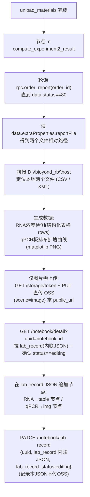

# 实验二结果计算与记录本展示节点（节点 m）

## 目标
在 [sirna_station.py](/Users/dp/python/Uni-Lab-OS-sirna/unilabos/devices/workstation/bioyond_studio/sirna_station/sirna_station.py) 中新增一个 `@action` 节点，接在 `unload_materials` 之后，自动完成：拉取实验二报告文件 → 生成数据(RNA 表格 + qPCR 曲线图) → 上传 OSS(图片/附件) → 写入实验记录本(RNA 用原生表格节点、qPCR 用图片节点)。

## 记录本可嵌入的节点类型（已查证）
notebook 编辑器(Plate/Slate)支持的承载形式：
- **`img` 图片**：matplotlib 出的 qPCR 扩增曲线/板排布图。需先传 OSS 拿 `url`。
- **原生表格 `table`/`tr`/`td`/`th`**：在记录本里**直接渲染成表格**(可编辑、导出 Word/PDF 保留)，**无需上传 OSS**，直接把数据写进 Plate JSON。**RNA 浓度检测首选此方式**。
- **`file` 附件**：csv/xlsx/docx/pdf(≤4MB)，只显示**可下载卡片、不内嵌预览**。用于归档原始仪器文件。
- 编辑器**没有**专门的 spreadsheet/数据表自定义节点，内嵌表格只能用原生 `table`。

## 端到端数据流



## 关键前置结论（已查证 ✅）
- notebook 运行时，后端 `job_start.data.notebook_id` 即记录本 UUID（见 [engine/model.go](/Users/dp/go/code/uni-lab-backend/pkg/core/schedule/engine/model.go) `SendActionData`）。
- **⚠️ notebook_id 获取方式（已订正）**：原计划"从 `HostNode.get_instance()` 读"**不可行**——`host_node.py` 全文无 `notebook` 字样，HostNode 唯一的 job 上下文 `DeviceActionStatus` 只有 `job_ids`，**不持有 notebook_id**。`send_goal` 打包 ROS goal 时也只发 `action_kwargs` + `unilabos_param.sample_uuids`，**不带 notebook_id**。
- **✅ 正确入口：device_manager**。notebook_id 真实存在于 `JobInfo.notebook_id`（[ws_client.py](/Users/dp/python/Uni-Lab-OS-sirna/unilabos/app/ws_client.py) L81），可经 `DeviceActionManager.active_jobs[device_action_key]` / `get_active_jobs()` / `get_job_info(job_id)` 反查。`DeviceActionManager` 挂在 `WebSocketClient.device_manager`（L1665），而 `WebSocketClient` 是进程级单例，有现成全局入口 `get_communication_client()`（[communication.py](/Users/dp/python/Uni-Lab-OS-sirna/unilabos/app/communication.py) L142 `_client_cache`）。edge 端设备节点与 ws client 同进程，故 `@action` 内可直接读到。**决策：节点内用 `get_communication_client().device_manager` 按 `device_action_key` 反查 notebook_id，不改框架。**
  - 时序安全：job_start 流程先 `device_manager.start_job()` 填 active_jobs，再 `send_goal` 触发 ROS action 跑 `@action`（ws_client L1052/L1077），故 `@action` 运行时该 JobInfo 必在表中。
  - ⚠️ always_free 特判：若节点 m 声明 `always_free=True`（如 `unload_materials`/MANUAL_CONFIRM 节点），STARTED 后会被移出 `active_jobs`，只能靠 `get_active_jobs()` 补回（L304-306）→ lookup 必须两路兜底。
  - ⚠️ 需确认节点能拿到自身 `device_id` 以拼 `device_action_key=f"/devices/{device_id}/{action}"`（参考 `bioyond_cell_workstation` 的 `self.device_id` 走 `_ros_node`）。
  - ⚠️ 分层耦合：devices 层 import `app.communication` 属反向依赖（架构异味，能跑但不洁）；判空回退：取不到 notebook_id 时明确报错，不静默写空记录本。
  - 备选方案 B（更干净、需改框架两处）：`send_goal` 把 notebook_id 塞进 `JSON_UNILABOS_PARAM`，`base_device_node` 注入循环加一支识别 `notebook_id` 形参（与 `sample_uuids` 注入同机制）。先用 A 跑通，长期维护再考虑迁 B。
- **认证 ✅ 已确认可用**：edge `client.py` 用 `Authorization: Lab base64(ak:sk)`（`BasicConfig.auth_secret()`）。后端 `labRouter = v1.Group("/lab", auth.AuthWeb())`，`AuthWeb` 支持 `Lab` 方案，`getLabUser` 把 `base64(ak:sk)` 解析成 lab 用户（[middleware.go](/Users/dp/go/code/uni-lab-backend/pkg/middleware/auth/middleware.go) L103-123, L221）。故 edge 直接可调 `/notebook/detail` 与 `/notebook/lab-record`。
- **notebook 接口 ✅ 存在**：`GET /api/v1/lab/notebook/detail?uuid=` → `NotebookDetailResp`；`PATCH /api/v1/lab/notebook/lab-record` → `UpdateNotebookLabRecordReq`（[router.go](/Users/dp/go/code/uni-lab-backend/pkg/web/router.go) L290/L298，[model.go](/Users/dp/go/code/uni-lab-backend/pkg/core/notebook/model.go) L207-236）。
- **⚠️ lab_record 存储方式（已厘清）**：后端 `lab_record` 为 `datatypes.JSON`，按原样存（[notebook.go](/Users/dp/go/code/uni-lab-backend/pkg/core/notebook/notebook/notebook.go) L1586-1588）。前端**两种格式都支持**：前端"保存"按钮默认把 Slate JSON 传 OSS(`scene='record'`)、`lab_record` 存 **URL 字符串**；但读取 `fetchNotebookRecord` 同时兼容**内联数组**（"老 inline 格式"直接返回）。→ **edge 节点选内联数组**：直接 PATCH `lab_record:[...]`，省掉记录本 JSON 的 OSS 往返。**只有 qPCR 图片二进制才需要 OSS**（供 `img` 节点的 url）。
- **写 lab_record 的硬约束**：必须 `notebook.lab_record_status == "editing"` 才能写（[notebook.go](/Users/dp/go/code/uni-lab-backend/pkg/core/notebook/notebook/notebook.go) L1496-1498）；目标记录本当前正是 `editing`（curl 实测）。PATCH 时若一并传 `lab_record_status:"editing"` 可保持可编辑。
- **⚠️ OSS 复用对象（已订正）**：**优先复用 edge 自家** [app/web/client.py](/Users/dp/python/Uni-Lab-OS-sirna/unilabos/app/web/client.py) + [app/oss_upload.py](/Users/dp/python/Uni-Lab-OS-sirna/unilabos/app/oss_upload.py)——它们已用 `Authorization: Lab {auth}`（`BasicConfig.auth_secret()`），且 `remote_addr` 已含 `/api/v1`。**不要直接套 neware 的 `get_upload_token`/`upload_file_with_presigned_url`**：那两函数 ① 鉴权走 `UNI_LAB_AUTH_TOKEN` 环境变量(Bearer/Api)，非 edge 的 Lab ak/sk；② URL 拼 `{base_url}/api/v1/lab/storage/token` 而 base_url **不含** `/api/v1`，与 `HTTPConfig.remote_addr`（已含 `/api/v1`）拼一起会 `.../api/v1/api/v1/...` 双前缀。
- **⚠️ 后端接口 URL 拼接统一规则**：edge `HTTPConfig.remote_addr` 已含 `/api/v1`（如 `https://leap-lab.bohrium.com/api/v1`），故 notebook/storage 接口一律拼成 `{remote_addr}/lab/notebook/detail`、`{remote_addr}/lab/storage/token`，**不再加 `/api/v1`**。
- `order_report` 现有 RPC 只传 `data=order_id`（[bioyond_rpc.py](/Users/dp/python/Uni-Lab-OS-sirna/unilabos/devices/workstation/bioyond_studio/bioyond_rpc.py) L782）；`status` 是**响应字段**，仅 `status==80` 时才有 `extraProperties.reportFile`，否则轮询重查。
- 数据生成逻辑已落地为 [gen_report.py](/Users/dp/python/Uni-Lab-OS-sirna/unilabos/script/gen_report.py)（RNA 浓度 + qPCR 板排布/曲线/统计），需拆成可 import 函数：RNA→结构化表格 rows；qPCR→PNG。
- 样本映射表 `data/细胞培养板.xlsx` 为**工作站已知固定文件**（用户确认），随脚本读取做孔位→样本映射。
- reportFile 两文件区分规则（用户确认）：`.csv`=RNA、`.xml`=qPCR；本地前缀 `D:\bioyond_rb\host`。

## 实现步骤

### 1. 取 notebook_id（决策：不改框架，经 device_manager）
节点内通过 `get_communication_client().device_manager` 反查当前 job 的 notebook_id：
```python
from unilabos.app.communication import get_communication_client

key = f"/devices/{self.device_id}/compute_experiment2_result"
dm = get_communication_client().device_manager
job = dm.active_jobs.get(key) or next(
    (j for j in dm.get_active_jobs() if j.device_action_key == key), None
)
notebook_id = (job.notebook_id if job else "") or ""
if not notebook_id:
    raise ValueError("未取到 notebook_id（device_manager 当前无匹配 active job），中止写记录本")
```
- always_free 兜底：上面 `or next(...)` 已覆盖（`get_active_jobs()` 会补 always_free 的 STARTED job）。
- 不动 `host_node.py` / `base_device_node.py`；仅本节点。
- 备选方案 B（需改框架，见「关键前置结论」）：`send_goal` 注入 `unilabos_param.notebook_id` + `base_device_node` 解析。先 A 后 B。

### 2. 云端客户端 helper（OSS + notebook）
新增模块（建议 `unilabos/devices/workstation/bioyond_studio/sirna_station/notebook_client.py`），**优先复用 edge 自家 `app/web/client.py` / `app/oss_upload.py`**（已是 `Authorization: Lab {BasicConfig.auth_secret()}`，`remote_addr` 已含 `/api/v1`）。URL 一律 `{remote_addr}/lab/...`，不再加 `/api/v1`：
- `upload_image_to_oss(file_path, scene="image")` → 复用 `app/oss_upload.py`（基于 `client.remote_addr`），返回 `public_url` + `path`。**仅 qPCR 图片走 OSS。**（如确需直拼 storage/token，注意 `{remote_addr}/lab/storage/token`，别套 neware 的 base_url 拼法。）
- `get_notebook_detail(uuid)` → `GET /notebook/detail?uuid=`，取 `data.lab_record` + `data.lab_record_status`。
- `save_lab_record(uuid, value)` → `PATCH /notebook/lab-record`，body `{uuid, lab_record:<Slate 数组>, lab_record_status:"editing"}`。**采用内联数组（前端 `fetchNotebookRecord` 对数组直接返回，无需 OSS）。** 写前确认 `lab_record_status=="editing"`。
- `build_image_node / build_table_node / build_file_node`：节点结构见下方「Slate 节点 schema」（前端代码反推，精确）。

### Slate 节点 schema（✅ 从前端 [notebook-editor](/Users/dp/go/code/Uni-Lab-Cloud/web/src/shared/components/notebook-editor) 反推，已锁定）

**顶层 lab_record = Slate `Value` = 数组**（block 节点列表）。空文档 = `[{ "type": "p", "children": [{ "text": "" }] }]`（`types.ts` `EMPTY_VALUE`）。

**lab_record 存储两种格式都被读取支持**（`experiment-record.tsx` `fetchNotebookRecord`）：① 内联数组（"老 inline 格式"，直接返回）；② OSS URL 字符串（前端"保存"按钮默认走这个：`saveNotebookRecordApi` 把 JSON 传 OSS `scene='record'` 后存 URL）。**edge 节点选 ①：直接 PATCH 数组，省掉记录本 JSON 的 OSS 往返；图片二进制仍需 OSS。**

**图片节点 `img`（void，来源 `upload-flow.ts`）：**
```json
{ "type": "img", "url": "<OSS publicUrl>", "path": "<OSS对象key>",
  "name": "qpcr.png", "size": 12345, "mimeType": "image/png",
  "width": 760, "uploadStatus": "done", "children": [{ "text": "" }] }
```
（`width` 可选；`uploadId` 是运行时字段，落库不需要）

**附件节点 `file`（可选，归档原始 xlsx/csv）：** 同上去掉 `width`，`type:"file"`。

**表格节点（`@udecode/plate-table`，type 串见 `plugins.ts`）：**
```json
{ "type": "table", "colSizes": [140, 140, 140, 140],
  "children": [
    { "type": "tr", "children": [
      { "type": "th", "children": [{ "type": "p", "children": [{ "text": "Sample Name" }] }] },
      { "type": "th", "children": [{ "type": "p", "children": [{ "text": "Nucleic Acid(ng/uL)" }] }] }
    ]},
    { "type": "tr", "children": [
      { "type": "td", "children": [{ "type": "p", "children": [{ "text": "样品1-ID" }] }] },
      { "type": "td", "children": [{ "type": "p", "children": [{ "text": "58.25" }] }] }
    ]}
  ]}
```
- `table.colSizes`：每列像素宽数组（前端默认每列 140，`EditorToolbar.tsx`）。列数 = 表头列数。
- 行 `tr`；表头单元格 `th`、数据单元格 `td`；cell 的 `children` 为 block，用段落 `p` 包裹文本。
- RNA 浓度检测表用此节点，**无需 OSS**。

### 3. 报告文件获取
节点 m 内：轮询 `rpc.order_report(order_id)`（间隔/超时可配），命中 `data.status==80` 后取 `data.extraProperties.reportFile` 两路径，前缀拼 `D:\bioyond_rb\host` 定位本地文件；按扩展名区分 `.csv`(RNA) / `.xml`(qPCR)。

### 4. 生成数据/图片
复用/落地两份提取计划为可 import 的函数：
- RNA：`rna_concentration` 逻辑 → 返回**结构化表格**(表头 + 各行)，供构造原生 `table` 节点；可选另出 xlsx 作附件归档。
- qPCR：`qpcr_plate_curves` 逻辑(matplotlib) → `qPCR板排布及扩增曲线.png`(图片)；板排布可另出 `table` 或并入图片。

### 5. 新增节点 m
在 sirna_station.py 仿 `unload_materials` 加 `@action def compute_experiment2_result(self, order_id, host_prefix=r"D:\bioyond_rb\host", poll_interval=..., poll_timeout=..., **kwargs)`，串联步骤 1→3→4→2：
- **notebook_id 不作为入参/handle**：进入方法后按步骤 1 从 `device_manager` 反查（取不到即报错中止）。
- RNA 表格 → `build_table_node` 直接追加(无需上传)。
- qPCR 图片 → 上传 OSS → `build_image_node` 追加。
- 写记录本前先 `GET notebook/detail` 确认 `lab_record_status=="editing"`：非 editing 则报错中止（或视需要先 PATCH 置 editing），避免静默失败。
- `handles` 输入 `order_id`（连 `wait_for_order_finish.order_id`）、输出 `success` / 图片 URL 列表。
- ⚠️ 若沿用 `unload_materials` 的 `always_free=True`，步骤 1 的 lookup 必须走 `get_active_jobs()` 兜底。

### 6. 工作流接线
将 m 接在 `unload_materials` 之后（参考首图节点 DAG），order_id 取自上游。

### 7. 验证
用真实/示例报告文件试跑：order-report 轮询命中 80、两文件定位、RNA 表格数据 + qPCR 曲线图生成、图片 OSS 上传成功、notebook detail 读取 → 追加 `table`(RNA) + `img`(qPCR) 节点 → PATCH 保存，前端记录本里 **RNA 显示为表格、qPCR 显示为图片**。

## 待确认/假设（更新于 2026-06-09）
- ✅ 样本映射表 `细胞培养板.xlsx`：工作站已知固定文件（用户确认）。🟡 待定：节点运行时读取的**具体绝对路径**未敲定（注意别误读散落在其它仓库的同名副本，如 uni-lab-backend 根目录下那个）。
- ✅ reportFile 区分：`.csv`=RNA、`.xml`=qPCR（用户确认）；前缀 `D:\bioyond_rb\host`。
- ✅ 认证：edge `Lab base64(ak:sk)` 经 `AuthWeb`/`getLabUser` 解析为用户，可调 notebook 接口。
- ✅ **notebook_id 获取（已订正）**：节点内经 `get_communication_client().device_manager` 反查（`active_jobs[device_action_key]` / `get_active_jobs()`），**不走 HostNode**（HostNode 不持有 notebook_id）。不改框架。详见「关键前置结论」。
- 🟡 device_id 取用：需确认节点能拿到自身 `device_id` 以拼 `device_action_key`（参考 `bioyond_cell_workstation`）。
- ✅ lab_record：写入须 `lab_record_status=="editing"`；edge 走内联数组格式，不传 OSS。🟡 待确认：**自动化运行时**目标记录本是否一定处于 `editing`（手动 curl 那本是；端到端跑时其生命周期何时置 editing 未明）→ 节点写前必须先读 detail 校验，非 editing 报错或先置 editing。
- ✅ **OSS 复用对象（已订正）**：用 edge 自家 `app/web/client.py` / `app/oss_upload.py`（Lab 鉴权 + remote_addr 已含 `/api/v1`），**不套 neware 的 env-token/base_url 拼法**（双 `/api/v1` 前缀坑）。
- 🟡 `order_report` 响应结构（`data.status==80`、`data.extraProperties.reportFile` 两路径）来自约定，仓库无结构定义 → 执行前抓一份真实 `status==80` 报文核字段；轮询加超时/失败态/reportFile 缺失兜底。
- 🟡 **Slate schema 为前端反推、未端到端验证**：后端原样存 `datatypes.JSON`、前端 `fetchNotebookRecord` 兼容内联数组（已查证），但 `table/tr/td/th + colSizes`、`img` 字段集尚未真跑过"写入→前端渲染"。验证阶段第一步先写最小 `table`+`img` 节点 PATCH 进去，前端肉眼确认渲染正常再接真实数据。
- 🟡 RNA 浓度标准曲线仍为占位（用户同意先占位跑通，待真实标曲替换 `--slope/--intercept`）。
- 🟡 并发覆盖风险：`lab_record` 整份覆盖式保存，节点 m 写入前先拉最新再追加；若用户同时在前端编辑存在 last-write-wins 风险（先接受）。
- 🟡 分层耦合：devices 层 import `app.communication` 属反向依赖（架构异味，先接受；长期可迁框架注入方案 B）。

## 附：新增 qPCR 熔解曲线（Melt Curve Plot）

### 背景与已验证结论
- xml = LightCycler 480 SYBR，384 孔，单通道，每孔 202 个 `Acq`，每点含 `Fluor`/`Temp`/`Time`。
- 协议含 `melting curve` 程序（AnalysisMode=Melting Curves，连续采集 65→97°C）。分段已确认：**Acq 1-45 = 扩增段(~60°C)**，**Acq 46-202 = 熔解段(温度斜升 64.6→96.7°C)**。
- 报告里那张原图（76/84°C 双峰、-Rn' 达 59 万）**不是这个 xml 画的**：本 xml 是加水空跑，熔解段荧光单调下降、无峰（正常）；且原图图例 `CAL27/NA` 不在 plate map 里。→ 代码按 -dF/dT 正确实现即可，真实数据进来会自然显峰。
- 熔解曲线**不涉及 CT 阈值**。

### 实现（在已完成的 node-m 基础上增量）
1. [gen_report.py](/Users/dp/python/Uni-Lab-OS-sirna/unilabos/script/gen_report.py) 新增三处（放在 `render_qpcr_curve_image` 附近）：
   - `parse_qpcr_melt(xml_path, amp_cycles=45)`：单遍 `iterparse`，同时收集 `AnalysisSample` 的 `pos_by_sample` 与每孔熔解段 `(temps, fluors)`（取 `Acq` 索引 > amp_cycles 的尾段），返回 `(pos_by_sample, melt_by_sample)`，避免二次全量解析。
   - `plot_melt_curves(melt_by_pos, meta, out_png, dpi, smooth=9)`：逐孔按温度排序 → 移动平均平滑 → `d = -np.gradient(F, T)` → `ax.plot(T, d)`；按 target/reference 着色，x=温度°C，y=-dF/dT，标题「qPCR 熔解曲线 Melt Curve」。`numpy` 函数内 import。
   - `render_qpcr_melt_image(xml_path, out_png, plate_map_path=DEFAULT_MAP, amp_cycles=45, dpi=150)`：解析 → sample_no 映射到 384 孔位 → `build_well_meta` → `plot_melt_curves`，返回 `out_png`。
2. [sirna_station.py](/Users/dp/python/Uni-Lab-OS-sirna/unilabos/devices/workstation/bioyond_studio/sirna_station/sirna_station.py) 的 `compute_experiment2_result`：生成 `qpcr_melt_curves.png` → `nbc.upload_to_oss(scene="image")` → 章节插入「扩增曲线」之后并重排号（一 RNA / 二 板排布图 / 三 扩增曲线 / **四 熔解曲线(新)** / 五 统计分析 / 六 原始数据附件）；`image_urls` 追加熔解图 url，更新 `confirmation_message`。

### 校验
- `python3 -m py_compile` 两文件；用 `data/场景二实验数据-qpcr20260520181417.xml` 实跑 `render_qpcr_melt_image` 出 PNG（空跑数据无峰属预期）；`ReadLints` 无新增错误。按既有约定只 add、不 commit。
