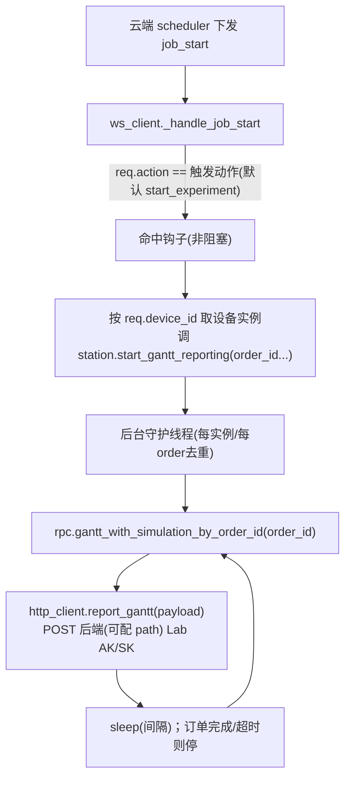

# 工作流甘特图回传（edge 侧）

## 范围
**只做 edge 侧**：监听 scheduler action → 拉 LIMS 甘特 → POST 给后端。后端「接收甘特写 redis + 前端轮询读」接口**本次不实现**，作为外部依赖（POST 目标 path 走配置，后端就绪前会 404，属预期）。

## 端到端数据流

## 关键前置结论（已查证）
- LIMS 甘特 RPC **已存在**：`gantt_with_simulation_by_order_id(order_id, return_envelope=...)`（[bioyond_rpc.py](/Users/dp/python/Uni-Lab-OS-sirna/unilabos/devices/workstation/bioyond_studio/bioyond_rpc.py) L1037），返回 `{items:[{deviceName,name,startTime,endTime,color,...}]}`。
- 解析辅助现成：`_gantt_items` / `_call_single_arg_lims_section`（[sirna_station.py](/Users/dp/python/Uni-Lab-OS-sirna/unilabos/devices/workstation/bioyond_studio/sirna_station/sirna_station.py)）。
- `job_start` 携带 `action`/`action_args`/`device_id`/`notebook_id`/`task_id`/`job_id`，edge 解析为 `JobAddReq`（[ws_client.py](/Users/dp/python/Uni-Lab-OS-sirna/unilabos/app/ws_client.py) `_handle_job_start`，[model.py](/Users/dp/python/Uni-Lab-OS-sirna/unilabos/app/model.py)）。
- edge→云端 POST 现成封装：`HTTPClient`（`self._session` + `Authorization: Lab base64(ak:sk)` + `HTTPConfig.remote_addr`，[client.py](/Users/dp/python/Uni-Lab-OS-sirna/unilabos/app/web/client.py)）。
- order_id 在工作流里由 `submit→start→wait` 的 handles 链产生；设备实例另存 `_last_submitted_order_ids`。
- 重要约束：ws_client 框架层**无 LIMS rpc 句柄/api_key**，必须把拉取动作转交给设备实例（设备实例才有 `hardware_interface`）。

## 实现步骤

### 1. ws_client 框架钩子（识别 action，非阻塞）
在 [ws_client.py](/Users/dp/python/Uni-Lab-OS-sirna/unilabos/app/ws_client.py) `_handle_job_start` 解析出 `req` 后、`send_goal` 之外，加一段：
- 若 `req.action == 配置的触发动作`，**不阻塞主流程**地触发甘特上报：取设备实例后调用其方法（在后台线程里跑，绝不拖慢 job 执行）。
- 取设备实例：通过 `HostNode.get_instance(0)` 的设备注册表按 `req.device_id` 拿到 driver 实例（需确认查找 API；找不到则记日志跳过）。
- 钩子幂等：同一 `job_id`/`order_id` 只启动一次上报（避免 job_start 重发重复起线程）。

### 2. 设备实例上报方法
在 [sirna_station.py](/Users/dp/python/Uni-Lab-OS-sirna/unilabos/devices/workstation/bioyond_studio/sirna_station/sirna_station.py) 新增 `start_gantt_reporting(self, order_id="", notebook_id="", **ctx)`（普通方法，非 @action）：
- 解析 order_id：优先入参（来自 `job_start.action_args`），否则回退 `_last_submitted_order_ids`。
- 起后台 daemon 线程（按 order_id 去重，记录在 `self._gantt_threads`）循环：
  - `rpc = self._require_hardware_interface("gantt_with_simulation_by_order_id")`
  - `payload = self._gantt_items(rpc.gantt_with_simulation_by_order_id(order_id, return_envelope=True))`
  - `http_client.report_gantt({...order_id, notebook_id, items, ts})`
  - `sleep(poll_interval)`；命中订单完成（复用 `order_finish_event` / 订单状态）或 `poll_timeout` 则退出。
- 提供「一次性模式」开关（拉一次 POST 一次即停）。

### 3. HTTPClient 新增 POST 方法
在 [client.py](/Users/dp/python/Uni-Lab-OS-sirna/unilabos/app/web/client.py) 仿 `resource_tree_get` / `workflow_import` 加 `report_gantt(payload)`：`self._session.post(f"{self.remote_addr}{GANTT_REPORT_PATH}", json=payload, headers={"Authorization": f"Lab {self.auth}"}, timeout=...)`；`GANTT_REPORT_PATH` 走配置（后端就绪后填真实 path）。

### 4. 配置项
新增可配置：触发动作名（默认 `start_experiment`）、`poll_interval`、`poll_timeout`、一次性/轮询模式、上报开关、后端 gantt 接口 path。放在现有 config 体系（`UNILABOS_*` 环境变量 / device config）。

### 5. 验证
- 构造一条 `job_start`(action=触发动作, action_args 含 order_id) 喂给 `_handle_job_start`，确认：钩子命中、不阻塞、起一个后台线程、`gantt_with_simulation_by_order_id` 被调、`report_gantt` 发出 POST（后端未就绪时 4xx 属预期，校验请求体结构正确）。
- 校验幂等：重复 job_start 不重复起线程。

## 待确认/假设
- 触发动作默认 `start_experiment`，可配；order_id 优先取 `action_args`，否则 `_last_submitted_order_ids`。
- 节奏默认后台周期轮询（间隔/超时可配），保留一次性模式。
- 后端接收接口（写 redis）+ 前端轮询读取接口 + redis key **不在本 plan**，需另立 backend plan；POST path 暂用配置占位。
- ws_client 按 device_id 取设备实例的具体 API 待实现时确认。
- 钩子务必非阻塞且幂等，不能影响正常 job 执行。
