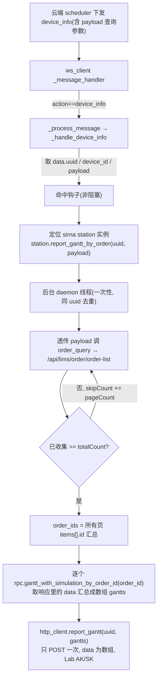

# 工作流甘特图回传（edge 侧）

## 范围
**只做 edge 侧**：监听 scheduler 下发的 `device_info` 消息 → **用消息 payload 里的查询参数请求 LIMS order-list 拿到 order_id** → 逐个拉 LIMS 甘特 → POST 给后端 `/api/v1/edge/job/result`。后端「接收甘特并写入 / 前端读取」逻辑**本次不实现**，作为外部依赖（接口 path 走配置）。

## 逻辑变更说明（重要）
- **旧逻辑（已废弃）**：edge 收到触发后，固定调 `get_order_list(status="执行中（60）", latest_only=False)` 实时查所有「执行中」订单，再逐个拉甘特。查询条件写死在 edge。
- **新逻辑（本次）**：查询条件不再由 edge 决定，而是由 scheduler 在 `device_info.payload` 里下发。edge 把 payload 里的 `{timeType, beginTime, endTime, skipCount, pageCount, status}` **原样透传**给 `/api/lims/order/order-list`，**自动翻页**拿到全部符合条件订单的 `items[].id`（即 order_id），再逐个拉甘特汇总回传。**不再依赖 `get_order_list` 的下拉标签/`latest_only` 约束，改为直接调底层 `order_query` rpc 透传。**

## 触发消息格式（scheduler → edge，WebSocket）
```json
{
  "action": "device_info",
  "data": {
    "uuid": "xxx",
    "device_id": "bioyond_sirna_station",
    "payload": {
      "timeType": "CreationTime",
      "beginTime": "2026-01-01T00:00:00.000Z",
      "endTime": "2026-12-31T23:59:59.999Z",
      "skipCount": 0,
      "pageCount": 10,
      "status": ""
    }
  },
  "session": ""
}
```
- 外层 `action` == `device_info` → 即触发甘特回传。在 [ws_client.py](/Users/dp/python/Uni-Lab-OS-sirna/unilabos/app/ws_client.py) 中为 `message_type`（`message_type = data.get("action")`，`message_data = data.get("data")`，L678-679）。
- `data.uuid` → 回传时原样作为 POST body 的 `uuid`（**仅用于回传**，不是 order_id）。
- `data.device_id` → 精确定位 station 实例（本例 `bioyond_sirna_station`），**必填**，缺失不触发。
- `data.payload` → **order-list 查询参数**（dict），edge 原样透传给 LIMS：
  - `status`：order-list **原始值**（如 `"60"` 执行中、`"80"` 成功…），**空字符串/缺省 = 不限状态查全部**。edge **不做** `ORDER_STATUS_VALUE_MAP` 标签映射。
  - `timeType`：`CreationTime`(创建时间) / `FinishedTime`(完成时间)，与 `beginTime/endTime` 配合。
  - `beginTime`/`endTime`：ISO8601（建议带 `Z` 的 UTC，如 `2026-04-10T06:24:59.955Z`），`endTime > beginTime`。
  - `skipCount`：翻页起点偏移；`pageCount`：每页条数（**order-list 必填**；自动翻页时作为单页批大小）。

## 回传接口（edge → 后端）
```bash
curl -X POST 'https://<host>/api/v1/edge/job/result' \
  -H 'Authorization: Lab <token>' \
  -H 'Content-Type: application/json' \
  -d '{ "uuid": "xxx", "data": [ {"items": [...]}, {"items": [...]} ] }'
```
- `data` 为数组，长度 == 查到的 order_id 数；每个元素是该订单甘特接口响应里的 `data`（`{"items": [...]}`），**已去掉内层 envelope 的一层 `data` 包装**。

## 端到端数据流



## 关键前置结论（已查证）
- `device_info` 分支**已存在**（[ws_client.py](/Users/dp/python/Uni-Lab-OS-sirna/unilabos/app/ws_client.py) L784-785 `elif message_type == "device_info": await self._handle_device_info(message_data)`），`_handle_device_info` 已实现（L799），本次在其内**新增读取 `message_data.payload` 并透传**。
- 消息分发：`_message_handler` 用 `data.get("action")` 作 message_type、`data.get("data")` 作 payload(即 `message_data`)（L676-691）。`device_info` 一定会被处理。
- LIMS 订单查询 RPC **已存在**：`order_query(json_str, *, return_envelope=False)`（[bioyond_rpc.py](/Users/dp/python/Uni-Lab-OS-sirna/unilabos/devices/workstation/bioyond_studio/bioyond_rpc.py) L762），把传入 dict 原样作为 `data` POST 给 `/api/lims/order/order-list`。`return_envelope=False` 时返回 `response["data"]`（即 `{"totalCount": N, "items": [...]}`），`items[].id` 即 order_id。**本次直接用它透传 payload，不走 `get_order_list`**（后者强制下拉标签 status + `latest_only`，不适配原始值透传与翻页）。
- order-list 实测要点（已用 `61.169.57.196:44457` apiKey `B10B5995` 验证）：`pageCount` 为**必填**，缺失会 `code=0 "Method arguments are not valid!"`；`beginTime/endTime` 格式宽松（ISO8601 带/不带 Z、空格分隔、仅日期均接受）；返回里 `data.totalCount` 为符合条件总数，可据此翻页。
- LIMS 甘特 RPC **已存在**：`gantt_with_simulation_by_order_id(order_id, return_envelope=...)`（[bioyond_rpc.py](/Users/dp/python/Uni-Lab-OS-sirna/unilabos/devices/workstation/bioyond_studio/bioyond_rpc.py) L1037）。本次取 `return_envelope=True` 的响应后**只取其中的 `data` 字段**（`{"items": [...]}`）放进数组，避免与 body 外层 `data` 双层嵌套（已在 `_gantt_report_worker` 落地）。
- edge→云端 POST 现成封装：`HTTPClient`（`self._session` 已挂 `Authorization: Lab base64(ak:sk)`，`self.remote_addr` 已含 `/api/v1`，[client.py](/Users/dp/python/Uni-Lab-OS-sirna/unilabos/app/web/client.py) L23-61）。
- 重要约束：ws_client 框架层**无 LIMS rpc 句柄/api_key**，必须把拉取动作转交给设备实例（设备实例才持有 `hardware_interface`）。
- **设备实例定位（已查证有标准通道）**：`HostNode.get_instance(0).devices_instances[device_id].driver_instance`（[host_node.py](/Users/dp/python/Uni-Lab-OS-sirna/unilabos/ros/nodes/presets/host_node.py) L276/L658；[base_device_node.py](/Users/dp/python/Uni-Lab-OS-sirna/unilabos/ros/nodes/base_device_node.py) L2216）。已封装为 `_locate_gantt_station`（[ws_client.py](/Users/dp/python/Uni-Lab-OS-sirna/unilabos/app/ws_client.py) L842），按 device_id 精确匹配且要求 driver 有 `report_gantt_by_order`，否则不触发。

## 实现步骤

### 1. ws_client：device_info 分支读取 payload 并透传
在 [ws_client.py](/Users/dp/python/Uni-Lab-OS-sirna/unilabos/app/ws_client.py) `_handle_device_info`（L799）现有逻辑基础上改动：
- 仍读 `uuid = message_data.get("uuid")`（缺失返回）、`device_id = message_data.get("device_id")`（缺失记日志返回、**不触发**）。
- **新增**读 `payload = message_data.get("payload") or {}`（不是 dict 则视为 `{}`）。
- 定位 station 后改为 `station.report_gantt_by_order(uuid, payload)`（多传 payload；内部起后台线程，绝不阻塞 ws 消息循环；幂等去重按 uuid 在该方法内处理）。
- `_locate_gantt_station` 不变。

### 2. 设备实例上报方法（核心改造）
在 [sirna_station.py](/Users/dp/python/Uni-Lab-OS-sirna/unilabos/devices/workstation/bioyond_studio/sirna_station/sirna_station.py) 把 `report_gantt_by_order(self, uuid)` 改为 `report_gantt_by_order(self, uuid, query)`（`query` 为 payload dict），后台线程体 `_gantt_report_worker(self, uuid, query)`：
- **构建 order-list 请求 data**（透传 payload，做最小规整）：
  ```python
  data = {
      "timeType": str(query.get("timeType") or ""),
      "beginTime": query.get("beginTime") or None,
      "endTime": query.get("endTime") or None,
      "status": "" if query.get("status") in (None, "") else str(query.get("status")),  # 原始值透传, 空=不限
      "filter": str(query.get("filter") or ""),
      "sorting": str(query.get("sorting") or "creationTime desc"),
      "skipCount": int(query.get("skipCount") or 0),
      "pageCount": int(query.get("pageCount") or 50),  # pageCount 必填, 缺省给批大小
  }
  ```
- **自动翻页收集全部 order_id**：
  ```python
  rpc = self._require_hardware_interface("order_query")
  order_ids, skip, page = [], data["skipCount"], data["pageCount"]
  total = None
  while True:
      data["skipCount"] = skip
      page_data = rpc.order_query(json.dumps({**data, "skipCount": skip}, ensure_ascii=False)) or {}
      items = page_data.get("items") or []
      total = page_data.get("totalCount") if total is None else total
      order_ids += [str(i.get("id")) for i in items if i.get("id")]
      skip += page
      if not items or (total is not None and skip >= total):
          break
      # 安全上限: 防御 totalCount 异常导致死循环 (如 skip > 安全阈值 或 已收集 >= total)
  ```
  - 翻页终止条件：本页空 / 已收集数 >= `totalCount` / 命中安全上限（避免脏数据死循环）。
  - `order_ids` 为空 → 记日志跳过、不 POST（当前无符合条件订单）。
- **逐个拉甘特 + 去内层 data**（沿用已落地实现）：
  ```python
  rpc_g = self._require_hardware_interface("gantt_with_simulation_by_order_id")
  gantts = []
  for oid in order_ids:
      try:
          envelope = rpc_g.gantt_with_simulation_by_order_id(oid, return_envelope=True)
          gantt_data = (envelope or {}).get("data")
          if gantt_data is None:
              logger.error("甘特图响应缺少 data 字段，跳过 order_id=%s", oid); continue
          gantts.append(gantt_data)
      except Exception as exc:
          logger.error("甘特图拉取失败 order_id=%s: %s", oid, exc)
  ```
- `from unilabos.app.web import http_client; http_client.report_gantt(uuid, gantts)`（**只 POST 一次**）。
- 全程异常吞掉只记日志，不影响主流程；同 uuid 幂等去重保持原实现。

### 3. HTTPClient 新增 POST 方法
在 [client.py](/Users/dp/python/Uni-Lab-OS-sirna/unilabos/app/web/client.py) 仿 `resource_tree_get` 加：
```python
def report_gantt(self, uuid: str, data: Any) -> requests.Response:
    from unilabos.config.config import GanttReportConfig
    return self._session.post(
        f"{self.remote_addr}{GanttReportConfig.report_path}",   # 默认 /edge/job/result
        json={"uuid": uuid, "data": data},
        headers={"Authorization": f"Lab {self.auth}"},
        timeout=60,
    )
```
`remote_addr` 已含 `/api/v1`，故默认 `report_path = "/edge/job/result"` 即命中 `.../api/v1/edge/job/result`。

### 4. 配置项
新增 `GanttReportConfig`（[config.py](/Users/dp/python/Uni-Lab-OS-sirna/unilabos/config/config.py)）：`enabled`（上报总开关）、`report_path`（默认 `/edge/job/result`）。

### 5. 验证
- 构造一条带 payload 的消息喂 `_process_message`：
  `{"action":"device_info","data":{"uuid":"u1","device_id":"bioyond_sirna_station","payload":{"timeType":"CreationTime","beginTime":"2026-01-01T00:00:00.000Z","endTime":"2026-12-31T23:59:59.999Z","skipCount":0,"pageCount":10,"status":""}}}`
  确认：命中、不阻塞、起一个后台线程、按 payload 透传调 `order_query`（status 空=不限）、`totalCount > pageCount` 时**自动翻页**直到收集完所有 order_id、对每个 order_id 调一次 `gantt_with_simulation_by_order_id`、`report_gantt` **只发一次** POST 且 body == `{"uuid":"u1","data":[{"items":[...]}, {"items":[...]}, ...]}`。
- 反例：缺 uuid → 忽略；**缺 device_id → 不触发**；device_id 匹配不到设备 → 不触发；**payload 查不到任何订单 → 记日志跳过不 POST**；同一 uuid 重复消息 → 不重复起线程；脏 totalCount → 命中安全上限退出不死循环。
- 后端接口未就绪时返回 4xx 属预期，校验请求体结构正确即可。

## 待确认/假设（本轮已确认）
- **翻页**：edge **自动翻页**，把 payload 条件下所有符合的订单全部查出来再逐个拉甘特（payload 的 `skipCount` 作起点、`pageCount` 作单页批大小；按 `totalCount` 翻完）。
- **status**：scheduler 传 order-list **原始值**（如 `"60"`，**空 = 不限状态查全部**）；edge **原样透传**，不做 `ORDER_STATUS_VALUE_MAP` 标签映射。
- **消息结构**：`message_data` 顶层有 `uuid` 与 `device_id`（device_id 必填、用于定位设备），查询参数都在 `message_data.payload` 里。
- `data.uuid` 仅用于回传 body 的 `uuid`；order_ids 由 payload 查询 order-list 得到。
- **上传次数：只 POST 一次**，所有订单甘特（每个取响应里的 `data`，即 `{"items":[...]}`）汇总成数组作为 body 的 `data`。
- 边界：payload 查不到订单 → 记日志跳过不 POST；部分订单甘特拉取失败 → 跳过该条、其余正常上传，全失败才跳过；甘特响应**取其中 `data`**放进数组（不双层嵌套）。
- 触发模型为**事件驱动一次性**（每条 device_info 查一次+POST 一次），不做周期轮询。
- 钩子务必非阻塞且按 uuid 幂等，不能影响正常消息循环。
- 后端 `/api/v1/edge/job/result` 接收逻辑不在本 plan，path 走配置。
