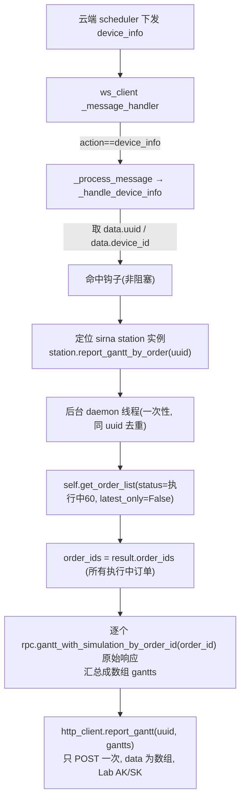

# 工作流甘特图回传（edge 侧）

## 范围
**只做 edge 侧**：监听 scheduler 下发的 `device_info` 消息 → 拉 LIMS 甘特 → POST 给后端 `/api/v1/edge/job/result`。后端「接收甘特并写入 / 前端读取」逻辑**本次不实现**，作为外部依赖（接口 path 走配置）。

## 触发消息格式（scheduler → edge，WebSocket）
```json
{
  "action": "device_info",
  "data": { "uuid": "xxx", "device_id": "bioyond_sirna_station", "payload": {} },
  "session": ""
}
```
- 外层 `action` == `device_info` → 即触发甘特回传。在 [ws_client.py](/Users/dp/python/Uni-Lab-OS-sirna/unilabos/app/ws_client.py) 中为 `message_type`（`message_type = data.get("action")`，`message_data = data.get("data")`，L678-679）。**不再有内层 `data.action`**。
- `data.uuid` → 回传时原样作为 POST body 的 `uuid`（**仅用于回传**，不是 order_id）。
- `data.device_id` → 精确定位 station 实例（本例 `bioyond_sirna_station`）。

## 回传接口（edge → 后端）
```bash
curl -X POST 'https://<host>/api/v1/edge/job/result' \
  -H 'Authorization: Lab <token>' \
  -H 'Content-Type: application/json' \
  -d '{ "uuid": "xxx", "data": <甘特接口原始响应> }'
```

## 端到端数据流



## 关键前置结论（已查证）
- `device_info` 当前**未被处理**，会落到 `_process_message` 的 `else` 分支（[ws_client.py](/Users/dp/python/Uni-Lab-OS-sirna/unilabos/app/ws_client.py) L753-784），需新增分支。
- 消息分发：`_message_handler` 用 `data.get("action")` 作 message_type、`data.get("data")` 作 payload（L676-691）。即便 `session`/`edge_session` 不匹配，非 `*_material` 消息仍会进入 `_process_message`，故 `device_info` 一定会被处理。
- LIMS 甘特 RPC **已存在**：`gantt_with_simulation_by_order_id(order_id, return_envelope=...)`（[bioyond_rpc.py](/Users/dp/python/Uni-Lab-OS-sirna/unilabos/devices/workstation/bioyond_studio/bioyond_rpc.py) L1037），原始响应原样回传。
- order_id 来源：**实时查 LIMS 正在执行的订单**。复用已有 `@action` 方法 `get_order_list(status="执行中（60）", latest_only=True)`（[sirna_station.py](/Users/dp/python/Uni-Lab-OS-sirna/unilabos/devices/workstation/bioyond_studio/sirna_station/sirna_station.py) L1874），返回 `order_id`；底层 `order_query` → `/api/lims/order/order-list`，`"执行中（60）"` 经 `ORDER_STATUS_VALUE_MAP`（L158-165）映射为 `"60"`。`@action` 用 `@wraps` 返回 wrapper（[decorators.py](/Users/dp/python/Uni-Lab-OS-sirna/unilabos/registry/decorators.py) L394-404），故可直接 `self.get_order_list(...)` 调用。**不再依赖 `_last_submitted_order_ids`。**
- edge→云端 POST 现成封装：`HTTPClient`（`self._session` 已挂 `Authorization: Lab base64(ak:sk)`，`self.remote_addr` 已含 `/api/v1`；现有调用如 `self._session.post(f"{self.remote_addr}/edge/material", ...)`，[client.py](/Users/dp/python/Uni-Lab-OS-sirna/unilabos/app/web/client.py) L23-61）。
- 重要约束：ws_client 框架层**无 LIMS rpc 句柄/api_key**，必须把拉取动作转交给设备实例（设备实例才持有 `hardware_interface`）。
- **设备实例定位（已查证有标准通道）**：
  - `HostNode` 持有注册表 `self.devices_instances: Dict[str, ROS2DeviceNode]`，以 device_id 为 key（[host_node.py](/Users/dp/python/Uni-Lab-OS-sirna/unilabos/ros/nodes/presets/host_node.py) L276，L658 `self.devices_instances[device_id] = d` 填充）。
  - `ROS2DeviceNode.driver_instance` 属性返回底层驱动对象（即持有 `get_order_list`/`_require_hardware_interface` 的 `SirnaStation`，[base_device_node.py](/Users/dp/python/Uni-Lab-OS-sirna/unilabos/ros/nodes/base_device_node.py) L2216）。
  - 故精确拿法一行：`HostNode.get_instance(0).devices_instances[device_id].driver_instance`。
  - ws_client 不持有 station 引用，访问设备一律走 `HostNode.get_instance(0)`（同 `_handle_pong`/`_handle_job_start`）。
- **新触发消息当前不含 device_id**（只有 `uuid/action/payload`）：故采用混合定位——见实现步骤 1。

## 实现步骤

### 1. ws_client 新增 device_info 分支（非阻塞）
在 [ws_client.py](/Users/dp/python/Uni-Lab-OS-sirna/unilabos/app/ws_client.py) `_process_message` 增加：
```python
elif message_type == "device_info":
    await self._handle_device_info(message_data)
```
新增 `_handle_device_info(self, message_data)`：
- 读 `uuid = message_data.get("uuid")`；缺失直接返回。**外层 `action == device_info` 即进入，无内层 action 判定。**
- 读 `device_id = message_data.get("device_id")`；**缺失则不触发**（记日志返回）。
- 按 device_id 精确定位 station 后调 `station.report_gantt_by_order(uuid)`（内部起后台线程，**绝不阻塞** ws 消息循环）；幂等去重在该方法内按 uuid 处理。
- **定位 station 驱动实例（方案 A，精确匹配）**（`host_node = HostNode.get_instance(0)`，封装为 `_locate_gantt_station`）：
  - `station = host_node.devices_instances[device_id].driver_instance`，且该 driver 须有 `report_gantt_by_order` 方法；否则返回 None → **不触发**（无能力筛兜底，避免误触发）。
  - `device_id` 即启动 graph JSON 顶层 `"type":"device"` 节点的 `id`，**已确认为 `bioyond_sirna_station`**（启动用 `_sirna_local/sirna_station_graph.example.json`，该图仅此一个设备节点）。
  - scheduler 下发消息示例（device_id 放在内层 `data`，与 uuid 平级，**必填**）：
    ```json
    {"action":"device_info","data":{"uuid":"xxx","device_id":"bioyond_sirna_station","payload":{}},"session":""}
    ```

### 2. 设备实例上报方法
在 [sirna_station.py](/Users/dp/python/Uni-Lab-OS-sirna/unilabos/devices/workstation/bioyond_studio/sirna_station/sirna_station.py) 新增 `report_gantt_by_order(self, uuid: str)`（普通方法，非 @action），后台线程体 `_gantt_report_worker`：
- **实时查所有执行中订单**：`order_ids = self.get_order_list(status="执行中（60）", latest_only=False).get("order_ids")`；为空则记日志跳过（当前无执行中订单）。
- 起后台 **daemon 线程一次性** 执行（同 uuid 去重）：
  - `rpc = self._require_hardware_interface("gantt_with_simulation_by_order_id")`
  - 逐个 `gantt = rpc.gantt_with_simulation_by_order_id(order_id, return_envelope=True)` —— 取**完整原始响应**，不做裁剪；汇总成数组 `gantts`（单个订单拉取失败只记日志、跳过该条）。
  - `from unilabos.app.web import http_client; http_client.report_gantt(uuid, gantts)`（**只 POST 一次**，data 为数组；复用模块级单例 + Lab AK/SK）。
  - 全程异常吞掉只记日志，不影响主流程。

### 3. HTTPClient 新增 POST 方法
在 [client.py](/Users/dp/python/Uni-Lab-OS-sirna/unilabos/app/web/client.py) 仿 `resource_tree_get` 加：
```python
def report_gantt(self, uuid: str, data: Any) -> requests.Response:
    from unilabos.config.config import GanttReportConfig
    return self._session.post(
        f"{self.remote_addr}{GanttReportConfig.report_path}",   # 默认 /edge/job/result
        json={"uuid": uuid, "data": data},
        headers={"Authorization": f"Lab {self.auth}"},
        timeout=60,
    )
```
`remote_addr` 已含 `/api/v1`，故默认 `report_path = "/edge/job/result"` 即命中 `.../api/v1/edge/job/result`。

### 4. 配置项
新增 `GanttReportConfig`（[config.py](/Users/dp/python/Uni-Lab-OS-sirna/unilabos/config/config.py)）：`enabled`（上报总开关）、`report_path`（默认 `/edge/job/result`）。

### 5. 验证
- 构造一条 `{"action":"device_info","data":{"uuid":"u1","device_id":"bioyond_sirna_station","payload":{}}}` 喂给 `_process_message`，确认：命中、不阻塞、起一个后台线程、`get_order_list(status="执行中（60）")` 取到 order_ids、对每个 order_id 调一次 `gantt_with_simulation_by_order_id`、`report_gantt` **只发一次** POST 且 body == `{"uuid":"u1","data":[<订单1原始甘特>, <订单2原始甘特>, ...]}`。
- 反例：缺 uuid → 忽略；**缺 device_id → 不触发**；device_id 匹配不到设备 → 不触发；**无执行中(60)订单 → 记日志跳过不 POST**；同一 uuid 重复消息 → 不重复起线程。
- 后端接口未就绪时返回 4xx 属预期，校验请求体结构正确即可。

## 待确认/假设
- 触发判定：外层 `action==device_info` 且 `data.device_id` 能精确匹配到带 `report_gantt_by_order` 能力的设备；二者缺一不触发。
- `data.uuid` 仅用于回传 body 的 `uuid`；order_ids 由 `get_order_list(status="执行中（60）", latest_only=False)` 实时查询所有执行中订单得到。
- **上传次数：只 POST 一次**。把所有执行中订单的甘特（每个为该订单接口的原始响应）汇总成一个数组作为 body 的 `data` 一起传。即查到 N 个订单 → 调 N 次甘特接口 → 汇总成长度 N 的数组 → 1 次上报。
- 边界：当前无执行中(60)订单 → 记日志跳过、不 POST（实时查询天然规避了进程重启空态问题）；部分订单甘特拉取失败 → 跳过该条、其余正常上传，全失败才跳过。
- 甘特响应**原样**放进 POST body 的 `data` 字段（不裁剪/不包 envelope 转换）。
- 触发模型为**事件驱动一次性**（每条 device_info 拉一次+POST 一次），不做周期轮询。
- 实例定位采用方案 A：scheduler 在 `device_info.data` 带 `device_id`（与 uuid/action 平级），edge 用 `devices_instances[device_id].driver_instance` 精确定位。`device_id` 已确认为 `bioyond_sirna_station`（启动 graph 唯一设备节点 id）。C（按 `report_gantt_by_order` 能力筛、命中非唯一则放弃）仅作消息暂未带 device_id 时的兜底；本边端仅一台工作站，C 也能唯一命中。
- 钩子务必非阻塞且按 uuid 幂等，不能影响正常消息循环。
- 后端 `/api/v1/edge/job/result` 接收逻辑不在本 plan，path 走配置。
