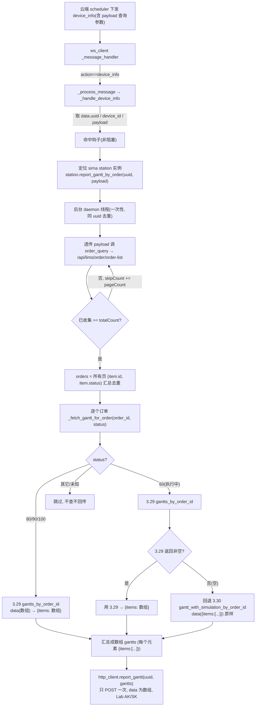

# 工作流甘特图回传（edge 侧）

## 范围
**只做 edge 侧**：监听 scheduler 下发的 `device_info` 消息 → **用消息 payload 里的查询参数请求 LIMS order-list 拿到 order_id** → 逐个拉 LIMS 甘特 → POST 给后端 `/api/v1/edge/job/result`。后端「接收甘特并写入 / 前端读取」逻辑**本次不实现**，作为外部依赖（接口 path 走配置）。

## 逻辑变更说明（重要）
- **旧逻辑（已废弃）**：edge 收到触发后，固定调 `get_order_list(status="执行中（60）", latest_only=False)` 实时查所有「执行中」订单，再逐个拉甘特。查询条件写死在 edge。
- **新逻辑（本次）**：查询条件不再由 edge 决定，而是由 scheduler 在 `device_info.payload` 里下发。edge 把 payload 里的 `{timeType, beginTime, endTime, skipCount, pageCount, status}` **原样透传**给 `/api/lims/order/order-list`，**自动翻页**拿到全部符合条件订单的 `(order_id, status)`（status 取 item 的整数 `status` 字段），再逐个拉甘特汇总回传。**不再依赖 `get_order_list` 的下拉标签/`latest_only` 约束，改为直接调底层 `order_query` rpc 透传。**
- **甘特接口按订单 status 分流（本次新增）**：不再统一只用 3.30。
  - `status ∈ {80, 90, 100}`（成功/失败/已取出）→ **只查 3.29** `gantts_by_order_id`（实验实际甘特，`data` 为数组）。
  - `status == 60`（执行中）→ **先查 3.29**；3.29 返回非空数组就用它；**3.29 为空才回退查 3.30** `gantt_with_simulation_by_order_id`（仿真甘特，`data` 为 `{items:[...]}`）。每个订单只用一个来源（刚启动还没执行步骤的订单 3.29 为空，回退到仿真拿到计划）。
  - **其它 / 未知 status（如待运行 0）→ 跳过**：不查任何甘特接口、不进回传数组。
  - **输出统一为 `{items:[...]}`**：3.29 的数组塞进 `items`，3.30 本就是 `{items:[...]}` 原样用。回传 body 的 `data` 数组每个元素都是 `{items:[...]}`，后端只读 `items`。

## 触发消息格式（scheduler → edge，WebSocket）
```json
{
  "action": "device_info",
  "data": {
    "uuid": "xxx",
    "device_id": "bioyond_sirna_station",
    "payload": {
      "timeType": "CreationTime",
      "beginTime": "2026-01-01T00:00:00.000Z",
      "endTime": "2026-12-31T23:59:59.999Z",
      "skipCount": 0,
      "pageCount": 10,
      "status": ""
    }
  },
  "session": ""
}
```
- 外层 `action` == `device_info` → 即触发甘特回传。在 [ws_client.py](/Users/dp/python/Uni-Lab-OS-sirna/unilabos/app/ws_client.py) 中为 `message_type`（`message_type = data.get("action")`，`message_data = data.get("data")`，L678-679）。
- `data.uuid` → 回传时原样作为 POST body 的 `uuid`（**仅用于回传**，不是 order_id）。
- `data.device_id` → 精确定位 station 实例（本例 `bioyond_sirna_station`），**必填**，缺失不触发。
- `data.payload` → **order-list 查询参数**（dict），edge 原样透传给 LIMS：
  - `status`：order-list **原始值**（如 `"60"` 执行中、`"80"` 成功…），**空字符串/缺省 = 不限状态查全部**。edge **不做** `ORDER_STATUS_VALUE_MAP` 标签映射。
  - `timeType`：`CreationTime`(创建时间) / `FinishedTime`(完成时间)，与 `beginTime/endTime` 配合。
  - `beginTime`/`endTime`：ISO8601（建议带 `Z` 的 UTC，如 `2026-04-10T06:24:59.955Z`），`endTime > beginTime`。
  - `skipCount`：翻页起点偏移；`pageCount`：每页条数（**order-list 必填**；自动翻页时作为单页批大小）。

## 回传接口（edge → 后端）
```bash
curl -X POST 'https://<host>/api/v1/edge/job/result' \
  -H 'Authorization: Lab <token>' \
  -H 'Content-Type: application/json' \
  -d '{ "uuid": "xxx", "data": [ {"items": [...]}, {"items": [...]} ] }'
```
- `data` 为数组，长度 == 查到的 order_id 数；每个元素**统一为 `{"items": [...]}`**：来自 3.29 时把其 `data` 数组塞进 `items`，来自 3.30 时其 `data` 本就是 `{"items":[...]}` 原样用。后端只读 `items`。

## 端到端数据流



## 关键前置结论（已查证）
- `device_info` 分支**已存在**（[ws_client.py](/Users/dp/python/Uni-Lab-OS-sirna/unilabos/app/ws_client.py) L784-785 `elif message_type == "device_info": await self._handle_device_info(message_data)`），`_handle_device_info` 已实现（L799），本次在其内**新增读取 `message_data.payload` 并透传**。
- 消息分发：`_message_handler` 用 `data.get("action")` 作 message_type、`data.get("data")` 作 payload(即 `message_data`)（L676-691）。`device_info` 一定会被处理。
- LIMS 订单查询 RPC **已存在**：`order_query(json_str, *, return_envelope=False)`（[bioyond_rpc.py](/Users/dp/python/Uni-Lab-OS-sirna/unilabos/devices/workstation/bioyond_studio/bioyond_rpc.py) L762），把传入 dict 原样作为 `data` POST 给 `/api/lims/order/order-list`。`return_envelope=False` 时返回 `response["data"]`（即 `{"totalCount": N, "items": [...]}`），`items[].id` 即 order_id。**本次直接用它透传 payload，不走 `get_order_list`**（后者强制下拉标签 status + `latest_only`，不适配原始值透传与翻页）。
- order-list 实测要点（已用 `61.169.57.196:44457` apiKey `B10B5995` 验证）：`pageCount` 为**必填**，缺失会 `code=0 "Method arguments are not valid!"`；`beginTime/endTime` 格式宽松（ISO8601 带/不带 Z、空格分隔、仅日期均接受）；返回里 `data.totalCount` 为符合条件总数，可据此翻页。
- **两个甘特 RPC 均已存在**（[bioyond_rpc.py](/Users/dp/python/Uni-Lab-OS-sirna/unilabos/devices/workstation/bioyond_studio/bioyond_rpc.py)）：
  - **3.29** `gantts_by_order_id(order_id, *, return_envelope=False)`（L970）→ `/api/lims/order/gantts-by-order-id`。`return_envelope=True` 时响应 `data` 是**数组**：每元素含 `{sampleId, stepId, subWorkFlowId, deviceId, code, color, name, description, startTime, endTime, creationTime, lastModificationTime, duraion, id(甘特Id)}`（实验**实际执行**步骤）。
  - **3.30** `gantt_with_simulation_by_order_id(order_id, *, return_envelope=False)`（L1037）→ `/api/lims/order/gantt-with-simulation-by-order-id`。`return_envelope=True` 时响应 `data` 是**对象** `{"items":[...]}`：每元素含 `{code, deviceId, deviceName, routineId, color, name, description, startTime, endTime, estimatedStartTime, estimatedEndTime}`（含未执行步骤的 estimated 预计时间，仿真）。
  - 两者**无共同唯一 ID、字段结构不同**；本次不做字段级合并，按订单 status 二选一（见逻辑变更说明）。
- order-list 返回 item 含整数 `status` 字段（取值 60/80/90/100 等）与 `statusName` 中文；本次按 **item 的整数 `status`** 判定走哪个甘特分支。
- edge→云端 POST 现成封装：`HTTPClient`（`self._session` 已挂 `Authorization: Lab base64(ak:sk)`，`self.remote_addr` 已含 `/api/v1`，[client.py](/Users/dp/python/Uni-Lab-OS-sirna/unilabos/app/web/client.py) L23-61）。
- 重要约束：ws_client 框架层**无 LIMS rpc 句柄/api_key**，必须把拉取动作转交给设备实例（设备实例才持有 `hardware_interface`）。
- **设备实例定位（已查证有标准通道）**：`HostNode.get_instance(0).devices_instances[device_id].driver_instance`（[host_node.py](/Users/dp/python/Uni-Lab-OS-sirna/unilabos/ros/nodes/presets/host_node.py) L276/L658；[base_device_node.py](/Users/dp/python/Uni-Lab-OS-sirna/unilabos/ros/nodes/base_device_node.py) L2216）。已封装为 `_locate_gantt_station`（[ws_client.py](/Users/dp/python/Uni-Lab-OS-sirna/unilabos/app/ws_client.py) L842），按 device_id 精确匹配且要求 driver 有 `report_gantt_by_order`，否则不触发。

## 实现步骤

### 1. ws_client：device_info 分支读取 payload 并透传
在 [ws_client.py](/Users/dp/python/Uni-Lab-OS-sirna/unilabos/app/ws_client.py) `_handle_device_info`（L799）现有逻辑基础上改动：
- 仍读 `uuid = message_data.get("uuid")`（缺失返回）、`device_id = message_data.get("device_id")`（缺失记日志返回、**不触发**）。
- **新增**读 `payload = message_data.get("payload") or {}`（不是 dict 则视为 `{}`）。
- 定位 station 后改为 `station.report_gantt_by_order(uuid, payload)`（多传 payload；内部起后台线程，绝不阻塞 ws 消息循环；幂等去重按 uuid 在该方法内处理）。
- `_locate_gantt_station` 不变。

### 2. 设备实例上报方法（核心改造）
在 [sirna_station.py](/Users/dp/python/Uni-Lab-OS-sirna/unilabos/devices/workstation/bioyond_studio/sirna_station/sirna_station.py)。`report_gantt_by_order(self, uuid, query)` 签名不变（上一轮已落地）；本轮改 `_query_order_ids_for_gantt → _query_orders_for_gantt`（带回 status）、新增 `_fetch_gantt_for_order`、改写 `_gantt_report_worker`。

#### 2a. `_query_orders_for_gantt(query)`：自动翻页收集 (order_id, status)
在现有翻页逻辑基础上，每条 item 同时取 `id` 与整数 `status`，按 order_id 去重：
```python
GANTT_RUNNING_STATUS = 60  # 模块级常量

base_payload = {
    "timeType": str(query.get("timeType") or ""),
    "beginTime": query.get("beginTime") or None,
    "endTime": query.get("endTime") or None,
    "status": "" if query.get("status") in (None, "") else str(query.get("status")),
    "filter": str(query.get("filter") or ""),
    "sorting": str(query.get("sorting") or "creationTime desc"),
    "pageCount": page,  # 缺省 50；plan 备注 order-list 上限 1000
}
rpc = self._require_hardware_interface("order_query")
orders, seen, total = [], set(), None
for _ in range(max_pages):
    page_data = rpc.order_query(json.dumps({**base_payload, "skipCount": skip}, ensure_ascii=False)) or {}
    items = page_data.get("items") or []
    if total is None: total = _safe_int(page_data.get("totalCount"))
    for it in items:
        oid = str((it or {}).get("id") or "").strip()
        if oid and oid not in seen:
            seen.add(oid)
            orders.append({"order_id": oid, "status": _safe_int((it or {}).get("status"))})
    if not items: break
    skip += page
    if total is not None and skip >= total: break
return orders  # [{"order_id": str, "status": int|None}]
```
（`_safe_int` 为本地小工具：能转就转，否则 None。其余翻页/安全上限逻辑与现状一致。）

#### 2b. `_fetch_gantt_for_order(order_id, status)`：按 status 选接口，统一返回 `{items:[...]}`；跳过返回 `None`
模块级常量：`GANTT_RUNNING_STATUS = 60`、`GANTT_FINISHED_STATUSES = frozenset({80, 90, 100})`。
```python
def _fetch_gantt_for_order(self, order_id, status):
    if status == GANTT_RUNNING_STATUS:           # 执行中：先 3.29，空回退 3.30
        rpc = self._require_hardware_interface("gantts_by_order_id")
        items29 = (rpc.gantts_by_order_id(order_id, return_envelope=True) or {}).get("data")
        items29 = items29 if isinstance(items29, list) else []
        if items29:
            return {"items": items29}
        rpc30 = self._require_hardware_interface("gantt_with_simulation_by_order_id")
        data30 = (rpc30.gantt_with_simulation_by_order_id(order_id, return_envelope=True) or {}).get("data")
        if isinstance(data30, dict):
            data30.setdefault("items", [])
            return data30                        # 3.30 本就是 {"items":[...]}
        return {"items": []}
    if status in GANTT_FINISHED_STATUSES:        # 80/90/100：只查 3.29
        rpc = self._require_hardware_interface("gantts_by_order_id")
        items29 = (rpc.gantts_by_order_id(order_id, return_envelope=True) or {}).get("data")
        return {"items": items29 if isinstance(items29, list) else []}
    return None                                  # 其它/未知 status：跳过不查
```
- `status == 60` 且 3.29 非空 → 用 3.29；3.29 空 → 回退 3.30。
- `status ∈ {80,90,100}` → 只查 3.29。
- 其它 / 未知（`None`、`0` 待运行等）→ 返回 `None`，worker 跳过、不进回传数组。

#### 2c. `_gantt_report_worker(self, uuid, query)`
```python
orders = self._query_orders_for_gantt(query)
if not orders:
    logger.error("甘特图回传：payload 查询未命中任何订单，跳过 uuid=%s query=%s", uuid, query); return
gantts = []
for o in orders:
    try:
        gantts.append(self._fetch_gantt_for_order(o["order_id"], o["status"]))
    except Exception as exc:
        logger.error("甘特图拉取失败 order_id=%s status=%s: %s", o["order_id"], o["status"], exc)
from unilabos.app.web import http_client
http_client.report_gantt(uuid, gantts)   # 只 POST 一次
```
- 全程异常吞掉只记日志，不影响主流程；同 uuid 幂等去重保持原实现。

### 3. HTTPClient 新增 POST 方法
在 [client.py](/Users/dp/python/Uni-Lab-OS-sirna/unilabos/app/web/client.py) 仿 `resource_tree_get` 加：
```python
def report_gantt(self, uuid: str, data: Any) -> requests.Response:
    from unilabos.config.config import GanttReportConfig
    return self._session.post(
        f"{self.remote_addr}{GanttReportConfig.report_path}",   # 默认 /edge/job/result
        json={"uuid": uuid, "data": data},
        headers={"Authorization": f"Lab {self.auth}"},
        timeout=60,
    )
```
`remote_addr` 已含 `/api/v1`，故默认 `report_path = "/edge/job/result"` 即命中 `.../api/v1/edge/job/result`。

### 4. 配置项
新增 `GanttReportConfig`（[config.py](/Users/dp/python/Uni-Lab-OS-sirna/unilabos/config/config.py)）：`enabled`（上报总开关）、`report_path`（默认 `/edge/job/result`）。

### 5. 更新单元测试
更新 [tests/devices/workstation/test_sirna_gantt_report.py](/Users/dp/python/Uni-Lab-OS-sirna/tests/devices/workstation/test_sirna_gantt_report.py)：
- 翻页测试改为断言 `_query_orders_for_gantt` 返回 `[{"order_id":..., "status":...}]`；fake `order_query` 的 item 补 `status` 字段；其余翻页/去重/默认 pageCount/脏 totalCount 用例随之调整。
- 新增 `_fetch_gantt_for_order` 分支测试（fake rpc 同时实现 `gantts_by_order_id` 与 `gantt_with_simulation_by_order_id`，记录各自调用次数）：
  - `status ∈ {80,90,100}` → 只调 3.29，返回 `{"items": <3.29数组>}`，**不**调 3.30；
  - `status == 60` 且 3.29 非空 → 用 3.29，不调 3.30；
  - `status == 60` 且 3.29 空 → 回退调 3.30，返回 3.30 的 `{"items":[...]}`；
  - 输出恒为 `{"items": [...]}`。
- worker 测试：混合状态订单 → `report_gantt` 只发一次，`data` 每元素都是 `{"items":[...]}`。

### 6. 验证
- 构造一条带 payload 的消息喂 `_process_message`：
  `{"action":"device_info","data":{"uuid":"u1","device_id":"bioyond_sirna_station","payload":{"pageCount":10,"status":""}}}`
  确认：命中、不阻塞、起后台线程、自动翻页收集 `(order_id, status)`、**按 status 选接口**（60→3.29 空回退 3.30；其它→只 3.29）、`report_gantt` **只发一次** 且 body == `{"uuid":"u1","data":[{"items":[...]}, ...]}`。
- 反例：缺 uuid → 忽略；**缺 device_id → 不触发**；device_id 匹配不到设备 → 不触发；**payload 查不到任何订单 → 记日志跳过不 POST**；同一 uuid 重复消息 → 不重复起线程；脏 totalCount → 命中安全上限退出不死循环。
- `make`/`py_compile` + 跑 `pytest tests/devices/workstation/test_sirna_gantt_report.py`；后端接口未就绪时返回 4xx 属预期，校验请求体结构正确即可。

## 待确认/假设（本轮已确认）
- **甘特接口分流**：`status==60` 先查 3.29、空才回退 3.30（每订单单一来源）；`status ∈ {80,90,100}` 只查 3.29；**其它/未知 status（如待运行 0）直接跳过、不查不回传**。
- **status 判定**：取 order-list 返回 item 的整数 `status` 字段（60/80/90/100），不用 statusName。
- **输出结构**：每个订单统一为 `{"items":[...]}`（3.29 数组塞进 items，3.30 原样），后端只读 items。
- **翻页**：edge 自动翻页，按 `totalCount` 翻完（`skipCount` 起点、`pageCount` 单页批大小，缺省 50；order-list 上限 1000）。
- **status 透传**：payload.status 为 order-list **原始值**（空=不限状态查全部），原样透传、不做标签映射。注意这是 order-list 的过滤入参；分流判定用的是每个订单**返回的** item.status。
- **消息结构**：`message_data` 顶层有 `uuid` 与 `device_id`（device_id 必填、用于定位设备），查询参数都在 `message_data.payload` 里。`data.uuid` 仅用于回传 body 的 `uuid`。
- **上传次数：只 POST 一次**，所有订单甘特汇总成数组作为 body 的 `data`。
- 边界：payload 查不到订单 → 记日志跳过不 POST；部分订单甘特拉取失败 → 跳过该条、其余正常上传。
- 触发模型为**事件驱动一次性**（每条 device_info 查一次+POST 一次），不做周期轮询；钩子非阻塞且按 uuid 幂等。
- 后端 `/api/v1/edge/job/result` 接收逻辑不在本 plan，path 走配置。

## 附录：[临时调试] 全链路耗时埋点（用完即删）

> 目的：分析 scheduler 下发 `device_info` 后，edge 侧到最终调用后端 `/api/v1/edge/job/result` 的**全链路耗时**，以及中途各 LIMS 接口（order-list / gantts-by-order-id / gantt-with-simulation-by-order-id）的**单次耗时**。所有日志写入独立文件，便于离线分析；分析完成后整体删除以下改动即可。

### 日志输出位置
- 目录：`/Users/dp/python/Uni-Lab-OS-sirna/gantt_timing/`（由 `unilabos/app/gantt_timing.py` 内 `_LOG_DIR` 计算为 repo 根目录下的 `gantt_timing/`）。
- **每个 `device_info`（每个 `uuid`）单独一个文件**：`gantt_timing_<uuid>.log`（uuid 中非 `[A-Za-z0-9_.-]` 字符会被替换为 `_`）。`finish()` 时关闭该 uuid 的文件句柄。
- 每行格式：`时间戳 | uuid=<uuid> | [步骤] | 耗时=xx.xms | 附加信息`。

### 改动清单（删除时按此回滚）
1. **新增文件** `unilabos/app/gantt_timing.py`：专用文件 logger，提供 `mark_received(uuid)` / `timed(uuid, label, extra)` / `record(...)` / `finish(uuid, summary)`。删除时直接删整个文件。
2. **`unilabos/app/ws_client.py`** `_handle_device_info`：在 `uuid` 校验通过后插入 `gantt_timing.mark_received(uuid)`（计时起点）。删除该 try 块即可。
3. **`unilabos/devices/workstation/bioyond_studio/sirna_station/sirna_station.py`**：
   - `_gantt_report_worker`：用 `gantt_timing.timed(...)` 包裹 order-list 查询、单订单甘特拉取、回传 POST，结尾 `gantt_timing.finish(...)` 记总耗时（含未命中/无甘特/异常分支）。
   - `_query_orders_for_gantt(query, _timing_uuid=None)`：新增 `_timing_uuid` 形参，翻页循环内对每次 `order_query`（单页）计时。
   - `_fetch_gantt_for_order(order_id, status, _timing_uuid=None)`：新增 `_timing_uuid` 形参，分别对 3.29 / 3.30 调用计时。
   - 删除时去掉 `_timing_uuid` 形参与 `gantt_timing` 相关包裹、还原直连调用即可。

### 记录的埋点节点
- `[收到 device_info]`：计时起点（ws 线程）。
- `[order-list] 单页请求`：每翻一页一条（含 page/skip/pageCount）。
- `[order-list] 全部翻页查询订单` + `命中订单数`：order-list 阶段总耗时与订单数。
- `[甘特拉取] 单订单`：每个订单整体耗时（含 status）。
- `[3.29 gantts-by-order-id]` / `[3.30 gantt-with-simulation-by-order-id]`：各甘特接口单次耗时。
- `[回传 POST] /edge/job/result`：最终回传后端接口耗时（含 data_count）。
- `[全链路结束] 总耗时`：从收到 device_info 到回传完成的端到端耗时。

> 注：本轮未改 `unilabos/device_comms/rpc.py`（上一轮临时加的通用 HTTP 计时已回退），所有耗时统一收敛到上面的专用日志文件。
