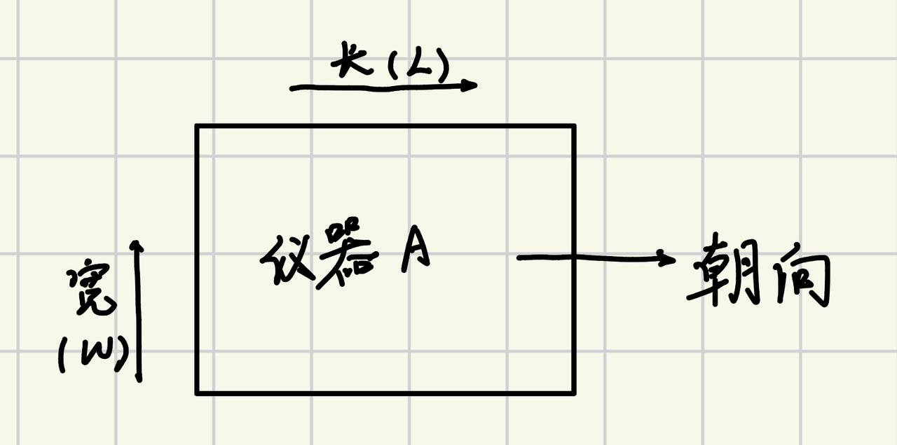
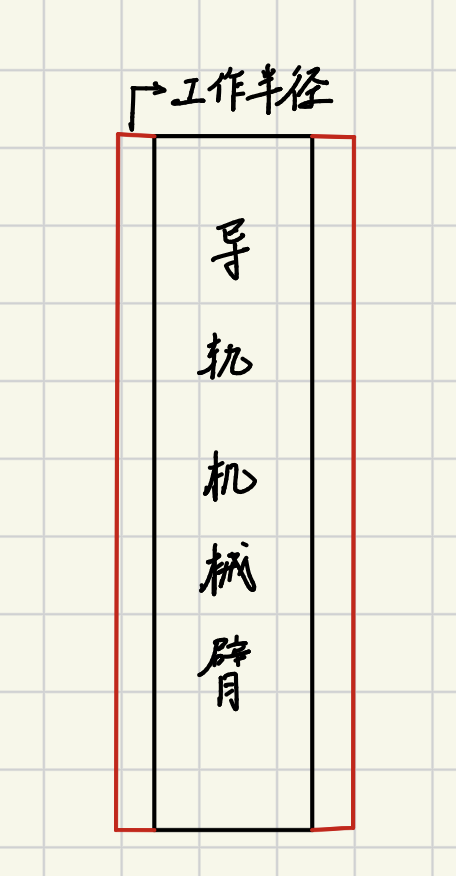
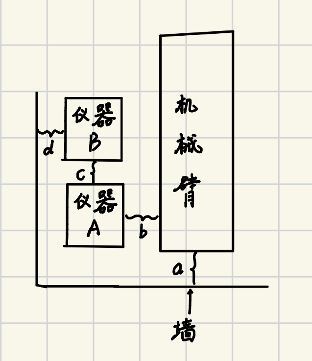
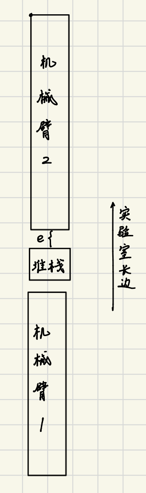
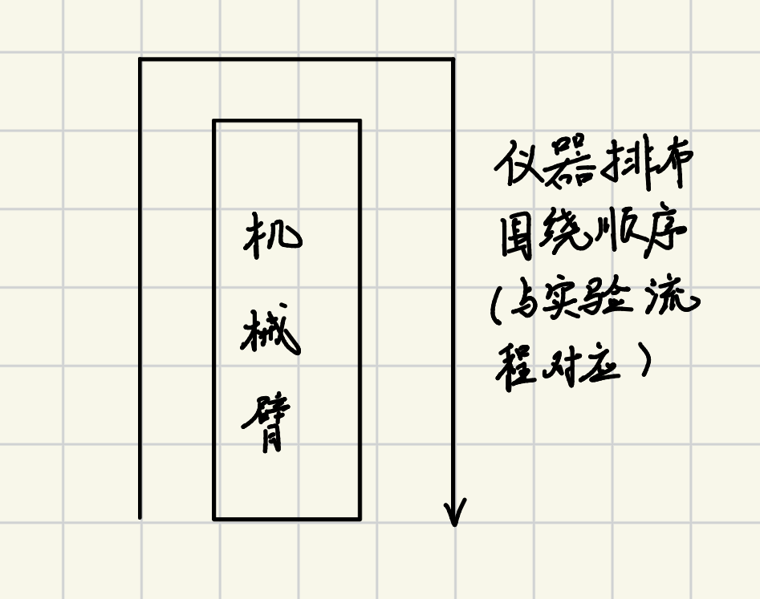

可能需要继承自技能中的方法：

- [ ] 如何进行碰撞检测

- [ ] 如何将仪器布局到实验室（前端）中——直接给坐标的方式

## 交付顺序

1. 先实现以导轨机械臂为主体进行布局，仪器按工作流围绕在机械臂周围，先不考虑多台同类型仪器
2. 基于甘特图实现布局，需要考虑多台同类型仪器如何布局

## 布局逻辑

### 主逻辑

1. 先布置机械臂，再布置其余仪器
2. 默认布局顺序为从下到上（在机械臂周围布局时，从下方的机械臂开始，下方机械臂周围布满仪器后再到上方机械臂），从左到右（在同一台机械臂周围布局仪器时，先在机械臂左边布局再在机械臂右边布局仪器）

## 如何布置机械臂

#### 待解决的问题

- [ ] 机械臂需要几台

- [ ] 机械臂的可达性，需要一个机械臂型号和工作半径对应的表，主要用途在于约束距离参数b的最大取值，见下

- [ ] 机械臂放在房间中的哪个位置

#### 1. 机械臂需要几台

所有仪器都有一个朝向的定义，在导轨类机械臂场景中，规定所有仪器的朝向必须面向导轨。约定和朝向垂直的方向为仪器的宽W，待布局的所有仪器的宽之和为sumW。假设需要n个机械臂，那么这n个机械臂能覆盖的仪器的总宽度为2nL，L为单个机械臂的导轨长度，n应该满足：2(n-1)LsumW<=2nL。

> 注意sumW还要考虑距离参数c，见下，因此sumW = sumW+(k-1)c，k为仪器台数

> **说明（粗估 + 多退少补）**：上式算出的 n 只是**粗估**。原因是 sumW 用 (k-1)c 高估了间距（跨侧/跨臂相邻的仪器并不存在间距 c），且单侧"整段不超过 L"的装箱会产生碎片，故"总宽度放得下" ≠ "装箱排得下"。实际布局采用"多退少补"：按 n 布臂后做仪器装箱，空臂则删（退），仪器有剩余则 n+1 重排（补），详见"如何布置一台/多台仪器"。

#### 2. 导轨类机械臂的可达性判定

机械臂存在一个bbox，并且不同类型的导轨机械臂存在不同的工作半径，当前认为处于下图红色范围内的区域都是机械臂可达的：

不同类型的机械臂工作半径长度不同。

> **可达性约定（简化）**：当前不做逐仪器的精细可达性判定，只采用以下两条参数级约束即认为可达：
>
> - 仪器侧：只要 **b < 工作半径** 即认为机械臂能够到该侧仪器；
> - 堆栈侧：只要 **e < 工作半径** 即认为相邻两臂都能够到中间的堆栈（转运交接点）。
>
> 因此需要一张「机械臂型号 → (导轨长度 L, 工作半径, bbox)」对应表，供台数计算与上述约束取值使用。

#### 3. 机械臂在房间中如何放置

需要解决的问题：

- [ ] 在非正方形房间内，机械臂的朝向问题：最长边怎么放？

- [ ] 第一台机械臂怎么摆放？后续机械臂的摆放逻辑？

- [ ] 在摆放机械臂之前还需要进行的可行性检查？

规定仪器和机械臂在房间中的放置的朝向只能是0/90/180/270，首先需要定义以下几个距离参数：

- a：机械臂较短一侧到墙的垂直距离
- b：机械臂较长一侧到仪器的垂直距离，规定在机械臂同一侧的所有仪器到机械臂的垂直距离b是一致的
- c：仪器之间的距离，为一个仪器长边到另一个仪器长边的垂直距离
- d：仪器到墙的垂直距离，为仪器宽边到墙的垂直距离

这些距离参数是决定机械臂和仪器在房间中放置位置（即坐标）的关键，有默认值，也可以由用户手动调整。

##### 3.1 机械臂的朝向问题

在非正方形房间中，机械臂的最长边和房间的最长边平行。这引出一个问题：先确定需要多少台机械臂，看房间的最长边能否容纳下所有机械臂和堆栈。

沿长边从下墙到上墙依次为：下墙 — a — [臂1, 长 L] — (2e+stack_h) — [臂2] — … — [臂n] — a — 上墙（两端各预留一个 a，stack_h 为堆栈沿长边方向的尺寸）。需要满足**长边不等式**：

> **不等式3（长边）**：2·a + n·L + (n-1)·(2e + stack_h) ≤ 房间长边

由此可反解出长边几何上能容纳的最大臂数：

> n_max = ⌊ (房间长边 − 2a + 2e + stack_h) / (L + 2e + stack_h) ⌋

可行性判定：若粗估的 n_需 > n_max，则长边放不下，布局不可行（需换更大房间 / 更短导轨 / 减仪器）；否则进入装箱排布（多退少补），并始终保持实际臂数 ≤ n_max。
（若希望顶端贴更近，可把顶端单独设参数 a_top，不等式改为 a + a_top + n·L + (n-1)(2e+stack_h) ≤ 房间长边。）

##### 3.2 机械臂的摆放逻辑

**第一台机械臂怎么摆放？**

距离参数a明确了机械臂较短一侧到墙的距离，还需要明确机械臂较长一侧到墙的距离才能确定第一台机械臂在房间中的具体坐标。要明确这一点，除开距离参数b和d外，还需要仪器的长度这一点，而这一点又由长度L最长的仪器决定。因此需要下面这个方式来判断仪器能否布局到房间内：

不等式1:*“距离参数d2+距离参数b2+最长的仪器长度L+第二长的仪器长度L+机械臂宽度 <= 房间较短一边的长度”*

不等式2:*“距离参数d2+距离参数b+最长的仪器长度L+机械臂宽度 <= 房间较短一边的长度”*

**注意：**上述不等式1成立表示一定能布局到房间内，但是不成立不一定代表不能布局到房间内，不成立时，下方的居中摆放方式不可行；如果不等式2不成立，代表不能布局到房间内。

> 当考虑多台同类型仪器时，上述不等式或许要重新考虑

关于机械臂的摆放，有两种考虑方式：

1. 摆放更靠近墙：

这是默认方式，采用这种方法能更方便后续向实验室中添加额外的仪器。在此情况下，机械臂较长一侧到一面墙的距离为：*距离参数d+距离参数b+最长的仪器长度L*，加上模型库中机械臂的bbox长宽，就能在2维平面中确定第一台机械臂的位置。

- 摆放在房间中间

这种方法适用于实验室较短的一边也十分大。使用时需要满足不等式1，此时可以直接将机械臂布置到整个房间的中间，即机械臂的bbox中轴线和房间中轴线重合，但是机械臂短侧到墙的距离仍然为参数a。

**后续机械臂的摆放逻辑**

多台机械臂的摆放如图所示，有以下几个要点：

- 机械臂导轨沿实验室长边进行摆放，即机械臂的长边和实验室的长边是平行的
- 多个机械臂之间必须要有堆栈，用于机械臂之间的耗材转运，n台机械臂需要n-1台堆栈，机械臂和堆栈之间的距离固定为距离参数e
- 关于堆栈如何摆放，堆栈受两个约束：堆栈bbox的中轴线和机械臂的中轴线是重合的，且距离参数e规定了机械臂到堆栈的垂直距离

因此，在确定了堆栈种类后，知道机械臂1的位置（坐标），即可确定后续机械臂的位置（坐标）

##### 3.3 摆放机械臂前的可行性检查/判断

- 实验室房间面积是否大于所有仪器+机械臂+堆栈的面积
- 判断需要几台机械臂和堆栈
- 判断实验室长边是否能放下多台机械臂和堆栈
- 3.2 机械臂的摆放逻辑中的两个不等式是否成立

## 如何布置仪器

#### 待解决的问题

- [ ] 如何布置一台/多台仪器——约定仪器围绕机械臂的布局顺序

- [ ] 如何计算仪器坐标的方法

#### 如何布置一台/多台仪器

如果对仪器进行一台一台计算，当仪器较多时计算量较大；当前考虑的是线性实验，因此打算采用下面这种布局方式：一次性布局完机械臂一侧的仪器。

具体而言，考虑这样一个工作流：仪器1——仪器2——...——仪器k，在完成机械臂的布局后，可以计算仪器1到仪器i所需要消耗的导轨长度：costw(i) = sumi+(i-1)c，当costw(i)超过单个机械臂导轨长度L而costw(i-1)小于L时，那么仪器1到i-1就是机械臂单侧能布置下的最多仪器个数及要布置的仪器是什么，由于是线性的实验流程，因此后续仪器的布置也是这样的：先决定要布置在哪个机械臂的哪一侧，然后按实验步骤顺序选出能完全利用导轨长度且不超过导轨长度的仪器，完成这样仪器的布置。注意到章节“机械臂需要几台”中计算sumW时对仪器间距离的预估为(k-1)c，这实际上是高于k台仪器之间的间距的——因为在实验顺序上相连，但分布在机械臂两侧的仪器是不存在间距c的，因此可能出现所有仪器完成布局后，依然有机械臂空了一台/几台的情况，这个时候就要在布局中删除周围没有仪器的机械臂；也可能出现缺少机械臂来布局完所有仪器，此时需要加机械臂直到能布局完所有仪器。

上面这样的布局，应该能满足布局逻辑中的从下到上（在机械臂周围布局时，从下方的机械臂开始，下方机械臂周围布满仪器后再到上方机械臂），从左到右（在同一台机械臂周围布局仪器时，先在机械臂左边布局再在机械臂右边布局仪器）

#### 如何计算仪器坐标

由于是在2维平面进行布局，因此在有参考坐标的情况下，仪器受两个约束条件即可定下来其所在的坐标。考虑到布局逻辑是从下到上，从左到右，以及对于一个给定的仪器，只需要知道其在2维平面上代表该仪器的矩形的任意一个角的位置，通过bbox就可以计算出其中心点在实验室中的位置，因此有如下计划：
对单个机械臂，围绕其布局的仪器按实验流程呈逆时针，如下图所示。在完成对机械臂的布局时，需要存两个信息：对于每台机械臂，需要知道其四个角的位置，这样在有距离参数b后，并且知道了要布置在机械臂一侧的仪器是哪些仪器，也就知道了仪器的尺寸信息，加上每个仪器到机械臂的垂直距离相同，对于机械臂左侧的仪器，利用机械臂左下角的坐标就可以反推出所有左侧仪器的中心点的坐标；对于机械臂右侧的仪器，利用机械臂右上角的坐标就可以反推出所有右仪器的中心点的坐标。

## 布局具体逻辑实现

 [导轨类机械臂实验室布局逻辑](unilabos/layout_optimizer/导轨类机械臂实验室完整布局逻辑实现.md)